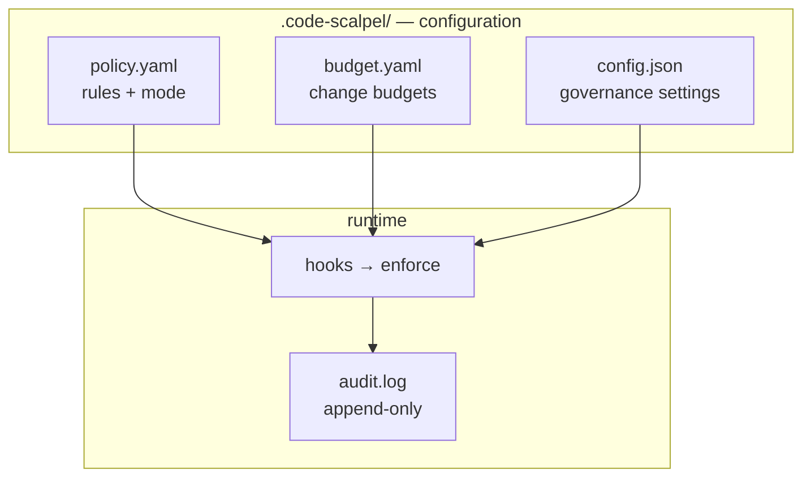

# .code-scalpel/ — Code Scalpel policy engine configuration

The governance home for Code Scalpel: security rules, change budgets, enforcement settings, and the audit trail — all in one directory.

<div align="right">

[](https://github.com/toxicwind/sovereign-projects#license)
[](https://github.com/toxicwind/sovereign-projects)

</div>

## Why this exists

Code Scalpel is a policy engine that governs how code gets written: what operations are allowed, how big a change may be, and who (or what) approves it. This directory is its entire runtime state — the policies it enforces, the budgets it respects, and the audit log it produces. One directory, zero ambiguity about what governs the codebase.

## What's inside

| File | Role |
|---|---|
| `policy.yaml` | **The source of truth** — security rules, enforcement mode |
| `budget.yaml` | Change-budget limits (blast-radius control) |
| `config.json` | Governance and enforcement settings |
| `dev-governance.yaml` | Governance profile for dev environments |
| `ide-extension.json` | IDE extension wiring |
| `response_config.json` / `response_config.schema.json` | Hook response shaping + schema |
| `project-structure.yaml` | Project-structure policy config (used by `policies/project/structure.rego`) |
| `policy.manifest.json` | Signed manifest for tamper detection (optional) |
| `license/` | License keys + cached license state ([README](license/)) |
| `policies/` | Production-ready policy templates ([README](policies/)) |
| `audit.log` | Audit trail of policy decisions (auto-generated) |
| `autonomy_audit/` | Autonomy engine audit logs (auto-generated) |



## Quick start

```bash
# 1. review the rules
less .code-scalpel/policy.yaml
# 2. review the budgets
less .code-scalpel/budget.yaml
# 3. set secrets (see Security below)
cp .env.example .env
# 4. enforce
code-scalpel install-hooks
```

## Environment variables

Check `.env.example` in the project root for required variables:

- **`SCALPEL_MANIFEST_SECRET`** — required for cryptographic policy verification
- **`SCALPEL_TOTP_SECRET`** — optional, for TOTP-based human verification

Copy `.env.example` to `.env` and fill in real values. Never commit `.env`.

## Cryptographic verification (optional)

Tamper-resistant policies: sign the manifest, verify before enforcing.

```bash
code-scalpel policy sign     # generate signed manifest
code-scalpel policy verify   # verify integrity
```

How it works: `policy.manifest.json` is signed with `SCALPEL_MANIFEST_SECRET`; any hand-edit to `policy.yaml` after signing fails verification. See the upstream [tamper-resistance docs](https://github.com/3D-Tech-Solutions/code-scalpel/blob/main/docs/security/tamper_resistance.md).

## Dev

- Policy templates: [`policies/`](policies/) — architecture, DevOps, DevSecOps, project structure
- Hook wiring: [`HOOKS_README.md`](HOOKS_README.md)
- Upstream guides: [policy engine](https://github.com/3D-Tech-Solutions/code-scalpel/blob/main/docs/policy_engine_guide.md) · [change budgeting](https://github.com/3D-Tech-Solutions/code-scalpel/blob/main/docs/guides/change_budgeting.md)

## License & security

MIT where marked — [LICENSE](https://github.com/toxicwind/sovereign-projects#license).

- `SCALPEL_MANIFEST_SECRET` / `SCALPEL_TOTP_SECRET` are real secrets: they live in `.env` (gitignored), never in `policy.yaml`, never in chat logs.
- `audit.log` and `autonomy_audit/` are append-only evidence — hand-editing them voids the tamper story.
- `license/license.jwt` holds the Pro/Enterprise key — never committed (see [license/](license/)).
