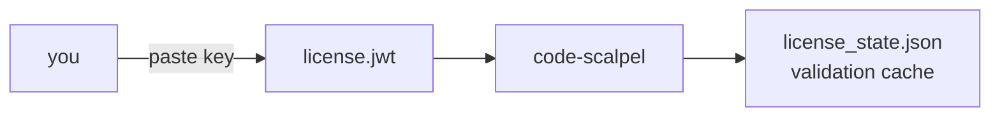

# license/ — Code Scalpel license keys

Where the Pro/Enterprise license key lives — and its validation cache. Nothing else belongs here.

<div align="right">

[](https://github.com/toxicwind/sovereign-projects#license)
[](https://github.com/toxicwind/sovereign-projects)

</div>

## What's inside

| File | Role |
|---|---|
| `license.jwt` | **You put this here** — your Pro/Enterprise license key |
| `license_state.json` | Auto-generated cache of license validation results (don't hand-edit) |



## Quick start

```bash
cp /path/to/your-license.key .code-scalpel/license/license.jwt
code-scalpel license verify   # or: the next code-scalpel run validates automatically
```

## License & security

MIT where marked — [LICENSE](https://github.com/toxicwind/sovereign-projects#license).

- **`license.jwt` is a secret.** Do not commit it. It is gitignored — keep it that way.
- `license_state.json` is a cache, not a credential — it holds validation *results*, safe to regenerate by deleting.
