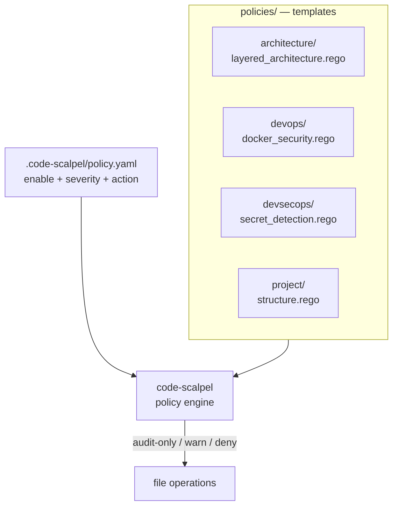

# policies/ — production-ready policy templates

Drop-in governance templates for architecture, DevOps, and DevSecOps — written in Rego, enabled in `policy.yaml`, enforced by Code Scalpel.

<div align="right">

[](https://github.com/toxicwind/sovereign-projects#license)
[](https://github.com/toxicwind/sovereign-projects)

</div>

## Why this exists

Writing governance policy from scratch is how it never gets written. These templates encode the checks teams actually want — layered-architecture boundaries, Dockerfile hygiene, secret detection — as ready-to-enable Rego files. Copy, tune, enable. The template is the starting point, not the finish line.

## What's here (only what's actually on disk)

```
policies/
├── architecture/   layered_architecture.rego     [README](architecture/)
├── devops/         docker_security.rego           [README](devops/)
├── devsecops/      secret_detection.rego          [README](devsecops/)
└── project/        structure.rego                 [README](project/)
```



## Quick start

Edit `.code-scalpel/policy.yaml` — three lines per policy:

```yaml
policies:
  architecture:
    - name: layered-architecture
      file: policies/architecture/layered_architecture.rego
      severity: HIGH
      action: DENY
```

Then:

```bash
code-scalpel policy validate          # syntax + wiring check
code-scalpel policy test --category architecture   # dry-run against this tree
```

## Severity & actions

| Field | Values | Meaning |
|---|---|---|
| `severity` | `LOW` / `MEDIUM` / `HIGH` / `CRITICAL` | how loud a violation is in the audit trail |
| `action` | `AUDIT` / `WARN` / `DENY` | log it, warn on it, or block the operation |

Recommendation: run new policies at `WARN` for a week, promote to `DENY` once the audit trail shows they're firing on real violations, not noise.

## Customizing

Templates are meant to be forked: copy the `.rego` file, rename it, tune the rules to your project, point `policy.yaml` at your copy. The upstream templates stay pristine so you can diff when Code Scalpel updates them.

## Dev

- [Policy Engine Guide](https://github.com/3D-Tech-Solutions/code-scalpel/blob/main/docs/policy_engine_guide.md) (upstream)
- Enforcement wiring: [`../HOOKS_README.md`](../HOOKS_README.md)
- Config source of truth: [`../README.md`](../README.md)

## License & security

MIT where marked — [LICENSE](https://github.com/toxicwind/sovereign-projects#license). Policies are code review for machines: `DENY` rules block real operations, so every policy change deserves the same review rigor as a production code change. The audit trail (`../audit.log`) records every policy decision — evidence, not vibes.
