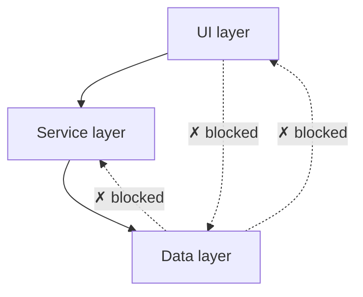

# architecture/ — layered-architecture policy

Enforces the codebase's architectural layering — UI → Service → Data — so dependencies only flow downhill.

<div align="right">

[](https://github.com/toxicwind/sovereign-projects#license)
[](https://github.com/toxicwind/sovereign-projects)

</div>

## Why this exists

Layer violations are silent tech debt: a UI module importing the database layer works fine today and rots the architecture tomorrow. This policy makes the dependency direction a machine-checked rule instead of a code-review hope.

## What it checks

**`layered_architecture.rego`** — the template in this directory:

- Dependencies may only point **down** the layer stack: UI → Service → Data.
- No layer may depend on a layer above it; no layer may skip the contract of the layer below it.



## Quick start

```yaml
# .code-scalpel/policy.yaml
policies:
  architecture:
    - name: layered-architecture
      file: policies/architecture/layered_architecture.rego
      severity: HIGH
      action: DENY
```

```bash
code-scalpel policy validate
code-scalpel policy test --category architecture
```

## Tuning

Open `layered_architecture.rego` and adjust the layer definitions to match your codebase's actual module layout — the template's layer names are placeholders, not gospel. Run at `action: WARN` first; promote to `DENY` when the violations it finds are real.

## License & security

MIT where marked — [LICENSE](https://github.com/toxicwind/sovereign-projects#license). A `DENY` architecture rule blocks real commits — review policy edits like production code. Decisions are logged to the Code Scalpel audit trail (`../../audit.log`).
