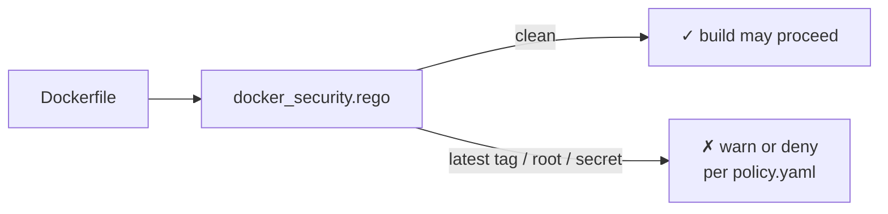

# devops/ — Dockerfile security policy

Validates Dockerfiles against security best practices — before the image gets built, not after it ships.

<div align="right">

[](https://github.com/toxicwind/sovereign-projects#license)
[](https://github.com/toxicwind/sovereign-projects)

</div>

## Why this exists

Insecure Dockerfiles are the quietest supply-chain hole: a `latest` tag here, a root user there, and your "hermetic" build is neither. This policy checks the Dockerfile *as a document* — no image build, no registry scan, just the file against the rules.

## What it checks

**`docker_security.rego`** — the template in this directory:

- Base images pinned (no floating `:latest` tags)
- No `root` user at runtime (non-root `USER` required)
- No secrets baked into layers (`ENV`/`ARG` secret patterns)
- Minimal layer hygiene (combined `RUN` chains, no package-manager caches left behind)



## Quick start

```yaml
# .code-scalpel/policy.yaml
policies:
  devops:
    - name: docker-security
      file: policies/devops/docker_security.rego
      severity: HIGH
      action: WARN
```

```bash
code-scalpel policy validate
code-scalpel policy test --category devops
```

## Tuning

Start at `WARN` — Dockerfile rules are the most likely to fire on legacy files. Fix or exempt the real ones, then promote to `DENY` for new Dockerfiles.

## License & security

MIT where marked — [LICENSE](https://github.com/toxicwind/sovereign-projects#license). This policy is a first gate, not the whole story — pair it with image scanning at build time. Policy decisions land in the Code Scalpel audit trail (`../../audit.log`).
