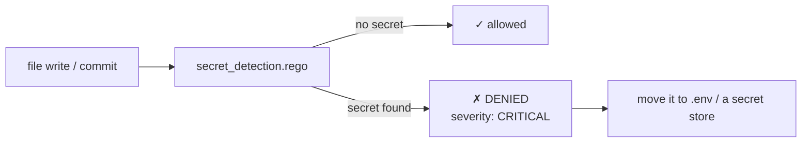

# devsecops/ — secret detection policy

Catches hardcoded secrets before they reach a commit — the one policy that should always be `DENY` + `CRITICAL`.

<div align="right">

[](https://github.com/toxicwind/sovereign-projects#license)
[](https://github.com/toxicwind/sovereign-projects)

</div>

## Why this exists

A committed secret is a compromised secret — rotation, revocation, and an incident report. This policy makes "oops, committed the API key" a thing that can't happen: the secret is caught at the hook layer, before the file is even written or the commit is created.

## What it checks

**`secret_detection.rego`** — the template in this directory:

- Hardcoded secrets in source: API keys, tokens, passwords, private keys
- High-entropy strings in suspicious positions (likely tokens)
- Known credential patterns (`aws_secret`, `sk-`, `ghp_`, PEM blocks, …)



## Quick start

```yaml
# .code-scalpel/policy.yaml
policies:
  devsecops:
    - name: secret-detection
      file: policies/devsecops/secret_detection.rego
      severity: CRITICAL
      action: DENY
```

```bash
code-scalpel policy validate
code-scalpel policy test --category devsecops
```

## When it fires

Don't weaken the rule to get unblocked — move the secret:

1. Move the value to `.env` (gitignored) or the platform secret store.
2. Reference it by environment variable in the code.
3. If the repo history already contains it, **rotate it** — removing it from the file is not enough.

## License & security

MIT where marked — [LICENSE](https://github.com/toxicwind/sovereign-projects#license). This policy is itself a security control: review its rules like you review firewall rules. A `secret_detection.rego` change that narrows a pattern is a security-relevant change — it belongs in the audit trail and in code review.
