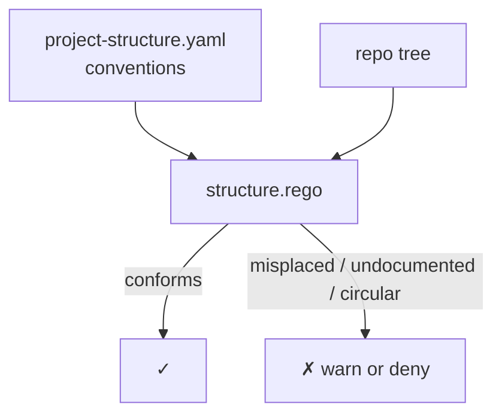

# project/ — project-structure policy

Enforces the Code Scalpel project's own conventions: where code lives, how it's documented, and how modules stay decoupled.

<div align="right">

[](https://github.com/toxicwind/sovereign-projects#license)
[](https://github.com/toxicwind/sovereign-projects)

</div>

## Why this exists

Consistency is a feature: when every module lives where you expect, agents (and humans) navigate the codebase without a map. This policy encodes the Code Scalpel project's structure conventions as a machine-checked rule — a README in every meaningful directory, core analysis isolated from integrations, no circular dependencies.

## What it checks

**`structure.rego`** — the policy in this directory, configured by `.code-scalpel/project-structure.yaml`:

- **File placement** — similar code in similar directories
- **Documentation** — README in every meaningful directory
- **Clean architecture** — core analysis isolated from integrations
- **Naming** — PEP 8 and project naming standards
- **Module boundaries** — no circular dependencies



## Quick start

```yaml
# .code-scalpel/policy.yaml
policies:
  project:
    - name: structure
      file: policies/project/structure.rego
      severity: HIGH
      action: DENY
```

Tune the conventions themselves in [`.code-scalpel/project-structure.yaml`](../../project-structure.yaml) — the Rego enforces it, the YAML describes it.

```bash
code-scalpel policy validate
code-scalpel policy test --category project
```

## License & security

MIT where marked — [LICENSE](https://github.com/toxicwind/sovereign-projects#license). Structure policy edits reshape the whole tree — keep `project-structure.yaml` under the same review bar as `policy.yaml` itself. Decisions land in the Code Scalpel audit trail (`../../audit.log`).
