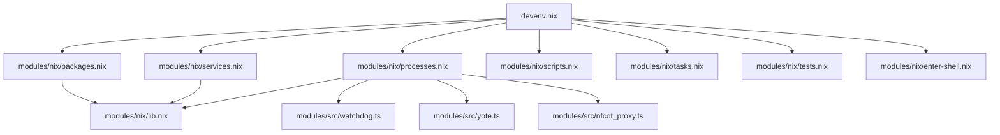

# 🐺 Sovereign Agent Farm

Fully consolidated under Nix-based `devenv` modular orchestration, utilizing native speculation engines, custom proxies, and real-time observability.

---

## 🏗️ Architecture & Modules

The configuration is completely folderized, separating Nix orchestration modules from the TypeScript core runtime scripts under the [modules/](file:///home/toxic/sovereign/modules) directory:



### Nix Orchestration ([modules/nix/](file:///home/toxic/sovereign/modules/nix))
- 📂 [lib.nix](file:///home/toxic/sovereign/modules/nix/lib.nix) — Constants, variables, model configurations, and custom Python/C++ derivations.
- 📂 [packages.nix](file:///home/toxic/sovereign/modules/nix/packages.nix) — System packages list and development language configurations.
- 📂 [processes.nix](file:///home/toxic/sovereign/modules/nix/processes.nix) — Process Compose manager for the 15+ microservices.
- 📂 [services.nix](file:///home/toxic/sovereign/modules/nix/services.nix) — Database services (PostgreSQL, Redis, Clickhouse, MongoDB, NATS, Kafka, etc.).
- 📂 [scripts.nix](file:///home/toxic/sovereign/modules/nix/scripts.nix) — Developer helper scripts (`health`, `boot`, `gpu-status`, etc.).
- 📂 [tasks.nix](file:///home/toxic/sovereign/modules/nix/tasks.nix) — Sandbox setup tasks.
- 📂 [tests.nix](file:///home/toxic/sovereign/modules/nix/tests.nix) — Automated integration tests running in the Nix sandbox.
- 📂 [enter-shell.nix](file:///home/toxic/sovereign/modules/nix/enter-shell.nix) — Developer shell greeting banner and GPU environment detectors.

### TS Runtime Core ([modules/src/](file:///home/toxic/sovereign/modules/src))
- 📂 [watchdog.ts](file:///home/toxic/sovereign/modules/src/watchdog.ts) — Background stack health monitor.
- 📂 [yote.ts](file:///home/toxic/sovereign/modules/src/yote.ts) — Consolidated Telegram bot and userbot client.
- 📂 [nfcot_proxy.ts](file:///home/toxic/sovereign/modules/src/nfcot_proxy.ts) — Neural Flow Chain-of-Thought request proxy.
- 📂 [prompt_cache_benchmark.ts](file:///home/toxic/sovereign/modules/src/prompt_cache_benchmark.ts) — Cache latency test suite.

---

## 🚀 Core Components

### 1. LlamaHerd Proxy ([llamaherd/](file:///home/toxic/sovereign/llamaherd))
A custom Python proxy replacing the old Flask stub. It runs `/bin/llamaherd serve` with active configuration and provides proxying, completion forwarding, and parameter formatting.

### 2. Yote Telegram & Overlord Service ([modules/src/yote.ts](file:///home/toxic/sovereign/modules/src/yote.ts))
Our unified Telegram interface rewritten in **Bun TypeScript**. It combines:
- **Telegram Bot API:** Command routing (`/start`, `/status`, `/chat`) and direct Qwen completions routing.
- **Telegram Userbot API (Overlord):** Authenticates a client session using MTProto.

### 3. Sovereign Watchdog ([modules/src/watchdog.ts](file:///home/toxic/sovereign/modules/src/watchdog.ts))
A background health check script rewritten in **Bun TypeScript**. It periodically audits port statuses for `llama-server`, `nfcot-proxy`, and `openfang`, writing logs and real-time status files.

---

## 🛠️ Commands & Testing

### Enter Dev Shell
```bash
devenv shell
```

### Start the Stack
```bash
devenv up
```

### Run Sandbox Integration Tests
```bash
devenv test
```

---
*🐺 Sovereign AI Managed — 2026 Emergent Infrastructure*
