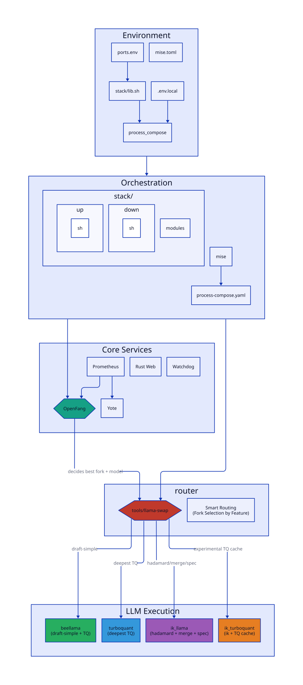
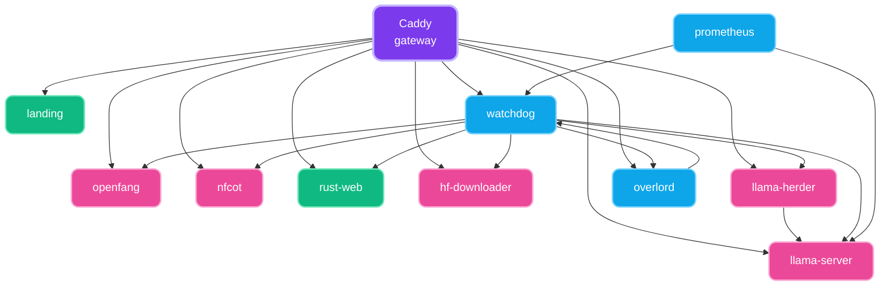

# 🐺 Sovereign Agent Farm

Fully consolidated under Nix-based `devenv` modular orchestration, utilizing native speculation engines, custom proxies, and real-time observability.

---

## 🏗️ Architecture & Modules

The configuration is structured as a declarative multi-process system, maintaining clean boundaries between the reproducible Nix environment definitions and the application layer.

### Live System Topology Map


### Process Graph


**Interactive editor** — open `docs/devenv-graph.html` locally for live editing and PNG/SVG export.

---

### Mapped Environment Breakdown

#### Nix Orchestration Layer (`modules/nix/`)
- **[lib.nix](modules/nix/lib.nix)** — Aggregates system paths, prebuilts, model declarations, and override targets.
- **[ports.nix](modules/nix/ports.nix)** — Single source of truth static port registry preventing service collisions.
- **[packages.nix](modules/nix/packages.nix)** — Manages specialized package variations and explicit `symlinkJoin` assemblies.
- **[processes.nix](modules/nix/processes.nix)** — Configures task topologies, liveness checks, and watcher loops.
- **[services.nix](modules/nix/services.nix)** — Manages multi-database service lifecycles (PostgreSQL, ClickHouse, Redis, MongoDB, etc.).
- **[generators.nix](modules/nix/generators.nix)** — Programmatically writes runtime configurations for Prometheus, Caddy, and server profiles.
- **[scripts.nix](modules/nix/scripts.nix)** — Exposes diagnostic utility tools into the global development shell context.
- **[tasks.nix](modules/nix/tasks.nix)** — Sandbox operations, initialization runs, and visual telemetry compilation.
- **[tests.nix](modules/nix/tests.nix)** — Validates local database connectivity and inference paths during system verification.

#### Core Runtimes (`src/` / `modules/`)
- **[src/watchdog.ts](src/watchdog.ts)** — Background daemon evaluating localized microservice performance vectors and connection health.
- **[src/yote.ts](src/yote.ts)** — Unified asynchronous entry point managing active bot connections and MTProto routing.
- **[modules/nfcot_proxy.py](modules/nfcot_proxy.py)** — Direct connection proxy optimizing inference paths with structured parameter layouts.
- **[src/prompt_cache_benchmark.ts](src/prompt_cache_benchmark.ts)** — Measures memory residency and prompt evaluation metrics under system stress.

---

## 🚀 Core Components

### LlamaHerd Proxy
Custom proxy optimization engine running at server boundaries with explicit metric tracking. Handles raw model inference transformations, stream splitting, and response caching.

### Yote Telegram & Overlord Service
Unified chat routing daemon executing inside the Bun TypeScript framework. Bypasses traditional bottlenecks by using native streaming pipelines that bind public endpoints directly into internal processing hooks.

### Sovereign Watchdog
Autonomic background telemetry script validating connection availability across active proxy ports (`llama-server`, `nfcot`, `openfang`), surfacing performance data directly into state metrics endpoints.

---

## 🛠️ Commands & Testing

### Enter Sandbox Dev Shell
```bash
devenv shell
```

### Spin Up Active Architecture
```bash
devenv up
```

### Validate Local Sandbox State
```bash
devenv test
```

### Regenerate Architecture Diagrams
```bash
devenv tasks run sovereign:graph
```

---

*🐺 Sovereign AI Managed — 2026 Emergent Infrastructure*