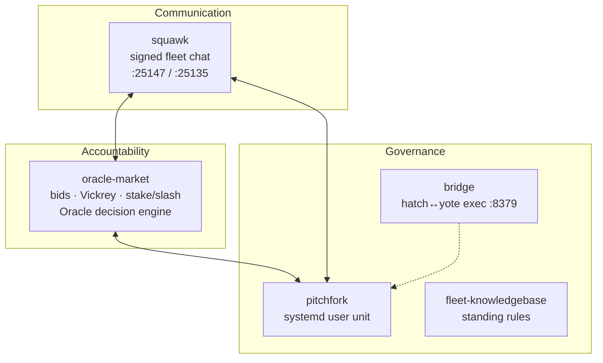
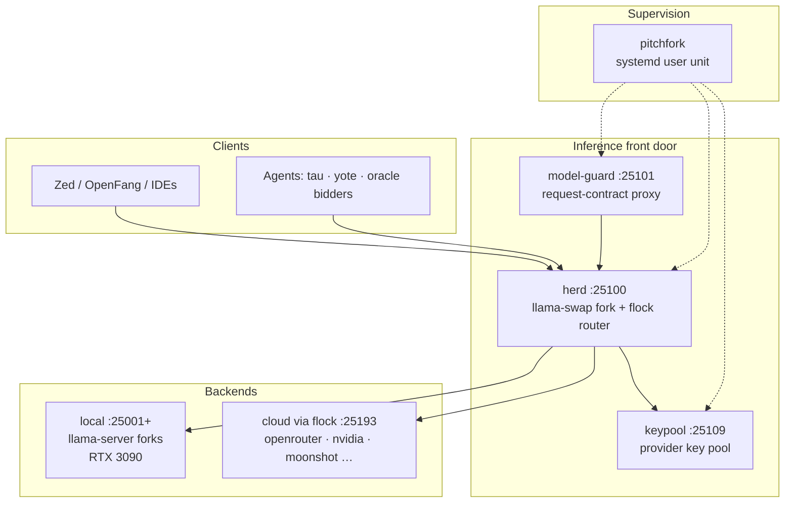
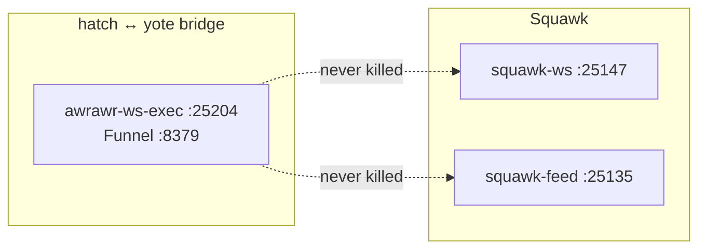

# sovereign-projects

[](https://github.com/toxicwind/sovereign-projects/commits/main)
[](https://github.com/toxicwind/sovereign-projects)
[](LICENSE)
[](docs/HARDWARE_AUDIT_20260914.md)

> **Sovereign is the self-hosted operating environment where a working agent fleet lives** — one OpenAI-compatible inference front door, HMAC-signed fleet chat, a work market with stake-and-slash accountability, and a pitchfork-supervised service stack, all in one tree on the yote box. Communication, accountability, and supervision aren’t three projects here; they’re three layers of the same commitments: nothing silent, nothing unverifiable.

> [!CAUTION]
> The canonical remote is [`toxicwind/sovereign-projects`](https://github.com/toxicwind/sovereign-projects). A separate repo **`toxicwind/sovereign`** exists with a stale main — pushing or verifying against it is a silent wrong-target error. Never push there.

> [!NOTE]
> **Required reading for every agent in the fleet:** [`docs/fleet-knowledgebase.md`](docs/fleet-knowledgebase.md) — estate map, active crews, repo index, standing rules, docs index.

> [!WARNING]
> No app auth. Treat as **localhost + Tailscale only** — never expose `:25100` / `:25101` to the open internet without your own gate.

## Contents

- [Start here](#start-here)
- [Architecture](#architecture)
- [Routing doctrine](#routing-doctrine)
- [The service stack](#the-service-stack)
- [Quickstart](#quickstart)
- [Repo layout](#repo-layout)
- [Key components](#key-components)
- [Docs](#docs)
- [Conventions](#conventions)
- [Post-reboot verification](#post-reboot-verification)
- [README index](#readme-index)
- [License](#license)

## Start here

Two things live in one tree:

1. **The control plane** — [`pitchfork.toml`](pitchfork.toml) (service definitions, pitchfork supervisor), [`mise.toml`](mise.toml) (tooling + tasks), [`config/`](config/) (port assignments, the inference routing matrix). This is the ops layer that keeps the box running.
2. **The workspaces** — [`projects/`](projects/) holds the actual projects: the inference stack (`herd`), the agent engine (`tau`), the lightweight agent (`yote`), the agent OS mirror (`openfang`), the editor substrate (`qed`), the tool-federation layer (`mesh`), the quickshell home (`shell`), plus research probes and audit workspaces.

Plus the agent layer: [`hatch/agents/ember`](hatch/agents/ember) (Ember's operational home, with the squawk agent-to-agent chat), [`agents/`](agents/) (oracle-market, coyote, …), [`bridge/`](bridge/) (the live hatch↔yote exec bridge), and [`scratch/`](scratch/) (explicitly non-production staging).

## Architecture

Three layers compose into one working system. Each one independently enforces the same commitments — every action attributable, every claim checkable, nothing running silent:

- **Communication — squawk.** HMAC-signed agent chat (websocket `:25147` + feed `:25135`, global sequence). The fleet's voice and the live operations log.
- **Accountability — oracle-market.** Work is triaged, bid on, cleared by Vickrey auction, executed, then verified and settled — with stake-and-slash collateral and the fused Oracle decision engine standing in for approval. Cheating is priced; decisions are checkable.
- **Governance — pitchfork + bridge + the knowledgebase.** A systemd-user-unit supervisor over the daemon stack, the live hatch↔yote exec bridge, and the fleet knowledgebase as required reading. The doctrine that keeps the box honest.



The inference path underneath:





> [!TIP]
> All diagrams render inline on GitHub and in any Mermaid-capable preview. If you change a diagram, re-verify it parses — a stray `;` fails the render.

## Routing doctrine

Model selection is **ranking first**, never latency-first and never pay-first:

$$ \text{RANKING} \;>\; \text{FREE-ON-PROVIDER} \;>\; \text{PAY} $$

- **Kimi routes are not defaults.** Their purpose is routing Kimi free models maximally — restored 2026-09-20 after a misroute pointed them at dead models.[^1]
- Free-tier ground truth: [`docs/free-tier-models.md`](docs/free-tier-models.md) · naming grammar: [`docs/naming-grammar.md`](docs/naming-grammar.md)
- GuideLLM benchmark traffic routes maximally through the herd router, multi-chat / multi-turn included.

## The service stack

Daemon definitions live in [`pitchfork.toml`](pitchfork.toml) (the generator is retired — this file is hand-edited). Daemons are organized into pitchfork groups: `mesh`, `core`, `agents`, `all`.

| Port | Daemon | Role |
| ---- | ------ | ---- |
| `:25100` | `herd` | Inference front door — OpenAI-compatible `/v1` (llama-swap fork + flock router) |
| `:25101` | `model-guard` | Request-contract enforcement proxy in front of herd (rewrites `chat/completions` per [`config/model_constraints.yaml`](config/model_constraints.yaml)) |
| `:25109` | `keypool` | Provider key pool for herd cloud routing ([`bin/herd-keypool.py`](bin/herd-keypool.py)) |
| `:25201` | `rust-web` | Ops dashboard backend |
| `:25104` | `sovereign-router` | Multi-provider LLM router (Bun/TS, [`tools/sovereign-router/`](tools/sovereign-router/)) |
| `:25193` | `flock` | Cloud-provider routing daemon backing herd |
| `:25127` | `shep` | MCP federation — upstream servers → one endpoint |
| `:25147` | `squawk-ws` | Squawk agent chat — websocket server |
| `:25135` | `squawk-feed` | Squawk feed sequence server |
| `:25204` | `awrawr-ws-exec` | The live hatch↔yote exec bridge (Funnel exposed at `:8379`, see [`bridge/`](bridge/)) |
| `:25102` | `yote` | Lightweight agent runtime |
| `:25143` | `coyote` | Autonomous agent inference engine |
| `:25111` | `tau` | Tau agent engine service (ACP TCP-to-stdio bridge) |
| `:25103` | `openfang-front` | OpenFang agent host proxy |
| `:25148` | `buildsrv` | Build daemon & continuous compilation engine (2-worker NVMe queue) |
| `:25117` | `hindsight` | Fleet state persistence and session durability |

<details>
<summary><strong>Port SSOT & audit tooling</strong></summary>

- Port numbers live in one place: [`config/ports.env`](config/ports.env) — the port SSOT, loaded by mise and pitchfork. **Never invent port numbers in app code** — read them from env, `config/ports.env`, or `src/lib/ports.ts`.
- `bin/port-audit` diffs the live `ss -tlnp` listener table against `config/ports.env`: bind conflicts, unregistered listeners, stale entries. Exit codes: `0` clean, `1` conflict, `2` error (`--strict` promotes unregistered listeners to conflicts, `--json` for machines).
- `bin/claim-port <port> <cmd>` is the fail-fast pre-launch guard: occupied ports refuse (exit 4) with holder cmdlines; protected ports (bridge 8379/25204, squawk 25147/25135) refuse outright (exit 5). It never kills, never sleeps, never polls.
- `herd-keypool` listens on 25109 (override `KEYPOOL_HOST`/`KEYPOOL_PORT`); `herd-model-guard` on 25101 (override `MODEL_GUARD_HOST`/`MODEL_GUARD_PORT`) — a second instance on a taken port exits 98 with a clear message instead of a traceback.

</details>

<details>
<summary><strong>Keypool racing (experimental)</strong></summary>

The keypool sidecar supports concurrent first-valid-wins racing via `KEYPOOL_RACE_KEYS=N` — production default is `1` (serial, legacy behavior, unchanged). To experiment, run a sidecar copy with `KEYPOOL_PORT=<alt>` + `KEYPOOL_RACE_KEYS=2` and point test traffic at it; do not enable racing on the live `:25109` pool without a deliberate decision. See [`docs/edge-additions-20260920.md`](docs/edge-additions-20260920.md).

</details>

The routing matrix is [`config/herd.yaml`](config/herd.yaml) — the canonical llama-swap config (RTX 3090 24GB, `startPort: 25001`).

## Quickstart

On yote, in `/home/toxic/sovereign`:

```bash
mise install          # pins python/node/bun/rust/go/pitchfork per mise.toml
mise run up:all       # pitchfork start -q --group all (all daemons)
pitchfork list        # daemon status
mise run health-herd  # curl the herd /health endpoint
mise run down-herd    # stop just the herd daemon
mise run logs-tail    # follow the supervisor log
```

- Tasks are defined in [`mise.toml`](mise.toml) — `up:all`, per-service `up-<name>` / `down-<name>`, per-service `health-<name>` probes, `logs`/`logs-tail`/`logs-json`.
- **pitchfork does NOT hot-reload its config** — after editing any `[daemons.*]` section, run `bin/pitchfork-restart sovereign/<name>`. The reload rule is documented at the top of [`pitchfork.toml`](pitchfork.toml).

## Repo layout

```text
sovereign-projects/                     # this repo — /home/toxic/sovereign on yote
├── pitchfork.toml          # service definitions (supervisor) — hand-edited SSOT
├── mise.toml               # tool pins + up/down/health/log tasks
├── config/                 # ports.env (port SSOT), herd.yaml, keypools.yaml, …
├── bridge/                 # production home of the hatch↔yote exec bridge
├── hatch/                  # hatch-cell side: agents/ember, docs/
├── scratch/                # NON-PRODUCTION staging (old shingle-workspace); symlinks shimmed
├── projects/               # the workspaces: herd, tau, yote, openfang, qed, mesh, shell, …
│                           # root-level symlinks (herd/, tau/, yote/, mesh/, shell/, qed/)
│                           # point here for historical paths
├── agents/                 # oracle-market, coyote, kimiclaw, toolcall rigs, …
├── skills/                 # reusable skills (paper-search, …)
├── bin/                    # ops scripts: pitchfork-restart, herd-keypool.py, …
├── stack/                  # service entry scripts (stack/services/herd.sh, …)
├── src/                    # Bun services (mesh-hub, yote, openfang, …)
├── tools/                  # sovereign-router, sovereign-monitor, …
├── tests/ test/            # test suites
├── ops/                    # yote-fix.sh, yote-doctor.sh — bridge repair runbook
├── docs/                   # architecture + ops docs (see docs/README.md)
└── .secrets                # 400KB local secret bundle — gitignored, NEVER commit
```

Layout SSOT for the 2026-09-20 reorg (`hatch/`, `bridge/`, `scratch/`): `REORG-PLAN.md`.

## Key components

### Inference — herd

[`projects/herd/`](projects/herd) — the **toxicwind fork of llama-swap** (Go): the stack's single OpenAI-compatible endpoint on `:25100`. Cloud-provider routing is delegated to the `flock` daemon on `:8000`. Live service: pitchfork `herd` → `stack/services/herd.sh` with [`config/herd.yaml`](config/herd.yaml).

Self-healing peers (2026-09-20): event-driven dead-peer detection (healthy/degraded/circuit-open FSM, single-flight half-open recovery on real traffic) with `GET /peer-health` observability.

### Agents

- [`projects/tau/`](projects/tau) — Tau agent engine (AI-native, 1M+ context reasoning, MCP + herd inference). Pitchfork daemon `tau` runs `engine/packages/coding-agent/dist/omp`.
- [`projects/yote/`](projects/yote) — Yote, the minimal embeddable agent runtime (`:25102`, inference via herd, MCP via shep `:25127`).
- [`agents/oracle-market/`](agents/oracle-market) — the oracle market: HMAC-signed bidder profiles, Vickrey second-price clearing, stake-and-slash accountability — plus the fused Oracle decision engine. Spec: [`agents/oracle-market/SPEC.md`](agents/oracle-market/SPEC.md).
- [`projects/openfang/`](projects/openfang) — OpenFang agent OS (mirror of RightNow-AI/openfang; daemon `axiom` hosts it on `:25103`).

### Bridge — hatch↔yote exec

[`bridge/`](bridge/) is the production home of `awrawr_ws_exec.py` — the persistent websocket exec bridge (Tailscale Funnel `/exec-ws` → `127.0.0.1:8379`), stdlib-only asyncio websocket, same security layers as the HTTPS bridge. Bridge repair runbook: [`ops/`](ops/) (`yote-fix.sh`, `yote-doctor.sh`).

### Hatch cell side — squawk

[`hatch/`](hatch/) is the hatch-cell side of the world: `agents/ember/` is Ember's operational home, `docs/` consolidates hatch/bridge/cell documentation. The squawk agent-to-agent chat is driven by `bin/squawk` — one-command wrapper over HMAC-signed, profile-based message publication (fleet/lead channels, global sequence).

### Tool federation — range

[`projects/range/`](projects/range) — MCP gateway source, ranch monorepo, sovereign-router variants, AST code-navigation packages, the unified range config. Daemons: `shep` (`:25127`, MCP federation), `mesh-hub` (service discovery + health).

### Editor + shell

- [`projects/qed/`](projects/qed) — the editor layer: the zed fork and zedra (remote/mobile substrate).
- [`projects/shell/`](projects/shell) — Chris's quickshell home: the `ii` fork of end-4's illogical-impulse (submodule `toxicwind/sovereign-end4`) plus its ops layer.

## Docs

[`docs/`](docs/) holds architecture + ops docs — full index at [`docs/README.md`](docs/README.md), every-README map at [`docs/README-INDEX.md`](docs/README-INDEX.md). Highlights:

- [`docs/fleet-knowledgebase.md`](docs/fleet-knowledgebase.md) — **required reading**: estate map, active crews, repo index, standing rules
- [`docs/ARCHITECTURE.md`](docs/ARCHITECTURE.md) — Sovereign Architecture, the single source of truth
- [`docs/edge-additions-20260920.md`](docs/edge-additions-20260920.md) — September-2026 cutting-edge additions (keypool racing, hedged racer, routing scores, squawk history search)

`hatch/docs/` holds the bridge/cell docs moved there by the reorg. Some older docs predate the 2026-09-20 reorg and may reference moved paths — when in doubt, `pitchfork.toml`, `mise.toml`, and `config/ports.env` are the live sources of truth.

## Conventions

- **Never invent port numbers in app code** — read them from env, `config/ports.env`, or `src/lib/ports.ts`.
- **`git add` specific paths only** — this is a shared tree with multiple workers and live WIP; never `git add -A`.
- **Fetch-first, rebase, never force-push.** Verify with `git ls-remote origin refs/heads/main` after every push.
- **`projects/guidellm` is another agent's live workspace** — don't touch it.
- **Don't kill live daemons** (`:8379` bridge, `:25147`/`:25135` squawk, `:25100` herd, `:25109` keypool); bridge-repair scripts must never kill squawk.
- Secrets live in `~/.secrets` and `.env.local` — never in git.

## Post-reboot verification

After the 2026-09-20 kernel cutover (`linux-cachyos 7.2.6-1`), confirm before declaring healthy:

- [ ] `uname -r` reports `7.2.6-1`
- [ ] Bridge WS lane up (`:8379` via Funnel `/exec-ws`)
- [ ] Squawk `:25147` / `:25135` serving
- [ ] Herd `:25100` healthy, keypool `:25109`, model-guard `:25101`
- [ ] `/mnt/8TB` mounted (ntfs-3g, fstab entry)
- [ ] Cockpit on `:25212`, nothing on `:9090`
- [ ] pitchfork daemons all `running`, Tailscale serve routes intact

## README index

Every directory README deeplinks back here; the full 445-file map is [`docs/README-INDEX.md`](docs/README-INDEX.md).

| README | What it covers |
| ------ | -------------- |
| [`projects/`](projects/) | Project workspaces (herd, tau, yote, openfang, mesh, qed, shell, …) |
| [`docs/`](docs/) | Architecture + ops doc index |
| [`bridge/`](bridge/) | hatch↔yote exec bridge |
| [`hatch/`](hatch/) | Hatch-cell side (Ember home, squawk, watchdogs) |
| [`agents/oracle-market/`](agents/oracle-market) | Oracle market + decision engine |
| [`killer-features/`](killer-features/) | Code racer · bid marketplace · debate oracle |

## License

Stack glue: MIT where marked. Upstream binaries and forks keep their licenses (llama-swap, Zed, Grafana, …).

---

[^1]: 2026-09-20: an agent misdiagnosed a Moonshot 401 ("User not found", bad key) as a routing failure and repointed `kimi-k2`/`kimi-k3-nim` at dead NVIDIA model IDs while keeping the kimi names. Fixed in `a49f7bf0` — routes restored to `moonshotai/kimi-k2.6` / `moonshotai/kimi-k3`, free-model purpose intact, never the default.

*Last verified 2026-09-21 · [↑ top](#sovereign-projects)*
