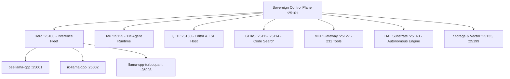

# 🔱 Sovereign Master Architecture

> **The unified, sovereign computing substrate. All inference engines, agent runtimes, tool federations, and developer environments consolidated into one 26/26 Always-On master orchestration suite.**  
> Canonical Monorepo & Control Plane: **[toxicwind/sovereign](https://github.com/toxicwind/sovereign)**

---

## 🌌 Unified Ecosystem Map

Sovereign is the single authoritative control plane that consolidates, manages, and orchestrates all individual sub-projects and daemon runtimes:



### Component Taxonomy & Sub-Project Registry

| Sovereign Subsystem | Canonical Identity | Port | Core Role & Capabilities |
|---|---|---|---|
| **Inference Router** | **Herd** (`llama-swap`) | `:25100` | 75 active models, AST Matrix routing, zero-downtime SSE keepalive, local GGUF fleet |
| **Autonomous Agent** | **Tau** (`pi-agent` / `omp`) | `:25125` | 1,000,000 token context window, 11-tool advisor suite, safe execution interceptor |
| **AI-Native Editor** | **QED** (`zed` / `zedra`) | `:25130` | High-performance GPUI editor, remote Zed host, LSP server integration |
| **High-Recall Search** | **GHAS** (`github-advanced-search`) | `:25112`–`:25114` | Blackbird-compatible API, HTTP MCP server, Next.js search UI |
| **Tool Federation** | **mcpproxy-go** | `:25127` | 231 approved tools across 18 MCP servers with 0 quarantined |
| **Agent Inference OS**| **HAL Substrate** | `:25143` | Autonomous reasoning loop with Yote & AST Matrix integration |
| **Agent Kernel OS** | **OpenFang** | `:25103` | 206 models, 61 skills, WebChat (:25203) |
| **C++ Inference Node**| **beellama-cpp** | `:25001` | CUDA 8.6 Flash-Attention LLM server for EXAONE 1.2B |
| **C++ Inference Node**| **ik-llama-cpp** | `:25002` | Defrag & fit-margin LLM server for Heretic 27B |
| **C++ Inference Node**| **llama-cpp-turboquant**| `:25003` | Turboquant 96k-context inference engine for Gemma 12B |
| **Vector DB** | **qdrant** | `:25133` | Embeddings and semantic vector search |
| **Session Cache** | **valkey / redis** | `:25199` | In-memory key-value state & token caching |
| **Ops Telemetry** | **rust-web & prometheus** | `:25201`, `:25105` | Watchdog dashboard, Prometheus TSDB, Grafana (:25110) |

---

## ⚡ Workstation Hardware Acceleration

Every component in Sovereign is compiled and tuned natively for the workstation:
- **CPU**: AMD Ryzen 7 8700F (8 Cores / 16 Threads, Zen 4 `znver4`)
  - Full vectorization: `AVX-512` (F, DQ, CD, BW, VL, VNNI, BF16, IFMA), `AVX2`, `FMA`, `BMI1/2`, `SHA-NI`
- **GPU**: NVIDIA GeForce RTX 3090 (24GB VRAM, Compute Capability 8.6, CUDA 8.6, Flash Attention 2)
- **RAM**: 62 GB High-Speed DDR5
- **Build Caching**: Unified `sccache` (20GB) + `ccache` (50GB) + `mold` 16-thread linker

---

## 🛠️ Management & Live Control

```bash
cd /home/toxic/sovereign

# Full status check of all 26 always-on services
mise run status

# Health watchdog verification
mise run health

# Supervisor control via pitchfork-llm
pitchfork-llm list
```
