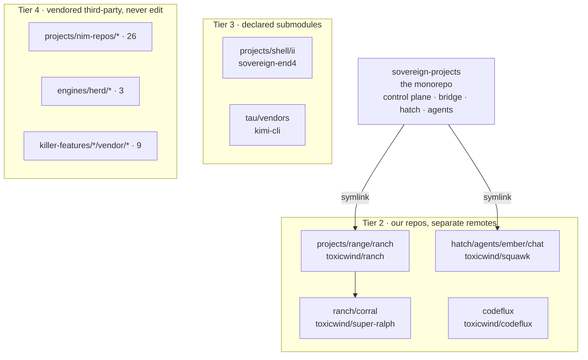
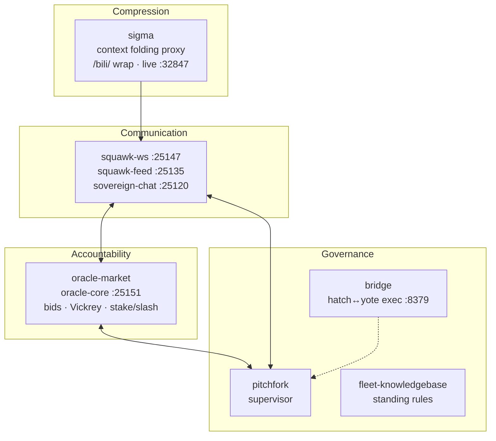
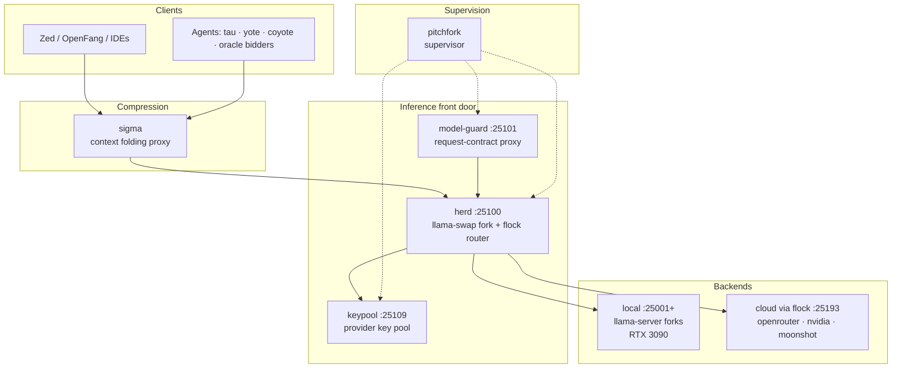
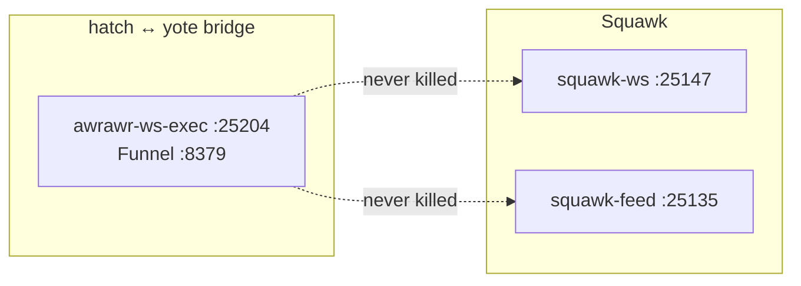

# sovereign-projects

<div align="right">

[](https://github.com/toxicwind/sovereign-projects/commits/main)
[](https://github.com/toxicwind/sovereign-projects)
[](LICENSE)
[](docs/HARDWARE_AUDIT_20260914.md)

</div>

> **Sovereign is the self-hosted operating environment where a working agent fleet lives** — one OpenAI-compatible inference front door, a compression layer that folds every long context, HMAC-signed fleet chat, a work market with stake-and-slash accountability, and a pitchfork-supervised service stack, all in one tree. Communication, accountability, and supervision are not three projects here; they are three layers of the same commitments: nothing silent, nothing unverifiable.

> [!CAUTION]
> The canonical remote is [`toxicwind/sovereign-projects`](https://github.com/toxicwind/sovereign-projects). A separate repo **`toxicwind/sovereign`** exists with a stale main — pushing or verifying against it is a silent wrong-target error. Never push there.

> [!NOTE]
> **Required reading for every agent in the fleet:** [`docs/fleet-knowledgebase.md`](docs/fleet-knowledgebase.md) — estate map, active crews, repo index, standing rules, docs index.

> [!WARNING]
> No app auth. Treat as **localhost + Tailscale only** — never expose `:25100` / `:25101` to the open internet without your own gate.

## Contents

- [Start here](#start-here)
- [Repository topology](#repository-topology)
- [Architecture](#architecture)
- [Routing doctrine](#routing-doctrine)
- [The service stack](#the-service-stack)
- [Quickstart](#quickstart)
- [Repo layout](#repo-layout)
- [Key components](#key-components)
- [Docs](#docs)
- [Conventions](#conventions)
- [Post-reboot verification](#post-reboot-verification)
- [README index](#readme-index)
- [License](#license)

## Start here

Two things live in one tree:

1. **The control plane** — [`pitchfork.toml`](pitchfork.toml) (service definitions, pitchfork supervisor), [`mise.toml`](mise.toml) (tooling + tasks), [`config/`](config/) (port assignments, the inference routing matrix). This is the ops layer that keeps the box running.
2. **The workspaces** — [`projects/`](projects/) holds the actual projects: the ranch monorepo under [`projects/range/ranch/`](projects/range/ranch/) (herd, tau, sigma, flock, vansrouter, boundless, paddock, stream-broker), the range MCP gateway, the ranch tool-federation layer, plus the agent runtimes (yote, openfang), the editor substrate (qed), the quickshell home (shell), and research and audit probes.

Plus the agent layer: [`hatch/agents/ember`](hatch/agents/ember) (Ember's operational home, with the squawk agent-to-agent chat), [`agents/`](agents/) (oracle-market, coyote, …), [`bridge/`](bridge/) (the live hatch↔yote exec bridge), and [`scratch/`](scratch/) (explicitly non-production staging).

**Where things actually run.** This checkout lives on **awrawr-pc**; the service stack described below is supervised on the **yote** box. Do not infer a daemon's health from `ss -tlnp` on this host — verify against `pitchfork.toml` and `config/ports.env`, which are the real sources of truth.

## Repository topology

`sovereign-projects` is nominally one monorepo, but the working tree holds several kinds of repository at once. Knowing which is which is the difference between committing a change and losing it.

**The four tiers.**

| Tier | What it is | How to spot it | Where changes go |
| ---- | ---------- | -------------- | ---------------- |
| **1. The monorepo** | Tracked directly by `toxicwind/sovereign-projects`. | No nested `.git`. | Commit here, `git add <path>`. |
| **2. Nested repo** | Separate checkout with its own remote, developed independently. | `.git` is a directory and `git remote get-url origin` returns one of ours. | Commit inside it and push its own remote. A commit in the monorepo does not include it. |
| **3. Submodule** | Pinned external code declared in [`.gitmodules`](.gitmodules). | `.git` is a *file*, not a directory. | Never edit. Move the pin with `git submodule update --remote`. |
| **4. Vendored third-party** | Read-only upstream checkout kept for reference. | `.git` present, remote owned by someone else. | Never edit, never push. |

**Tier 1, the monorepo proper:** `config/`, `bin/`, `bridge/`, `hatch/` (except `agents/ember/chat`), `agents/`, `skills/`, `packages/`, `src/`, `stack/`, `ops/`, `tools/` (except `nuvio-platform/submodules`), `tests/`, `docs/`, and the top-level `pitchfork.toml` and `mise.toml`.

**Tier 2, our own repos, developed separately:**

| Path | Remote |
| ---- | ------ |
| `projects/range/ranch/` | `toxicwind/ranch` |
| `projects/range/ranch/corral/` | `toxicwind/super-ralph` |
| `hatch/agents/ember/chat/` | `toxicwind/squawk` |
| `projects/guidellm/` | `toxicwind/guidellm` |
| `projects/outlier-toolkit/` | `toxicwind/outlier-toolkit` |
| `projects/wezterm/` | `toxicwind/wezterm` |
| `codeflux/` | `toxicwind/codeflux`, plus 4 forks under `codeflux/forks/` |

**Tier 3, the only two declared submodules:**

| Path | Remote | Note |
| ---- | ------ | ---- |
| `projects/shell/ii/` | `toxicwind/sovereign-end4` | Checked out. |
| `tau/vendors` | `MoonshotAI/kimi-cli` | Root `tau/`, not `projects/tau`. Not initialized. |

**Tier 4, vendored third-party, about 45 repos, never edit:** `projects/nim-repos/*` (26 NVIDIA-NIM community routers), `killer-features/*/vendor/*` (9 debate and auction research repos), `engines/herd/*` (3 llama.cpp forks: `beellama.cpp`, `ik_llama.cpp`, `llama-cpp-turboquant`), `projects/AURKA`, `projects/extagents`, `projects/llm-mapreduce`, `projects/deprecated/9router`, and 11 vendored submodules under `tools/nuvio-platform/submodules/`.

**Three name collisions to keep straight.**

| Name | One meaning | The other meaning |
| ---- | ----------- | ----------------- |
| `tau` | `tau/` at the root, a **bazel** tree | `projects/tau/` → `stockyard/tau`, the **bun** agent engine on `:25111` |
| `herd` | `engines/herd/`, C++ inference **engine** forks | `projects/herd/` → `stockyard/herd`, the **Go** router on `:25100` |
| `squawk` | `projects/range/ranch/squawk/` and `squawk-ws/`, the **servers** | `hatch/agents/ember/chat/`, the **client**, a separate repo |

**Stale leftovers, belonging to no tier — now archived.** These were abandoned worktrees and scratch clones from 2026-09-14 through 2026-09-20 whose `.git` files pointed into `.git/worktrees/`, a directory `git worktree list` no longer registered, so `git` could not resolve them at all. On 2026-09-27 they were moved, not deleted, to `.archive-20260920/orphaned-worktrees-20260927/` and recorded in that directory's `MANIFEST.md`: `bench-wt-tau/`, `merge-main-20260914/`, `mesh-bruteforce-20260914/`, `modelpush-71728/`, `wt-hft-hygiene-20260914/`, `kimi-audit-scratch-20260914/` (a nested clone of this very repo, 141 MB), and `.git.broken-2026-09-24T15-42-58-450Z/` (a partial copy of `.git/hooks`, superseded by the intact one). `mv` back to restore.

One of the old entries was **not** a leftover: `.merge-state.json` is live `bun` state recording `patchedDependencies` for `patches/@ark%2Fschema@0.56.2.patch` and `patches/puppeteer-core@25.3.0.patch`. Both patches exist, so deleting it would break `bun install`. It stays.

**The rule.** Before editing any directory, run `git remote get-url origin` inside it. No output means the monorepo, so commit here. Output means it is its own repository, so commit there.


```mermaid
flowchart TB
    SP["sovereign-projects<br/>the monorepo<br/>control plane · bridge · hatch · agents"]
    subgraph nested["Tier 2 · our repos, separate remotes"]
        RANCH["projects/range/ranch<br/>toxicwind/ranch"]
        CORRAL["ranch/corral<br/>toxicwind/super-ralph"]
        SQ["hatch/agents/ember/chat<br/>toxicwind/squawk"]
        CF["codeflux<br/>toxicwind/codeflux"]
    end
    subgraph sub["Tier 3 · declared submodules"]
        II["projects/shell/ii<br/>sovereign-end4"]
        KV["tau/vendors<br/>kimi-cli"]
    end
    subgraph vend["Tier 4 · vendored third-party, never edit"]
        NIM["projects/nim-repos/* · 26"]
        ENG["engines/herd/* · 3"]
        KILL["killer-features/*/vendor/* · 9"]
    end
    RANCH --> CORRAL
    SP -->|symlink| RANCH
    SP -->|symlink| SQ
```

Note that `stockyard/` lives inside `projects/range/ranch/`, so `projects/herd`, `projects/tau`, and `projects/sigma` are symlinks into the `ranch` repo rather than directories tracked by this one.

## Architecture

Five layers compose into one working system. Each independently enforces the same commitments — every action attributable, every claim checkable, nothing running silent:

- **Compression — sigma.** A transparent HTTP proxy in front of inference. It wraps upstream URLs under `/bili/`, streams the response, and folds the conversation into a compact digest at a token boundary. Long context stops costing long context.
- **Communication — squawk.** HMAC-signed agent chat (websocket `:25147` + feed `:25135`, global sequence). The fleet's voice and the live operations log.
- **Accountability — oracle-market.** Work is triaged, bid on, cleared by Vickrey auction, then executed and settled. Stake-and-slash collateral backs every bid, and the fused Oracle decision engine stands in for human approval. Cheating is priced. Decisions are checkable.
- **Governance — pitchfork + bridge + the knowledgebase.** A supervisor over the daemon stack, the live hatch↔yote exec bridge, and the fleet knowledgebase as required reading.
- **Execution — herd.** One OpenAI-compatible endpoint on `:25100` that every client, local model, and cloud provider routes through.


```mermaid
flowchart TB
    subgraph ctx["Compression"]
        SIG[sigma<br/>context folding proxy<br/>/bili/ wrap · live :32847]
    end
    subgraph comm["Communication"]
        SQ[squawk-ws :25147<br/>squawk-feed :25135<br/>sovereign-chat :25120]
    end
    subgraph acct["Accountability"]
        OM[oracle-market<br/>oracle-core :25151<br/>bids · Vickrey · stake/slash]
    end
    subgraph gov["Governance"]
        PF[pitchfork<br/>supervisor]
        BR[bridge<br/>hatch↔yote exec :8379]
        KB[fleet-knowledgebase<br/>standing rules]
    end
    SIG --> SQ
    SQ <--> OM
    OM <--> PF
    SQ <--> PF
    BR -.-> PF
```

The inference path underneath:


```mermaid
flowchart TB
    subgraph clients["Clients"]
        ZED[Zed / OpenFang / IDEs]
        AG[Agents: tau · yote · coyote · oracle bidders]
    end
    subgraph ctx["Compression"]
        SIG[sigma<br/>context folding proxy]
    end
    subgraph frontdoor["Inference front door"]
        HERD[herd :25100<br/>llama-swap fork + flock router]
        MG[model-guard :25101<br/>request-contract proxy]
        KP[keypool :25109<br/>provider key pool]
    end
    subgraph backends["Backends"]
        LOCAL[local :25001+<br/>llama-server forks<br/>RTX 3090]
        CLOUD[cloud via flock :25193<br/>openrouter · nvidia · moonshot]
    end
    ZED --> SIG
    AG --> SIG
    SIG --> HERD
    MG --> HERD
    HERD --> KP
    HERD --> LOCAL
    HERD --> CLOUD
    subgraph supervise["Supervision"]
        PF2[pitchfork<br/>supervisor]
    end
    PF2 -.-> HERD
    PF2 -.-> MG
    PF2 -.-> KP
```


```mermaid
flowchart LR
    subgraph bridge2["hatch ↔ yote bridge"]
        WS[awrawr-ws-exec :25204<br/>Funnel :8379]
    end
    subgraph chat["Squawk"]
        SW[squawk-ws :25147]
        SF[squawk-feed :25135]
    end
    WS -.->|never killed| SW
    WS -.->|never killed| SF
```

> [!TIP]
> All diagrams render inline on GitHub and in any Mermaid-capable preview. If you change a diagram, re-verify it parses — a stray `;` fails the render.

## Routing doctrine

Model selection is **ranking first**, never latency-first and never pay-first:

$$ \text{RANKING} \;>\; \text{FREE-ON-PROVIDER} \;>\; \text{PAY} $$

- **Kimi routes are not defaults.** Their purpose is routing Kimi free models maximally — restored 2026-09-20 after a misroute pointed them at dead models.[^1]
- Free-tier ground truth: [`docs/free-tier-models.md`](docs/free-tier-models.md) · naming grammar: [`docs/naming-grammar.md`](docs/naming-grammar.md)
- GuideLLM benchmark traffic routes maximally through the herd router, multi-chat / multi-turn included.
- **A context window is a property of the serving process, not the model family.** Declare it per route rather than inheriting a family guess — `qwen2.5:7b` is 200K in `CONTEXT_LIMIT_TABLE` but Ollama serves 32,768 by default. See `projects/range/ranch/sigma` → `CONFIGURATION.md` → `### context`.

## The service stack

Daemon definitions live in [`pitchfork.toml`](pitchfork.toml) (the generator is retired — this file is hand-edited). It defines **76 daemons**; the majors are below. Daemons are organized into pitchfork groups: `mesh`, `core`, `agents`, `all`.

| Port | Daemon | Role |
| ---- | ------ | ---- |
| `:25100` | `herd` | Inference front door — OpenAI-compatible `/v1` (llama-swap fork + flock router) |
| `:25101` | `model-guard` | Request-contract enforcement proxy in front of herd (rewrites `chat/completions` per [`config/model_constraints.yaml`](config/model_constraints.yaml)) |
| `:25109` | `keypool` | Provider key pool for herd cloud routing ([`bin/herd-keypool.py`](bin/herd-keypool.py)) |
| `:25111` | `tau` | Tau agent engine, exposed as a TCP daemon by `chute` (stdio→TCP ACP) |
| `:25102` | `yote` | Lightweight agent runtime and chat/bot plane |
| `:25103` | `openfang-front` | OpenFang public proxy (renamed from `axiom` 2026-09-21) → kernel `:25196` |
| `:25143` | `coyote` | Autonomous agent inference engine |
| `:25193` | `flock` | Cloud-provider routing daemon backing herd |
| `:25127` | `gatehouse` | MCP federation (was `shep`) |
| `:25115` | `mesh-hub` | Service discovery + health ([`src/services/mesh-hub.ts`](src/services/mesh-hub.ts)) |
| `:25120` | `sovereign-chat` | Fleet chat web plane ([`tools/sovereign-chat/`](tools/sovereign-chat/)) |
| `:25147` | `squawk-ws` | Squawk agent chat — websocket server |
| `:25135` | `squawk-feed` | Squawk feed sequence server |
| `:25151` | `oracle-core` | Oracle decision engine |
| `:25204` | `awrawr-ws-exec` | The live hatch↔yote exec bridge (Funnel exposed at `:8379`, see [`bridge/`](bridge/)) |
| `:25201` | `rust-web` | Ops dashboard backend |
| `:25215` | `sovereign-stream-broker` | Socket Stream transport broker (UNIX + TCP, OS keepalive 30s) |
| `:25117` | `hindsight` | Fleet state persistence and session durability |
| `:25148` | `brand` | Build daemon & continuous compilation engine (2-worker NVMe queue) |
| `:25197` | `boundless` | Boundless web service |
| `:20128` | `vansrouter` | Source-owned VansRouter runtime |
| `:32847` | `billion-context` | Sigma's compression proxy in its default local instance |

Undocumented-by-design remainder: infrastructure and on-demand daemons (`qdrant`, `redis`/valkey, `kafka`, `nginx`, `prometheus`, `grafana`, `node-exporter`, `cockpit` on `:25212`, `windmill`, `paper-poller`, `bench-radar`, `hf-downloader`, …). `pitchfork.toml` is the index; this table is orientation, not inventory.

<details>
<summary><strong>Port SSOT &amp; audit tooling</strong></summary>

- Port numbers live in one place: [`config/ports.env`](config/ports.env) — the port SSOT, loaded by mise (`_.file` in `mise.toml`) and by pitchfork. **Never invent port numbers in app code** — read them from env, `config/ports.env`, or `src/lib/ports.ts`.
- `bin/port-audit` diffs the live `ss -tlnp` listener table against `config/ports.env`: bind conflicts, unregistered listeners, stale entries. Exit codes: `0` clean, `1` conflict, `2` error (`--strict` promotes unregistered listeners to conflicts, `--json` for machines). It is a thin wrapper over `bin/port-audit.py`.
- `bin/claim-port <port> <cmd>` is the fail-fast pre-launch guard: occupied ports refuse (exit 4) with holder cmdlines; protected ports (bridge 8379/25204, squawk 25147/25135) refuse outright (exit 5). It never kills, never sleeps, never polls.
- `herd-keypool` listens on 25109 (override `KEYPOOL_HOST`/`KEYPOOL_PORT`); `herd-model-guard` on 25101 (override `MODEL_GUARD_HOST`/`MODEL_GUARD_PORT`) — a second instance on a taken port exits 98 with a clear message instead of a traceback.

</details>

<details>
<summary><strong>Socket Stream &amp; Cognitive EKG</strong></summary>

- The **Socket Stream Transport** ([`packages/sovereign-utils/src/transport/socket-stream.ts`](packages/sovereign-utils/src/transport/socket-stream.ts)) provides OS-level TCP keepalives (30s) to prevent middlebox drops in long-running reasoning SSE streams. Components: `SocketStreamConfig`, `RingTokenBuffer` (append-only ring buffer for token recovery across network interrupts), and `DirectSocketStreamClient`.
- The **Stream Broker** daemon ([`projects/range/ranch/stream-broker/`](projects/range/ranch/stream-broker/)) listens on UNIX socket (`/run/user/1000/sovereign-stream-broker.sock`) and TCP port `:25215`. Supervised by pitchfork with auto-restart.
- The **Cognitive EKG** monitoring layer (`herd-model-guard.py`) wraps all request/response lifecycles in `try/except (BrokenPipeError, ConnectionResetError)` to prevent server thread crashes on client disconnects. Audit trail at `data/model-guard-audit.jsonl`.
- Full architecture spec: [`docs/architecture/socket-stream-cognitive-ekg.md`](docs/architecture/socket-stream-cognitive-ekg.md).

</details>

<details>
<summary><strong>Keypool racing (experimental)</strong></summary>

The keypool sidecar supports concurrent first-valid-wins racing via `KEYPOOL_RACE_KEYS=N` — production default is `1` (serial, legacy behavior, unchanged). To experiment, run a sidecar copy with `KEYPOOL_PORT=<alt>` + `KEYPOOL_RACE_KEYS=2` and point test traffic at it; do not enable racing on the live `:25109` pool without a deliberate decision. See [`docs/edge-additions-20260920.md`](docs/edge-additions-20260920.md).

</details>

The routing matrix is [`config/herd.yaml`](config/herd.yaml) — the canonical llama-swap config (RTX 3090 24GB, `startPort: 25001`).

## Quickstart

On the box that hosts the stack, in `/home/toxic/sovereign`:

```bash
mise install          # pins python/node/bun/rust/go/pitchfork per mise.toml
mise run up:all       # pitchfork start -q --group all (all daemons)
pitchfork list        # daemon status
mise run health-herd  # curl the herd /health endpoint
mise run down-herd    # stop just the herd daemon
mise run logs-tail    # follow the supervisor log
```

- Tasks are defined in [`mise.toml`](mise.toml) — `up:all`, per-service `up-<name>` / `down-<name>` / `restart-<name>`, per-service `health-<name>` probes, `logs` / `logs-tail` / `logs-json`, and `svc-check` (the all-in-one probe that reports `PASS`/`FAIL` per port). Script-shaped tasks live as files in [`mise/tasks/`](mise/tasks/) — `up`, `down`, `health`, `status`, `doctor`; local overrides in [`mise.local.toml`](mise.local.toml).
- **pitchfork does NOT hot-reload its config** — after editing any `[daemons.*]` section, run `bin/pitchfork-restart sovereign/<name>`. The reload rule is documented at the top of [`pitchfork.toml`](pitchfork.toml).

## Repo layout

```text
sovereign-projects/                     # this repo — /home/toxic/sovereign on yote
├── pitchfork.toml          # service definitions (supervisor) — hand-edited SSOT
├── mise.toml               # tool pins + up/down/health/log tasks
├── mise.local.toml         # local task overrides (fix-socket, …)
├── config/                 # ports.env (port SSOT), herd.yaml, keypools.yaml, tau/, …
├── bridge/                 # production home of the hatch↔yote exec bridge
├── hatch/                  # hatch-cell side: agents/ember, bin/squawk, docs/
├── scratch/                # NON-PRODUCTION staging (old fleet-workspace); symlinks shimmed
├── projects/               # the workspaces (see below)
│   ├── range/ranch/        # the ranch monorepo — stockyard + squawk + barn + gear
│   ├── yote/  qed/  shell/  openfang/  audits/  ops/  tools/
│   ├── herd -> range/ranch/herd      # root-level symlinks
│   ├── tau  -> range/ranch/tau       # point here for historical paths
│   └── sigma-> range/ranch/sigma
├── agents/                 # oracle-market, coyote, kimiclaw, squawk-relay, …
├── skills/                 # 29 hand-authored skills — skill root #1, see Key components
├── bin/                    # ops scripts: pitchfork-restart, herd-keypool.py, claim-port, …
├── packages/               # sovereign-utils, metaharness, sovereign-scripts, … + coding-agent -> ../projects/tau/packages/coding-agent
├── src/                    # Bun services (mesh-hub, mesh-front, …)
├── stack/                  # service entry scripts (stack/services/herd.sh, …)
├── tools/                  # sovereign-chat, sovereign-router, sovereign-monitor, …
├── tests/ test/            # test suites
├── ops/                    # openfang-run.sh — daemon run scripts
├── docs/                   # architecture + ops docs (see docs/README.md)
└── .secrets                # 400KB local secret bundle — gitignored, NEVER commit
```

Layout SSOT for the 2026-09-20 reorg (`hatch/`, `bridge/`, `scratch/`): `REORG-PLAN.md`.

## Key components

### Compression — sigma

[`projects/sigma/`](projects/sigma) → [`projects/range/ranch/sigma`](projects/range/ranch/sigma) — the **toxicwind fork of `billion-context`**: a transparent compression proxy that sits between agents and inference. Point a client at `http://127.0.0.1:32847/bili/<upstream-url>` and it streams the response while folding the conversation into a compact digest at a token boundary. Measured on the live log: ~5× token reduction, 28 ms added per compress call, proxy overhead p50 41 ms / p99 107 ms, prompt-cache hit rate p50 99.5%.

It runs as a **tau extension**, not a pitchfork daemon — [`config/tau/agent/config.yml`](config/tau/agent/config.yml) (what `~/.tau/agent` symlinks to) loads `billion-context/dist/agent/omp-native.js`. Because it compresses at the ACP layer, it applies to agent traffic specifically, not to every request herd serves. That file is the **only** config the engine reads: `PI_CODING_AGENT_DIR` must point at it, and `~/.tau` (the config root) is a *different* directory — pointing the variable there silently disables compression on a login-shell session.


Two upstream inputs make it maintainable: [`bin/upstream-pull.sh`](projects/sigma/bin/upstream-pull.sh) drives a mechanical preview/merge/sync against `upstream/master` (requires the `weave` driver — it checks before merging, because an absent driver makes the merge silently do the wrong thing), and [`.gitattributes`](projects/sigma/.gitattributes) pins golden-fixture line endings and routes structured files to `merge=weave`. [`FORK-NOTES.md`](projects/sigma/FORK-NOTES.md) records exactly what the fork changed. Upstream is `ranxianglei/billion-context`; the fork is `toxicwind/sigma` on `main`.

**The fork is what actually runs.** The live `:32847` daemon is the published npm package by default, so a fork build does nothing until it is deployed. [`tools/bili-deploy.sh`](tools/bili-deploy.sh) does the whole thing: build, verify that the five fork-only symbols are in the bundle, back the live `dist` up **by rename**, copy the new one in, restart the daemon, and check the live window. Two traps make this worth scripting. A running daemon keeps its old inode, so a copied `dist` looks deployed while the old code keeps serving; and the extension's watchdog cannot revive an orphaned daemon, because it only arms while a parent session lives. Both are handled, and both are verified rather than assumed. `--no-build` reuses the existing build, `--check` reports without changing anything, and the three most recent `dist.fork-*` backups are kept for rollback.

### Inference — herd

[`projects/herd/`](projects/herd) → `stockyard/herd` — the **toxicwind fork of llama-swap** (Go): the stack's single OpenAI-compatible endpoint on `:25100`. Cloud-provider routing is delegated to the `flock` daemon on `:25193`. Live service: pitchfork `herd` → `stack/services/herd.sh` with [`config/herd.yaml`](config/herd.yaml).

Self-healing peers (2026-09-20): event-driven dead-peer detection (healthy/degraded/circuit-open FSM, single-flight half-open recovery on real traffic) with `GET /peer-health` observability.

### Communication — squawk

[`projects/range/ranch/squawk-ws/`](projects/range/ranch/squawk-ws/) and [`squawk/`](projects/range/ranch/squawk/) — the fleet's voice. `squawk-ws` (`:25147`, `squawk_ws_server.py`) is the HMAC-signed websocket server; `squawk-feed` (`:25135`) is the append-only sequence feed; `squawk-relay-sink` / `squawk-relay-forward` bridge cells; `sovereign-chat` (`:25120`, [`tools/sovereign-chat/`](tools/sovereign-chat/)) is the web plane. Agent-facing entry points are [`hatch/bin/squawk`](hatch/bin/squawk) and `hatch/bin/squawk-fleet` — one-command wrappers over profile-based message publication on fleet/lead channels.

These daemons are **protected**: `bin/claim-port` refuses 25147 and 25135 outright, and bridge-repair scripts must never kill them.

### Accountability — oracle-market

[`projects/range/ranch/oracle/`](projects/range/ranch/oracle/) — the oracle market: HMAC-signed bidder profiles, Vickrey second-price clearing, stake-and-slash accountability, plus the fused Oracle decision engine (`oracle-core`, `:25151`) standing in for human approval. Spec: [`projects/range/ranch/oracle/SPEC.md`](projects/range/ranch/oracle/SPEC.md).

### Agents

- [`projects/tau/`](projects/tau) → `stockyard/tau` — Tau agent engine (AI-native, 1M+ context reasoning, MCP + herd inference). Pitchfork daemon `tau` (`:25111`) runs `chute` over `stockyard/tau/packages/coding-agent/dist/omp acp`, with the vansrouter extension loaded.
- [`projects/yote/`](projects/yote) — Yote: the lightweight agent runtime **and the chat/bot plane above OpenFang** (`:25102`). Inference via herd, MCP via gatehouse `:25127`. It is also the name of this box's own estate — see `projects/yote/CONSOLIDATION.md`.
- [`projects/openfang/`](projects/openfang) — OpenFang agent OS (mirror of RightNow-AI/openfang). **This directory is a placeholder**, not a checkout; the running kernel is served by [`ops/openfang-run.sh`](ops/openfang-run.sh) from `/home/toxic/projects/rig-work` with config `config/openfang-25196.toml`. `openfang-front` (`:25103`) is the public proxy, `openfang` (`:25196`) the kernel.
- [`agents/coyote/`](agents/coyote) — autonomous agent inference engine (`:25143`).

### Bridge — hatch↔yote exec

[`bridge/`](bridge/) is the production home of `awrawr_ws_exec.py` — the persistent websocket exec bridge (Tailscale Funnel `/exec-ws` → `127.0.0.1:8379`), stdlib-only asyncio websocket, same security layers as the HTTPS bridge.

### Hatch cell side

[`hatch/`](hatch/) is the hatch-cell side of the world: `agents/ember/` is Ember's operational home, `bin/` holds the squawk wrappers and health checks, `docs/` consolidates hatch/bridge/cell documentation.

### Tool federation — range

[`projects/range/`](projects/range) — the ranch monorepo and MCP gateway source. `stockyard/` holds the inference and agent engines (herd, tau, sigma, flock, vansrouter, boundless, paddock, stream-broker); `squawk` and `squawk-ws` hold fleet chat; `barn/` holds shared runtime plumbing such as `chute`; `gear/` holds the skill library. Daemons: `gatehouse` (`:25127`, MCP federation), `mesh-hub` (`:25115`, service discovery + health, [`src/services/mesh-hub.ts`](src/services/mesh-hub.ts)), `mesh-landing` (`:25207`). Herd's MCP gateway config also lives at `stockyard/herd/mesh/`.

### Skills — sovereign + gear

Two hand-maintained roots plus one machine-written root. Registration lives in one place: `skills.customDirectories` in `~/.tau/config.yml`.

| Root | Loaded | What it is |
| --- | --- | --- |
| [`skills/`](skills/) | 29 | hand-authored ops skills: `brand`, `cattle-manager`, `hft-latency`, `parquet-ml`, … |
| [`projects/range/ranch/gear/`](projects/range/ranch/gear) | 486 | the private skill library, flat by design — one directory per skill at the repo root |
| `config/tau/agent/managed-skills` | 17 | output of the autolearn `manage_skill` tool. **Must be a real directory, never a symlink** — `assertManagedRootSafe` refuses a symlinked root, so a symlink there silently breaks every managed write. |

532 skills load, 527 unique names. Measured with the real loader, not a `find` approximation.

**How the loader behaves** ([`discovery/helpers.ts`](projects/range/ranch/tau/packages/coding-agent/src/discovery/helpers.ts)):

- The registered roots are scanned at **depth 1**: `<dir>/<name>/SKILL.md`. A flat repo like `gear` is therefore registered by pointing at its root. Nothing is copied, symlinked, or hoisted into category folders, so every skill keeps its own code and its own relative references. `scanSkillsFromDir` also takes an opt-in `recursive` / `maxDepth` for a collection that groups skills by category; no caller enables it yet, and a directory containing a `SKILL.md` stays terminal so a skill's own `scripts/` and `references/` never become phantom skills.
- A skill with **no `description` in its frontmatter is dropped silently**. That is the most common way a skill becomes invisible.
- Precedence is **first wins**, and `customDirectories` outrank `~/.claude/skills`. Order matters: `skills/` is listed first, so it wins the 5 names it shares with `gear` (`brand`, `fleet-push`, `repo-audit`, `hft-latency`, `sovereign-chat`).
- The answer to "too many skills" is a registry plus on-demand install (`omp skill` / skillshare), not a directory reshuffle. Re-homing skills breaks the parent-relative paths they were written against.

**Audit them** with [`tools/skill-audit.ts`](tools/skill-audit.ts). It discovers the roots from the agent config itself, so registering a collection is enough to get it audited, and it reports dangling symlinks, missing frontmatter, name/directory mismatches, dead `skill://` and file references, and cross-root name collisions. Run it after touching any skill root:

```bash
bun tools/skill-audit.ts          # report; exit 1 on defects
bun tools/skill-audit.ts --fix    # repair names and synthesise frontmatter
```

### Editor + shell

- [`projects/qed/`](projects/qed) — the editor layer: the zed fork and zedra (remote/mobile substrate).
- [`projects/shell/`](projects/shell) — Chris's quickshell home: the `ii` fork of end-4's illogical-impulse (submodule `toxicwind/sovereign-end4`) plus its ops layer.

## Docs

[`docs/`](docs/) holds architecture + ops docs — full index at [`docs/README.md`](docs/README.md), every-README map at [`docs/README-INDEX.md`](docs/README-INDEX.md). Highlights:

- [`docs/fleet-knowledgebase.md`](docs/fleet-knowledgebase.md) — **required reading**: estate map, active crews, repo index, standing rules
- [`docs/ARCHITECTURE.md`](docs/ARCHITECTURE.md) — Sovereign Architecture, the single source of truth
- [`projects/sigma/FORK-NOTES.md`](projects/sigma/FORK-NOTES.md) — what the sigma fork changed versus upstream `billion-context`
- [`docs/edge-additions-20260920.md`](docs/edge-additions-20260920.md) — September-2026 additions (keypool racing, hedged racer, routing scores, squawk history search)

`hatch/docs/` holds the bridge/cell docs moved there by the reorg. Some older docs predate the 2026-09-20 reorg and may reference moved paths — when in doubt, `pitchfork.toml`, `mise.toml`, and `config/ports.env` are the live sources of truth.

## Conventions

- **Never invent port numbers in app code** — read them from env, `config/ports.env`, or `src/lib/ports.ts`.
- **`git add` specific paths only** — this is a shared tree with multiple workers and live WIP; never `git add -A`.
- **Fetch-first, rebase, never force-push.** Verify with `git ls-remote origin refs/heads/main` after every push.
- **`projects/guidellm` is another agent's live workspace** — do not touch it.
- **Do not kill live daemons** (`:8379` bridge, `:25147`/`:25135` squawk, `:25100` herd, `:25109` keypool). Bridge-repair scripts must never kill squawk.
- Secrets live in `~/.secrets` and `.env.local` — never in git.

## Post-reboot verification

After the 2026-09-20 kernel cutover, confirm before declaring healthy:

- [ ] `uname -r` reports the cachyos kernel (currently `7.2.6-1-cachyos-bore`)
- [ ] Bridge WS lane up (`:8379` via Funnel `/exec-ws`)
- [ ] Squawk `:25147` / `:25135` serving
- [ ] Herd `:25100` healthy, keypool `:25109`, model-guard `:25101`
- [ ] `/mnt/8TB` mounted (ntfs-3g, fstab entry)
- [ ] Cockpit on `:25212`, nothing on `:9090`
- [ ] pitchfork daemons all `running`, Tailscale serve routes intact

## README index

This is the short list. The full map of every README in the tree is [`docs/README-INDEX.md`](docs/README-INDEX.md). Note that the reverse link is the exception, not the rule — most of the 165 directory READMEs do not point back here, and there is no reason they should.

| README | What it covers |
| ------ | -------------- |
| [`projects/sigma/FORK-NOTES.md`](projects/sigma/FORK-NOTES.md) | The compression proxy that fronts inference, and what the fork changed |
| [`projects/`](projects/) | Project workspaces (herd, tau, sigma, yote, openfang, qed, shell, …) |
| [`docs/`](docs/) | Architecture + ops doc index |
| [`bridge/`](bridge/) | hatch↔yote exec bridge |
| [`hatch/`](hatch/) | Hatch-cell side (Ember home, squawk, watchdogs) |
| [`projects/range/ranch/oracle/`](projects/range/ranch/oracle/) | Oracle market + decision engine |

## License

Stack glue: MIT where marked. Upstream binaries and forks keep their licenses (llama-swap, Zed, Grafana, …).

---

[^1]: 2026-09-20: an agent misdiagnosed a Moonshot 401 ("User not found", bad key) as a routing failure and repointed `kimi-k2`/`kimi-k3-nim` at dead NVIDIA model IDs while keeping the kimi names. Fixed in `a49f7bf0` — routes restored to `moonshotai/kimi-k2.6` / `moonshotai/kimi-k3`, free-model purpose intact, never the default.

*Last verified 2026-09-27 against `pitchfork.toml` (76 daemons), `config/ports.env`, and `mise.toml` on branch `forge/gate-retire-final`. Every port row, layout path, component path, task definition, and relative link in this file was re-checked against the live tree on that date; the claims it makes about a daemon's *runtime* health are for the yote box, not this one. [↑ top](#sovereign-projects)*
