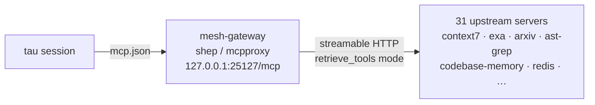

# agent-config

Machine-level tau agent configs — the repo-side source for the tau MCP wiring. Live copies live outside the repo (see Deploy).

<div align="right">

[](https://github.com/toxicwind/sovereign-projects#license)
[](https://github.com/toxicwind/sovereign-projects)

</div>

## Why this exists

Every tau session on awrawr-pc needs the same tool universe: one MCP gateway entry that fans out to all upstream servers. This directory holds the canonical `mcp.json` so the config is versioned, reviewed, and deployable — not a snowflake in someone's home directory.

## What's here

| File | Role |
|---|---|
| `mcp.json` | The single `mesh-gateway` MCP entry pointing tau at the mesh gateway |



One hop exposes everything: tau loads a single `retrieve_tools` function instead of hundreds of tool schemas, and the gateway handles health checks, quarantining new servers, and BM25 tool discovery.

## Quick start

```bash
cp agent-config/mcp.json ~/.tau/agent/mcp.json   # deploy (requires gateway on 127.0.0.1:25127)
```

## Deploy

| Path | Scope |
|---|---|
| `~/.tau/agent/mcp.json` | **user scope** — every tau session on awrawr-pc |

The repo copy is the source of truth; the live copy is deployed *from* here. Edit here, copy out, never the reverse.

## Verify

Against a running gateway (shep on `:25127`):

```bash
# raw MCP handshake
curl -s -X POST http://127.0.0.1:25127/mcp \
  -H 'content-type: application/json' \
  -d '{"jsonrpc":"2.0","id":1,"method":"initialize","params":{"protocolVersion":"2025-03-26","capabilities":{},"clientInfo":{"name":"check","version":"0"}}}'
```

Verified 2026-09-19: raw MCP initialize + `tools/list` handshake OK; a live `context7:resolve-library-id` call succeeded through the gateway.

## Config

`mcp.json` (single entry — the whole point):

```json
{
  "mcpServers": {
    "mesh-gateway": {
      "url": "http://127.0.0.1:25127/mcp",
      "transport": "streamable-http"
    }
  }
}
```

- **Endpoint:** `http://127.0.0.1:25127/mcp` — the shep/mcpproxy daemon (pitchfork-managed).
- **Mode:** streamable HTTP with `retrieve_tools` — one function, BM25-discovered tools.
- Adding a new upstream server happens at the gateway, not here — this file doesn't change.

## License & security

MIT where marked — [LICENSE](https://github.com/toxicwind/sovereign-projects#license). The gateway URL is localhost-only by design — `127.0.0.1:25127` is not on the funnel. If you ever point `mcp.json` at a non-localhost endpoint, you're exposing 31 upstream tool servers to the network: don't.
