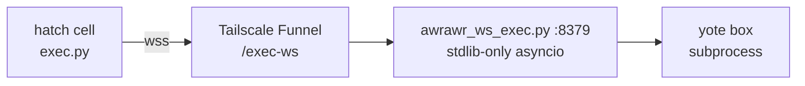

# bridge/ — the live hatch↔yote exec bridge

`awrawr_ws_exec.py` is the canonical tracked copy, run by pitchfork daemon `sovereign/awrawr-ws-exec` (Tailscale Funnel `/exec-ws` → `127.0.0.1:8379`).

> [!IMPORTANT]
> The bridge is never killed without a verified hot-replacement path — and never in the same remote command as its restart. Bridge-repair scripts must never kill squawk (`:25147` / `:25135`).

> [!NOTE]
> Compat: `/home/toxic/sovereign/shingle-workspace/awrawr_ws_exec.py` resolves here via symlink.

Bridge repair runbook: [`ops/`](../ops/) (`yote-fix.sh`, `yote-doctor.sh`) · diagnose-only canonical: [`ops/yote-doctor.sh`](../ops/yote-doctor.sh).

---

*Up: [root README](../README.md) · [fleet knowledgebase](../docs/fleet-knowledgebase.md) · [↑ top](#bridge--the-live-hatchyote-exec-bridge)*
