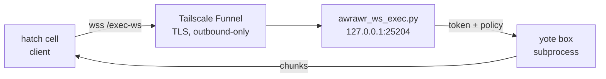

# Bridge — the live hatch ↔ yote exec bridge

The nerve cable of the whole estate: a persistent WebSocket exec bridge that lets the hatch cell run commands and move files on the yote box in real time. One tracked copy, one daemon, four security layers.

- **One tracked copy** — `awrawr_ws_exec.py`; pitchfork runs it as daemon `awrawr-ws-exec`.
- **Tailscale Funnel route** `/exec-ws` → `127.0.0.1:25204` (port from `WS_EXEC_PORT`, default `25204`).
- **Per-handshake token auth** — `X-MCP-Token` checked against `~/.awrawr_mcp_token` (re-read every handshake; rotation needs no restart).
- **Command policy + audit log** — imported from `awrawr_mcp`, one policy/audit implementation, no forks.
- **stdlib-only asyncio** — raw HTTP-Upgrade handshake + minimal framing, no third-party deps.
- **Limits** — 90s default timeout, 200000-char output cap (timeout cap 1800s).

## Hero flow


```mermaid
flowchart LR
    HATCH[hatch cell<br/>client] -->|wss /exec-ws| FUN[Tailscale Funnel<br/>TLS, outbound-only]
    FUN --> WS[awrawr_ws_exec.py<br/>127.0.0.1:25204]
    WS -->|token + policy| YOTE[yote box<br/>subprocess]
    YOTE -->|chunks| HATCH
```

## Quick start

```bash
# probe the daemon (token needed; check ~/.awrawr_mcp_token)
curl -sS -o /dev/null -w "%{http_code}\n" http://127.0.0.1:25204/exec-ws
```

```bash
# restart the bridge daemon (separate commands — never kill+start in one remote call)
pitchfork stop awrawr-ws-exec && pitchfork start awrawr-ws-exec
```

```bash
# send a command over the wire (JSON text message, multiplexed by client-chosen "id")
{"id": "1", "cmd": "uname -a", "workdir": "/home/toxic", "timeout": 120}
```

## Architecture

| Layer | Mechanism |
|---|---|
| Transport | Tailscale Funnel TLS, `/exec-ws` → `127.0.0.1:25204` (outbound-only) |
| Auth | `X-MCP-Token` per handshake vs `~/.awrawr_mcp_token`; 401 on mismatch |
| Policy | `_policy_check` from `awrawr_mcp` — denies before execution |
| Audit | `_audit` from `awrawr_mcp` — every command logged |
| Protocol | JSON text messages: `{id, cmd|argv, workdir, timeout}` → `{id, type: chunk|exit|denied}` |

**Shell-free exec:** pass `argv` instead of `cmd` to skip the shell entirely (no quoting bugs, no injection surface):

```json
{"id": "2", "argv": ["printf", "%s", "a`b"], "workdir": "/home/toxic"}
```

**File transfer** is binary-safe and resumable without the shell: `op: put` (upload, server returns resume offset after sha256+size handshake, raw binary frames) and `op: get` (download with `get-meta` size+sha256). No 90s ceiling on transfers.

## Config

| Knob | Default | Notes |
|---|---|---|
| `WS_EXEC_PORT` | `25204` | bind port on `127.0.0.1` |
| `~/.awrawr_mcp_token` | — | per-handshake auth token, re-read live |

Self-binding guard: the daemon refuses to start a second copy — it detects an existing holder on the port and exits cleanly instead of racing.

## Ops rules (hard-won)

> [!IMPORTANT]
> **The bridge is never killed without a verified hot-replacement path, and never in the same remote command as its restart.** Kill+start in a single remote command orphans the restart: the replacement races the dying holder, hits `EADDRINUSE`, exits 0, and the lane goes dark. Separate the stop and the start with a port-liveness check between.

> [!IMPORTANT]
> **Bridge-repair scripts must never kill squawk** (`:25147` ws / `:25135` feed).

## Dev / contributing

- `bridge/awrawr_ws_exec.py` is the canonical copy — tracked in `toxicwind/sovereign-projects`. Edit here, never a shadow copy.
- Security policy changes belong in `awrawr_mcp` (single impl), not in this file.
- Test: bind on a scratch port, handshake with the token, send a `cmd` and an `argv` message, verify `exit` frames and audit entries.

## License + security

Stack glue: MIT where marked. **This is a localhost + Tailscale surface by design** — never bind it to `0.0.0.0` and never expose `:25204` past the funnel. Treat the token file like a credential: `0600`, never committed, never pasted into chat. See the security layers at the top of `awrawr_ws_exec.py` for the authoritative list.
