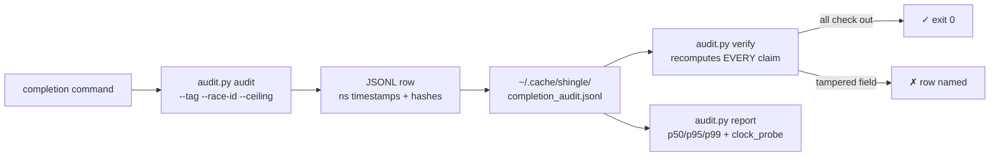

# completion-audit

A **checkable** completions auditor: wraps any completion call (model inference CLI, code-race run, transport attempt) and emits one JSONL row per call with nanosecond-captured timestamps, content hashes, ceiling enforcement, and winner/loser attribution. Then `verify` replays the ledger and **recomputes every claim** — artifacts, not vibes.

<div align="right">

[](https://github.com/toxicwind/sovereign-projects#license)
[](https://github.com/toxicwind/sovereign-projects)

</div>

## Why this exists

Latency claims are cheap; checkable latency claims are rare. This is the missing piece under the `hft-latency` skill (Chris's doctrine: *latency is a correctness criterion*): `bin/race.py` races, `bin/measure.py` times, and **this harness makes a completion auditable** — every number it reports can be recomputed from the ledger by an independent verifier. Tamper with one field and `verify` names the row.

## Features

- **Nanosecond capture** — start, first-byte (TTFB), end at `time.perf_counter_ns()` (monotonic; reported at μs).
- **Content hashes** — `sha256(stdout)`, `sha256(stderr)`, `sha256(prompt)` per row.
- **Ceilings enforced** — `--ceiling` kills overrunning attempts; `ceiling_breached` is recorded, not hand-waved.
- **Winner attribution is a claim** — `report`/`verify` recompute the winner per `--race-id` (min `elapsed_us` among valid); `verify` FAILS if a stored winner flag disagrees.
- **Clock-resolution proof** — every `report` includes a `clock_probe` (min non-zero delta of `perf_counter_ns` over 200k samples; 151ns measured 2026-09-14). Claims are μs; the source is ns.
- **Percentiles, never bare averages** — `report` prints p50/p95/p99 per tag.
- **Schema mirrors the live ledger** — fields align with `~/.cache/shingle/latency_race_winners.jsonl` so rows are comparable; the added fields are the checkable ones.



## Quick start

```bash
# one NIM completion, 60s ceiling, stdout must match /answer/
audit.py audit --tag nim-gpt-oss-20b --ceiling 60 --match answer -- \
    nim.py chat --model openai/gpt-oss-20b "2+2=?"

# verify the whole ledger (recomputes every claim)
audit.py verify ~/.cache/shingle/completion_audit.jsonl

# percentiles + clock probe
audit.py report ~/.cache/shingle/completion_audit.jsonl --out rep.json
```

## Auditing

Exit code is 0 iff the call was valid (exit 0, optional `--match` on stdout) AND not ceiling-breached. A one-line `audited` NDJSON event goes to stderr (borrowed from `hft-latency` `measure.py`); the wrapped command's stdout is captured into the row, not passed through.

A two-strategy race — same tag + `race_id`, winner recomputed at report time:

```bash
audit.py audit --tag model-race --race-id r1 --strategy gpt-oss-20b --ceiling 60 -- \
    nim.py chat --model openai/gpt-oss-20b "2+2=?"
audit.py audit --tag model-race --race-id r1 --strategy kimi-k3 --ceiling 60 -- \
    nim.py chat --model kimi-k3 "2+2=?"

# a code-race run audited as one completion
audit.py audit --tag code-race --ceiling 120 -- \
    race.py --ident RelayManager --lang python
```

`verify` recomputes: timestamp ordering, `elapsed_us`, `ttfb_us`, `cmd_sha256`, stdout/stderr hashes (full) or head/tail hashes (truncated), `valid`, `ceiling_breached`, winner attribution per race_id — and with `--report`, every percentile the report wrote. Any tampering (edited `elapsed_us`, swapped hash) fails with the row named.

## Ledger format

JSONL, one row per call. Default ledger `~/.cache/shingle/completion_audit.jsonl` (cell and awrawr-pc both). Schema `v:1`:

```json
{"v":1,"ts":"2026-09-14T18:20:00Z","tag":"nim-gpt-oss-20b","race_id":"r1",
 "strategy":"nim.py chat","cmd":[...],"cmd_sha256":"...","prompt_len":42,
 "prompt_sha256":"...","match":null,"ceiling_s":60.0,
 "t_ns":{"start":123456789,"first_byte":123458000,"end":125000000},
 "elapsed_us":1543211,"elapsed_ms":1543.211,"ttfb_us":700123,"ttfb_ms":700.123,
 "exit_code":0,"valid":true,"ceiling_breached":false,
 "stdout_len":312,"stderr_len":0,
 "stdout":{"full":true,"len":312,"sha256":"...","b64":"..."},
 "stderr":{"full":true,"len":0,"sha256":"...","b64":""},
 "winner":null}
```

Outputs over 1 MiB store head/tail (8 KiB each) + hashes instead of full bytes; `verify` checks the stored parts and flags anything it cannot recompute. stderr truncates at 64 KiB.

## Config

| Flag | Default | Meaning |
|---|---|---|
| `--tag` | — | ledger grouping key |
| `--race-id` | — | races share a tag; winner recomputed within the race |
| `--strategy` | — | free-text strategy label |
| `--ceiling` | — | seconds; breach → SIGKILL + `ceiling_breached: true` |
| `--match` | — | regex the stdout must satisfy for `valid: true` |
| `--ledger` | `~/.cache/shingle/completion_audit.jsonl` | where rows go |

## Borrowed, not invented

- ns timing + NDJSON-on-stderr + per-attempt ceilings: `hft-latency/bin/measure.py`
- race-first-wins + winners-log shape: `hft-latency/bin/race.py` (itself borrowed from `code-race/bin/race.py`)
- row schema fields: live `~/.cache/shingle/latency_race_winners.jsonl`
- per-run JSONL ledger + aggregate audit command: `emergent-enrich/papers.py --audit`
- content-hash dedup for attribution: squawk-feed transport `race-borrow`
- bench-pattern context: `hft-latency/patterns/bench-borrowing.md`

## License & security

MIT where marked — [LICENSE](https://github.com/toxicwind/sovereign-projects#license). The ledger is evidence: `verify` fails closed on any row it can't recompute, so treat ledger files as append-only. Never hand-edit a row and re-present it as verified — that's exactly the tampering this tool exists to catch.
