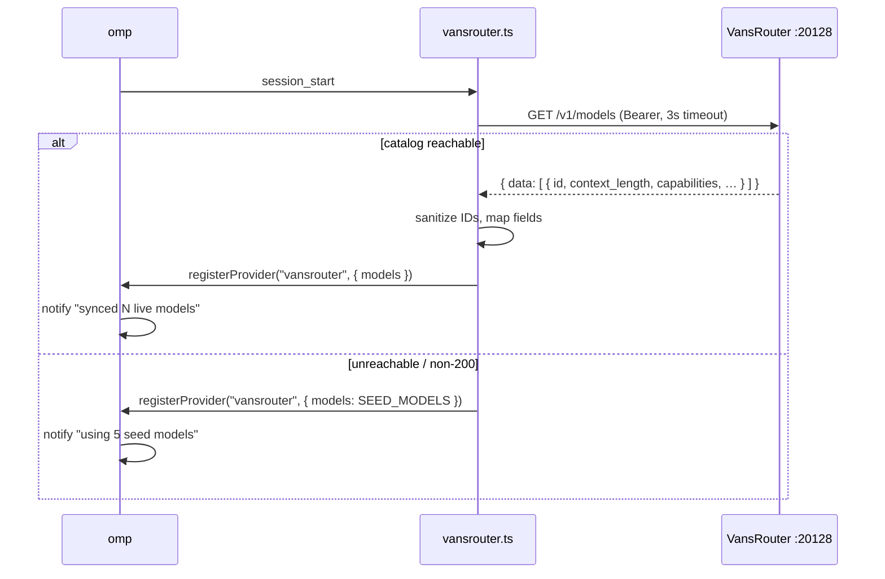

# tau Extensions

Local [omp](https://github.com/can1357/oh-my-pi) extensions for this machine. Plain
`.ts` files, loaded by omp at session start — one `export default function (pi: ExtensionAPI)`
per file.

| | |
|---|---|
| **Location** | `~/sovereign/config/tau/extensions/` |
| **Reached as** | `~/.tau/extensions` and `~/.omp/extensions` (both symlink here) |
| **Loader contract** | `export default function (pi: ExtensionAPI)` |
| **Extension API** | `@oh-my-pi/pi-coding-agent` → `ExtensionAPI` |
| **Extensions** | 2, both active |
| **Env source** | `~/.tau/.env` (same file as `~/.omp/.env`) |

> [!NOTE]
> Edit the files in `config/tau/extensions/`. Both `~/.tau` and `~/.omp` are
> symlinks to `~/sovereign/config/tau`, so a change here is visible through both
> paths with no reload step beyond restarting the session.

## Contents

- [Extensions](#extensions)
  - [vansrouter](#vansrouter)
  - [strict-bash-guard](#strict-bash-guard)
- [Managing extensions](#managing-extensions)
- [Verifying](#verifying)
- [Troubleshooting](#troubleshooting)
- [Related](#related)

---

## Extensions

| Extension | Hook | Purpose |
|---|---|---|
| [`vansrouter.ts`](./vansrouter.ts) | `registerProvider` + `session_start` | Registers the VansRouter OpenAI-compatible provider and syncs its live model catalog |
| [`strict-bash-guard.ts`](./strict-bash-guard.ts) | `tool_call` | Blocks shell commands that duplicate built-in tools |

---

## vansrouter

Registers a local OpenAI-compatible provider backed by
[VansRouter](http://127.0.0.1:20128) and replaces the model list with whatever
the live catalog actually serves.



The provider is registered **synchronously** at extension load with the seed
list, so a session never fails to start because the catalog is down. Live
discovery then replaces it on `session_start`.

### Configuration

All environment-driven; omp populates the process env from `~/.tau/.env`.

| Variable | Default | Meaning |
|---|---|---|
| `VANSROUTER_URL` | `http://127.0.0.1:20128/v1` | **Must include the `/v1` prefix** |
| `VANSROUTER_API_KEY` | — | Bearer token |
| `API_KEY_SECRET` | — | Secondary key source |

If neither key variable is set, the extension reads, in order:

1. `~/.config/vansrouter/env` (mode `0600`)
2. `~/.secrets`

…looking for `VANSROUTER_API_KEY=` or `API_KEY_SECRET=`. If all of those miss it
falls back to the literal string `local-sovereign`.

#### `VANSROUTER_URL` must carry `/v1`

The extension appends `/models` to the value *and* uses it verbatim as the
provider `baseUrl`. A value without the prefix breaks both.

```bash
# correct
VANSROUTER_URL=http://127.0.0.1:20128/v1
```

> [!WARNING]
> This was misconfigured on 2026-09-26: `~/.tau/.env:56` read
> `http://127.0.0.1:20128`, overriding the code's correct default. Discovery
> 404'd, the extension silently fell back to the 5-model seed list, and
> completions were routed to the wrong path. Fixed — see
> [Troubleshooting](#troubleshooting) to recognise or re-apply it.

### Catalog metadata

The extension reads the catalog's own fields rather than inferring them:

| Catalog field | Maps to |
|---|---|
| `id` | model id (after sanitization) |
| `context_length` | `contextWindow` |
| `max_completion_tokens` | `maxTokens` |
| `capabilities.vision` | adds `image` to `input` |
| `capabilities.pdf` | adds `pdf` to `input` |
| `capabilities.audioInput` | adds `audio` to `input` |
| `capabilities.videoInput` | adds `video` to `input` |
| `capabilities.reasoning` | `reasoning` |
| `owned_by` | *(not currently used)* |

> [!IMPORTANT]
> This replaced a previous build that hardcoded `contextWindow: 128_000` and
> `maxTokens: 8_192` for every model and guessed `vision` from the model ID by
> regex. Against the live 24-model catalog that understated six models — the two
> 1M-context DeepSeek models were reported as 128K, **13% of real** — and missed
> **all three** vision models, none of whose IDs match the pattern. If you ever
> see a model capped at 128K that the catalog says is larger, this mapping is
> the thing to check.

### Seed models

Registered synchronously so a session always starts. Used when discovery fails.

```
oc/jev-1.13-free
oc/mimo-v2.5-free
oc/deepseek-v4-flash-free
oc/nemotron-3.5-lightning-free
mmf/mimo-auto
```

Because these are bare ID strings, they carry no catalog metadata and fall back
to `128_000` / `8_192` with ID-regex capability inference.

### Model ID sanitization

Live entries are normalized before registration:

| Rule | Example |
|---|---|
| Consecutive duplicate segments collapse | `nvidia/nvidia/foo` → `nvidia/foo` |
| Fewer than 2 `/`-separated segments → dropped | `foo` |
| First two segments equal → dropped as malformed | `a/a/b` |
| Duplicate ids → dropped | — |

### Remaining hardcoded values

| Field | Value | Note |
|---|---|---|
| `cost.input` / `output` / `cacheRead` / `cacheWrite` | `0` | all models free — **disables cost accounting** |
| discovery timeout | `3000 ms` | `AbortSignal.timeout(3000)` |
| transport | `openai-completions` | with `authHeader: true` |
| `contextWindow` / `maxTokens` fallback | `128_000` / `8_192` | only when the catalog omits the field |
| vision/reasoning fallback | ID regex | only when `capabilities` is absent |

---

## strict-bash-guard

Blocks `bash` tool calls that duplicate built-in tools, so the agent reaches for
`glob` / `grep` / `read` instead of shelling out.

### Configuration

**None.** The four rules are hardcoded in the `blockedTools` array. There is no
env var, setting, or allowlist.

### What it blocks

| Pattern | Message |
|---|---|
| `\b(find\|fd)\s+[^|;&]+` | Use the `glob` tool instead of find |
| `\b(grep\|rg\|ripgrep)\s+` | Use `grep` or `ast_grep` instead of bash grep |
| `\b(sed\s+-n\|awk)\s+` | Use `read` (with line ranges) instead of sed/awk |
| `\b(cat\|head\|tail)\s+[^-]` | Use `read` instead of shell file reading |

A match returns `{ block: true, reason }` and the call does not execute.

### Sharp edges

- **`grep` and `rg` are blocked unconditionally.** Any command containing the
  token `grep` or `rg` followed by whitespace is rejected — including inside
  quoted strings and heredocs.
- **`cat`/`head`/`tail` need a non-dash next character.** `cat -n file` and
  `head -5` are allowed; `cat file` is blocked.
- **No escape hatch.** No prefix, flag, or comment marker bypasses a rule.
- **It only governs agent tool calls.** Your interactive shell is unaffected.

---

## Managing extensions

To disable one without deleting it, list its stem in `~/.tau/config.yml`:

```yaml
disabledExtensions:
  - strict-bash-guard
```

Currently empty — both extensions are active. Changes take effect on the next
session start.

---

## Verifying

```bash
# both files parse and export a default
bun -e 'const m = await import(process.env.HOME + "/.tau/extensions/vansrouter.ts"); console.log(typeof m.default)'
# → function

# provider registers and the live catalog syncs
bun -e '
const m = await import(process.env.HOME + "/.tau/extensions/vansrouter.ts");
let reg = null, h = null;
m.default({ registerProvider: (n, c) => { reg = c }, on: (e, f) => { if (e === "session_start") h = f } });
await h({}, { ui: { notify: () => {} } });
console.log(reg.models.length, "models");'
# → 24 models

# the endpoint the extension actually calls
curl -s -o /dev/null -w "%{http_code}\n" http://127.0.0.1:20128/v1/models
# → 200
```

In a live session the status line or a notification shows which path was taken:

```
[vansrouter] synced 24 live models      ← discovery worked
[vansrouter] using 5 seed models        ← discovery failed
```

---

## Troubleshooting

**Symptom: "using 5 seed models" on every session.**
`VANSROUTER_URL` is missing `/v1`, or VansRouter is not listening.

```bash
grep VANSROUTER_URL ~/.tau/.env
curl -s -o /dev/null -w "%{http_code}\n" http://127.0.0.1:20128/v1/models
```

**Symptom: a model is capped at 128K but the catalog says more.**
The catalog entry is missing `context_length`, or it landed in the seed list
(bare IDs carry no metadata).

**Symptom: a vision model won't accept images.**
Its `capabilities.vision` is absent or false in the catalog. The ID-regex
fallback does not match `minimax-m3`, `llama-4-maverick-*`, or `step-3.7-flash`.

**Symptom: extension not loading at all.**
Confirm the default export and syntax:

```bash
bunx oxlint ~/.tau/extensions/*.ts
bunx oxfmt --check ~/.tau/extensions/*.ts
```

---

## Related

- Installed plugins: [`../plugins/README.md`](../plugins/README.md)
- Registry: `~/.tau/plugins/omp-plugins.lock.json`
- Extension API: `@oh-my-pi/pi-coding-agent` → `ExtensionAPI`
- Session audit: `bun run ~/sovereign/skills/tau-session-audit/helper/audit.ts`
- Live install audit: `bun run ~/sovereign/skills/tau-tmux/helper/audit.ts`
