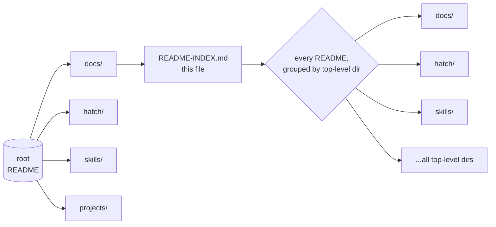

# README index — every README in this repo


**461 README files, this branch.** Relative links — click through from the GitHub tree or any clone. When a README moves, this index is regenerated from a live `find`, never hand-edited.

Master map: [root README](../README.md) · [fleet knowledgebase](fleet-knowledgebase.md)

## Quick Start

```bash
# Regenerate this index from the live tree (readme-max branch):
cd /home/toxic/.worktrees/readme-max && find . -name 'README.md' | sed 's|^\./||' | sort > /tmp/all-readmes.txt && wc -l /tmp/all-readmes.txt

# Find the README for one directory:
ls projects/herd/README.md

# Every README linked below is relative to docs/ — e.g. ../hatch/bin/README.md
```

## Map



## Contents

- [agent-config](#agent-config) (1)
- [agents](#agents) (1)
- [bridge](#bridge) (1)
- [.code-scalpel](#code-scalpel) (7)
- [completion-audit](#completion-audit) (1)
- [docs](#docs) (3)
- [hatch](#hatch) (7)
- [killer-features](#killer-features) (4)
- [ops](#ops) (3)
- [packages](#packages) (3)
- [pi-conversion](#pi-conversion) (1)
- [projects](#projects) (366)
- [readme-fix-sovereign-1789408144](#readme-fix-sovereign-1789408144) (1)
- [research](#research) (1)
- [(root)](#(root)) (1)
- [scratch](#scratch) (20)
- [services](#services) (1)
- [skills](#skills) (4)
- [sovereign-scripts](#sovereign-scripts) (1)
- [sovereign-skills](#sovereign-skills) (1)
- [src](#src) (2)
- [tailscale](#tailscale) (1)
- [tau-extensions](#tau-extensions) (5)
- [tools](#tools) (25)

## agent-config

- [agent-config/README.md](../agent-config/README.md)

## agents

- [projects/range/ranch/oracle/README.md](../projects/range/ranch/oracle/README.md)

## bridge

- [bridge/README.md](../bridge/README.md)

## .code-scalpel

- [.code-scalpel/license/README.md](../.code-scalpel/license/README.md)
- [.code-scalpel/policies/architecture/README.md](../.code-scalpel/policies/architecture/README.md)
- [.code-scalpel/policies/devops/README.md](../.code-scalpel/policies/devops/README.md)
- [.code-scalpel/policies/devsecops/README.md](../.code-scalpel/policies/devsecops/README.md)
- [.code-scalpel/policies/project/README.md](../.code-scalpel/policies/project/README.md)
- [.code-scalpel/policies/README.md](../.code-scalpel/policies/README.md)
- [.code-scalpel/README.md](../.code-scalpel/README.md)

## completion-audit

- [completion-audit/README.md](../completion-audit/README.md)

## docs

- [docs/fleet/personas/README.md](../docs/fleet/personas/README.md)
- [docs/Meta/Muse AI/README.md](../docs/Meta/Muse AI/README.md)
- [docs/README.md](../docs/README.md)

## hatch

- [hatch/agents/ember/chat/README.md](../hatch/agents/ember/chat/README.md)
- [hatch/agents/ember/README.md](../hatch/agents/ember/README.md)
- [hatch/agents/ember/squawk-relay/README.md](../hatch/agents/ember/squawk-relay/README.md)
- [hatch/audit-jarvis/README.md](../hatch/audit-jarvis/README.md)
- [hatch/bin/fleet/README.md](../hatch/bin/fleet/README.md)
- [hatch/bin/README.md](../hatch/bin/README.md)
- [hatch/README.md](../hatch/README.md)

## killer-features

- [killer-features/bid-market/bidder/README.md](../killer-features/bid-market/bidder/README.md)
- [killer-features/bid-market/e2e/README.md](../killer-features/bid-market/e2e/README.md)
- [killer-features/code-racer/README.md](../killer-features/code-racer/README.md)
- [killer-features/code-racer/tasks/README.md](../killer-features/code-racer/tasks/README.md)

## ops

- [ops/bg-tracker/bg-tracker/README.md](../ops/bg-tracker/bg-tracker/README.md)
- [ops/durability/README.md](../ops/durability/README.md)
- [ops/openfang-health/README.md](../ops/openfang-health/README.md)

## packages

- [packages/gayxxx-sovereign/README.md](../packages/gayxxx-sovereign/README.md)
- [packages/sovereign-scripts/README.md](../packages/sovereign-scripts/README.md)
- [packages/sovereign-skills/README.md](../packages/sovereign-skills/README.md)

## pi-conversion

- [pi-conversion/README.md](../pi-conversion/README.md)

## projects

- [projects/android-fleet/README.md](../projects/android-fleet/README.md)
- [projects/auto1m/README.md](../projects/auto1m/README.md)
- [projects/bridge/README.md](../projects/bridge/README.md)
- [projects/hatch-decode/pass3/README.md](../projects/hatch-decode/pass3/README.md)
- [projects/hatch-decode/README.md](../projects/hatch-decode/README.md)
- [projects/herd/cmd/misc/test-rerank/README.md](../projects/herd/cmd/misc/test-rerank/README.md)
- [projects/herd/cmd/wol-proxy/README.md](../projects/herd/cmd/wol-proxy/README.md)
- [projects/herd/docker/unified/README.md](../projects/herd/docker/unified/README.md)
- [projects/herd/docs/examples/aider-qwq-coder/README.md](../projects/herd/docs/examples/aider-qwq-coder/README.md)
- [projects/herd/docs/examples/benchmark-snakegame/README.md](../projects/herd/docs/examples/benchmark-snakegame/README.md)
- [projects/herd/docs/examples/README.md](../projects/herd/docs/examples/README.md)
- [projects/herd/docs/examples/restart-on-config-change/README.md](../projects/herd/docs/examples/restart-on-config-change/README.md)
- [projects/herd/docs/examples/speculative-decoding/README.md](../projects/herd/docs/examples/speculative-decoding/README.md)
- [projects/herd/docs/flock/README.md](../projects/herd/docs/flock/README.md)
- [projects/herd/internal/event/README.md](../projects/herd/internal/event/README.md)
- [projects/herd/mesh/flock-pkg/sovereign_complete_pkg/flock-dist/lib/env_dump/README.md](../projects/herd/mesh/flock-pkg/sovereign_complete_pkg/flock-dist/lib/env_dump/README.md)
- [projects/herd/mesh/flock-pkg/sovereign_complete_pkg/flock-dist/lib/llm_client/README.md](../projects/herd/mesh/flock-pkg/sovereign_complete_pkg/flock-dist/lib/llm_client/README.md)
- [projects/herd/mesh/flock-pkg/sovereign_complete_pkg/flock-dist/lib/orchestrator/README.md](../projects/herd/mesh/flock-pkg/sovereign_complete_pkg/flock-dist/lib/orchestrator/README.md)
- [projects/herd/mesh/flock-pkg/sovereign_complete_pkg/flock-dist/lib/switchover/README.md](../projects/herd/mesh/flock-pkg/sovereign_complete_pkg/flock-dist/lib/switchover/README.md)
- [projects/herd/mesh/flock-pkg/sovereign_complete_pkg/flock-dist/README.md](../projects/herd/mesh/flock-pkg/sovereign_complete_pkg/flock-dist/README.md)
- [projects/herd/mesh/flock-pkg/sovereign_complete_pkg/free_zed_gateway/README.md](../projects/herd/mesh/flock-pkg/sovereign_complete_pkg/free_zed_gateway/README.md)
- [projects/herd/mesh/flock-pkg/sovereign_complete_pkg/sovereign-ast-router/env_dump/README.md](../projects/herd/mesh/flock-pkg/sovereign_complete_pkg/sovereign-ast-router/env_dump/README.md)
- [projects/herd/mesh/flock-pkg/sovereign_complete_pkg/sovereign-ast-router/llm_client/README.md](../projects/herd/mesh/flock-pkg/sovereign_complete_pkg/sovereign-ast-router/llm_client/README.md)
- [projects/herd/mesh/flock-pkg/sovereign_complete_pkg/sovereign-ast-router/orchestrator/README.md](../projects/herd/mesh/flock-pkg/sovereign_complete_pkg/sovereign-ast-router/orchestrator/README.md)
- [projects/herd/mesh/flock-pkg/sovereign_complete_pkg/sovereign-ast-router/README.md](../projects/herd/mesh/flock-pkg/sovereign_complete_pkg/sovereign-ast-router/README.md)
- [projects/herd/mesh/flock-pkg/sovereign_complete_pkg/sovereign-ast-router/switchover/README.md](../projects/herd/mesh/flock-pkg/sovereign_complete_pkg/sovereign-ast-router/switchover/README.md)
- [projects/herd/mesh/flock-pkg/sovereign_complete_pkg/ultimate_extract/cert_extract/README.md](../projects/herd/mesh/flock-pkg/sovereign_complete_pkg/ultimate_extract/cert_extract/README.md)
- [projects/herd/mesh/flock-pkg/sovereign_complete_pkg/ultimate_extract/chunker/README.md](../projects/herd/mesh/flock-pkg/sovereign_complete_pkg/ultimate_extract/chunker/README.md)
- [projects/herd/mesh/flock-pkg/sovereign_complete_pkg/ultimate_extract/env_dump/README.md](../projects/herd/mesh/flock-pkg/sovereign_complete_pkg/ultimate_extract/env_dump/README.md)
- [projects/herd/mesh/flock-pkg/sovereign_complete_pkg/ultimate_extract/file_scan/README.md](../projects/herd/mesh/flock-pkg/sovereign_complete_pkg/ultimate_extract/file_scan/README.md)
- [projects/herd/mesh/flock-pkg/sovereign_complete_pkg/ultimate_extract/k8s_client/README.md](../projects/herd/mesh/flock-pkg/sovereign_complete_pkg/ultimate_extract/k8s_client/README.md)
- [projects/herd/mesh/flock-pkg/sovereign_complete_pkg/ultimate_extract/llm_client/README.md](../projects/herd/mesh/flock-pkg/sovereign_complete_pkg/ultimate_extract/llm_client/README.md)
- [projects/herd/mesh/flock-pkg/sovereign_complete_pkg/ultimate_extract/net_map/README.md](../projects/herd/mesh/flock-pkg/sovereign_complete_pkg/ultimate_extract/net_map/README.md)
- [projects/herd/mesh/flock-pkg/sovereign_complete_pkg/ultimate_extract/orchestrator/README.md](../projects/herd/mesh/flock-pkg/sovereign_complete_pkg/ultimate_extract/orchestrator/README.md)
- [projects/herd/mesh/flock-pkg/sovereign_complete_pkg/ultimate_extract/organizer/README.md](../projects/herd/mesh/flock-pkg/sovereign_complete_pkg/ultimate_extract/organizer/README.md)
- [projects/herd/mesh/flock-pkg/sovereign_complete_pkg/ultimate_extract/proc_mon/README.md](../projects/herd/mesh/flock-pkg/sovereign_complete_pkg/ultimate_extract/proc_mon/README.md)
- [projects/herd/mesh/flock-pkg/sovereign_complete_pkg/ultimate_extract/prompts/README.md](../projects/herd/mesh/flock-pkg/sovereign_complete_pkg/ultimate_extract/prompts/README.md)
- [projects/herd/mesh/flock-pkg/sovereign_complete_pkg/ultimate_extract/recon/README.md](../projects/herd/mesh/flock-pkg/sovereign_complete_pkg/ultimate_extract/recon/README.md)
- [projects/herd/mesh/flock-pkg/sovereign_complete_pkg/ultimate_extract/simhash/README.md](../projects/herd/mesh/flock-pkg/sovereign_complete_pkg/ultimate_extract/simhash/README.md)
- [projects/herd/mesh/flock-pkg/sovereign_complete_pkg/ultimate_extract/switchover/README.md](../projects/herd/mesh/flock-pkg/sovereign_complete_pkg/ultimate_extract/switchover/README.md)
- [projects/herd/mesh/flock-pkg/sovereign_complete_pkg/ultimate_extract/sys_mon/README.md](../projects/herd/mesh/flock-pkg/sovereign_complete_pkg/ultimate_extract/sys_mon/README.md)
- [projects/herd/mesh/flock-pkg/sovereign_complete_pkg/ultimate_extract/ts_core/README.md](../projects/herd/mesh/flock-pkg/sovereign_complete_pkg/ultimate_extract/ts_core/README.md)
- [projects/herd/mesh/gateway/bench/README.md](../projects/herd/mesh/gateway/bench/README.md)
- [projects/herd/mesh/gateway/contrib/linux-repos/README.md](../projects/herd/mesh/gateway/contrib/linux-repos/README.md)
- [projects/herd/mesh/gateway/README.md](../projects/herd/mesh/gateway/README.md)
- [projects/herd/mesh/README.md](../projects/herd/mesh/README.md)
- [projects/herd/mesh/research/ultimate_extract/cert_extract/README.md](../projects/herd/mesh/research/ultimate_extract/cert_extract/README.md)
- [projects/herd/mesh/research/ultimate_extract/chunker/README.md](../projects/herd/mesh/research/ultimate_extract/chunker/README.md)
- [projects/herd/mesh/research/ultimate_extract/env_dump/README.md](../projects/herd/mesh/research/ultimate_extract/env_dump/README.md)
- [projects/herd/mesh/research/ultimate_extract/file_scan/README.md](../projects/herd/mesh/research/ultimate_extract/file_scan/README.md)
- [projects/herd/mesh/research/ultimate_extract/k8s_client/README.md](../projects/herd/mesh/research/ultimate_extract/k8s_client/README.md)
- [projects/herd/mesh/research/ultimate_extract/llm_client/README.md](../projects/herd/mesh/research/ultimate_extract/llm_client/README.md)
- [projects/herd/mesh/research/ultimate_extract/net_map/README.md](../projects/herd/mesh/research/ultimate_extract/net_map/README.md)
- [projects/herd/mesh/research/ultimate_extract/orchestrator/README.md](../projects/herd/mesh/research/ultimate_extract/orchestrator/README.md)
- [projects/herd/mesh/research/ultimate_extract/organizer/README.md](../projects/herd/mesh/research/ultimate_extract/organizer/README.md)
- [projects/herd/mesh/research/ultimate_extract/proc_mon/README.md](../projects/herd/mesh/research/ultimate_extract/proc_mon/README.md)
- [projects/herd/mesh/research/ultimate_extract/prompts/README.md](../projects/herd/mesh/research/ultimate_extract/prompts/README.md)
- [projects/herd/mesh/research/ultimate_extract/recon/README.md](../projects/herd/mesh/research/ultimate_extract/recon/README.md)
- [projects/herd/mesh/research/ultimate_extract/simhash/README.md](../projects/herd/mesh/research/ultimate_extract/simhash/README.md)
- [projects/herd/mesh/research/ultimate_extract/switchover/README.md](../projects/herd/mesh/research/ultimate_extract/switchover/README.md)
- [projects/herd/mesh/research/ultimate_extract/sys_mon/README.md](../projects/herd/mesh/research/ultimate_extract/sys_mon/README.md)
- [projects/herd/mesh/research/ultimate_extract/ts_core/README.md](../projects/herd/mesh/research/ultimate_extract/ts_core/README.md)
- [projects/herd/mesh/router/flock-py/lib/env_dump/README.md](../projects/herd/mesh/router/flock-py/lib/env_dump/README.md)
- [projects/herd/mesh/router/flock-py/lib/llm_client/README.md](../projects/herd/mesh/router/flock-py/lib/llm_client/README.md)
- [projects/herd/mesh/router/flock-py/lib/orchestrator/README.md](../projects/herd/mesh/router/flock-py/lib/orchestrator/README.md)
- [projects/herd/mesh/router/flock-py/lib/switchover/README.md](../projects/herd/mesh/router/flock-py/lib/switchover/README.md)
- [projects/herd/mesh/router/flock-py/README.md](../projects/herd/mesh/router/flock-py/README.md)
- [projects/herd/mesh/router/free_zed_gateway/README.md](../projects/herd/mesh/router/free_zed_gateway/README.md)
- [projects/herd/mesh/router/README.md](../projects/herd/mesh/router/README.md)
- [projects/herd/mesh/router/sovereign-ast-router/env_dump/README.md](../projects/herd/mesh/router/sovereign-ast-router/env_dump/README.md)
- [projects/herd/mesh/router/sovereign-ast-router/llm_client/README.md](../projects/herd/mesh/router/sovereign-ast-router/llm_client/README.md)
- [projects/herd/mesh/router/sovereign-ast-router/orchestrator/README.md](../projects/herd/mesh/router/sovereign-ast-router/orchestrator/README.md)
- [projects/herd/mesh/router/sovereign-ast-router/README.md](../projects/herd/mesh/router/sovereign-ast-router/README.md)
- [projects/herd/mesh/router/sovereign-ast-router/switchover/README.md](../projects/herd/mesh/router/sovereign-ast-router/switchover/README.md)
- [projects/herd/models/README.md](../projects/herd/models/README.md)
- [projects/herd/race/README.md](../projects/herd/race/README.md)
- [projects/herd/README.md](../projects/herd/README.md)
- [projects/kodi-fleet/README.md](../projects/kodi-fleet/README.md)
- [projects/mesh/browserless/keeper/README.md](../projects/mesh/browserless/keeper/README.md)
- [projects/mesh/browserless/README.md](../projects/mesh/browserless/README.md)
- [projects/mesh/browserless/viewer/README.md](../projects/mesh/browserless/viewer/README.md)
- [projects/mesh/flock-pkg/sovereign_complete_pkg/flock-dist/lib/env_dump/README.md](../projects/mesh/flock-pkg/sovereign_complete_pkg/flock-dist/lib/env_dump/README.md)
- [projects/mesh/flock-pkg/sovereign_complete_pkg/flock-dist/lib/llm_client/README.md](../projects/mesh/flock-pkg/sovereign_complete_pkg/flock-dist/lib/llm_client/README.md)
- [projects/mesh/flock-pkg/sovereign_complete_pkg/flock-dist/lib/orchestrator/README.md](../projects/mesh/flock-pkg/sovereign_complete_pkg/flock-dist/lib/orchestrator/README.md)
- [projects/mesh/flock-pkg/sovereign_complete_pkg/flock-dist/lib/switchover/README.md](../projects/mesh/flock-pkg/sovereign_complete_pkg/flock-dist/lib/switchover/README.md)
- [projects/mesh/flock-pkg/sovereign_complete_pkg/flock-dist/README.md](../projects/mesh/flock-pkg/sovereign_complete_pkg/flock-dist/README.md)
- [projects/mesh/flock-pkg/sovereign_complete_pkg/free_zed_gateway/README.md](../projects/mesh/flock-pkg/sovereign_complete_pkg/free_zed_gateway/README.md)
- [projects/mesh/flock-pkg/sovereign_complete_pkg/sovereign-ast-router/env_dump/README.md](../projects/mesh/flock-pkg/sovereign_complete_pkg/sovereign-ast-router/env_dump/README.md)
- [projects/mesh/flock-pkg/sovereign_complete_pkg/sovereign-ast-router/llm_client/README.md](../projects/mesh/flock-pkg/sovereign_complete_pkg/sovereign-ast-router/llm_client/README.md)
- [projects/mesh/flock-pkg/sovereign_complete_pkg/sovereign-ast-router/orchestrator/README.md](../projects/mesh/flock-pkg/sovereign_complete_pkg/sovereign-ast-router/orchestrator/README.md)
- [projects/mesh/flock-pkg/sovereign_complete_pkg/sovereign-ast-router/README.md](../projects/mesh/flock-pkg/sovereign_complete_pkg/sovereign-ast-router/README.md)
- [projects/mesh/flock-pkg/sovereign_complete_pkg/sovereign-ast-router/switchover/README.md](../projects/mesh/flock-pkg/sovereign_complete_pkg/sovereign-ast-router/switchover/README.md)
- [projects/mesh/flock-pkg/sovereign_complete_pkg/ultimate_extract/cert_extract/README.md](../projects/mesh/flock-pkg/sovereign_complete_pkg/ultimate_extract/cert_extract/README.md)
- [projects/mesh/flock-pkg/sovereign_complete_pkg/ultimate_extract/chunker/README.md](../projects/mesh/flock-pkg/sovereign_complete_pkg/ultimate_extract/chunker/README.md)
- [projects/mesh/flock-pkg/sovereign_complete_pkg/ultimate_extract/env_dump/README.md](../projects/mesh/flock-pkg/sovereign_complete_pkg/ultimate_extract/env_dump/README.md)
- [projects/mesh/flock-pkg/sovereign_complete_pkg/ultimate_extract/file_scan/README.md](../projects/mesh/flock-pkg/sovereign_complete_pkg/ultimate_extract/file_scan/README.md)
- [projects/mesh/flock-pkg/sovereign_complete_pkg/ultimate_extract/k8s_client/README.md](../projects/mesh/flock-pkg/sovereign_complete_pkg/ultimate_extract/k8s_client/README.md)
- [projects/mesh/flock-pkg/sovereign_complete_pkg/ultimate_extract/llm_client/README.md](../projects/mesh/flock-pkg/sovereign_complete_pkg/ultimate_extract/llm_client/README.md)
- [projects/mesh/flock-pkg/sovereign_complete_pkg/ultimate_extract/net_map/README.md](../projects/mesh/flock-pkg/sovereign_complete_pkg/ultimate_extract/net_map/README.md)
- [projects/mesh/flock-pkg/sovereign_complete_pkg/ultimate_extract/orchestrator/README.md](../projects/mesh/flock-pkg/sovereign_complete_pkg/ultimate_extract/orchestrator/README.md)
- [projects/mesh/flock-pkg/sovereign_complete_pkg/ultimate_extract/organizer/README.md](../projects/mesh/flock-pkg/sovereign_complete_pkg/ultimate_extract/organizer/README.md)
- [projects/mesh/flock-pkg/sovereign_complete_pkg/ultimate_extract/proc_mon/README.md](../projects/mesh/flock-pkg/sovereign_complete_pkg/ultimate_extract/proc_mon/README.md)
- [projects/mesh/flock-pkg/sovereign_complete_pkg/ultimate_extract/prompts/README.md](../projects/mesh/flock-pkg/sovereign_complete_pkg/ultimate_extract/prompts/README.md)
- [projects/mesh/flock-pkg/sovereign_complete_pkg/ultimate_extract/recon/README.md](../projects/mesh/flock-pkg/sovereign_complete_pkg/ultimate_extract/recon/README.md)
- [projects/mesh/flock-pkg/sovereign_complete_pkg/ultimate_extract/simhash/README.md](../projects/mesh/flock-pkg/sovereign_complete_pkg/ultimate_extract/simhash/README.md)
- [projects/mesh/flock-pkg/sovereign_complete_pkg/ultimate_extract/switchover/README.md](../projects/mesh/flock-pkg/sovereign_complete_pkg/ultimate_extract/switchover/README.md)
- [projects/mesh/flock-pkg/sovereign_complete_pkg/ultimate_extract/sys_mon/README.md](../projects/mesh/flock-pkg/sovereign_complete_pkg/ultimate_extract/sys_mon/README.md)
- [projects/mesh/flock-pkg/sovereign_complete_pkg/ultimate_extract/ts_core/README.md](../projects/mesh/flock-pkg/sovereign_complete_pkg/ultimate_extract/ts_core/README.md)
- [projects/mesh/gateway/bench/README.md](../projects/mesh/gateway/bench/README.md)
- [projects/mesh/gateway/contrib/linux-repos/README.md](../projects/mesh/gateway/contrib/linux-repos/README.md)
- [projects/mesh/gateway/README.md](../projects/mesh/gateway/README.md)
- [projects/mesh/gateway/specs/002-windows-installer/contracts/README.md](../projects/mesh/gateway/specs/002-windows-installer/contracts/README.md)
- [projects/mesh/gateway/specs/013-tool-change-notifications/contracts/README.md](../projects/mesh/gateway/specs/013-tool-change-notifications/contracts/README.md)
- [projects/mesh/gateway/specs/045-paperclip-cockpit/agent-instructions/README.md](../projects/mesh/gateway/specs/045-paperclip-cockpit/agent-instructions/README.md)
- [projects/mesh/gateway/specs/064-glass-cockpit/agent-instructions/README.md](../projects/mesh/gateway/specs/064-glass-cockpit/agent-instructions/README.md)
- [projects/mesh/gateway/specs/065-evaluation-foundation/datasets/README.md](../projects/mesh/gateway/specs/065-evaluation-foundation/datasets/README.md)
- [projects/mesh/gateway/specs/083-discovery-profiler/datasets/README.md](../projects/mesh/gateway/specs/083-discovery-profiler/datasets/README.md)
- [projects/mesh/gateway/specs/README.md](../projects/mesh/gateway/specs/README.md)
- [projects/mesh/gemini-mcp/README.md](../projects/mesh/gemini-mcp/README.md)
- [projects/mesh/README.md](../projects/mesh/README.md)
- [projects/mesh/research/ultimate_extract/cert_extract/README.md](../projects/mesh/research/ultimate_extract/cert_extract/README.md)
- [projects/mesh/research/ultimate_extract/chunker/README.md](../projects/mesh/research/ultimate_extract/chunker/README.md)
- [projects/mesh/research/ultimate_extract/env_dump/README.md](../projects/mesh/research/ultimate_extract/env_dump/README.md)
- [projects/mesh/research/ultimate_extract/file_scan/README.md](../projects/mesh/research/ultimate_extract/file_scan/README.md)
- [projects/mesh/research/ultimate_extract/k8s_client/README.md](../projects/mesh/research/ultimate_extract/k8s_client/README.md)
- [projects/mesh/research/ultimate_extract/llm_client/README.md](../projects/mesh/research/ultimate_extract/llm_client/README.md)
- [projects/mesh/research/ultimate_extract/net_map/README.md](../projects/mesh/research/ultimate_extract/net_map/README.md)
- [projects/mesh/research/ultimate_extract/orchestrator/README.md](../projects/mesh/research/ultimate_extract/orchestrator/README.md)
- [projects/mesh/research/ultimate_extract/organizer/README.md](../projects/mesh/research/ultimate_extract/organizer/README.md)
- [projects/mesh/research/ultimate_extract/proc_mon/README.md](../projects/mesh/research/ultimate_extract/proc_mon/README.md)
- [projects/mesh/research/ultimate_extract/prompts/README.md](../projects/mesh/research/ultimate_extract/prompts/README.md)
- [projects/mesh/research/ultimate_extract/recon/README.md](../projects/mesh/research/ultimate_extract/recon/README.md)
- [projects/mesh/research/ultimate_extract/simhash/README.md](../projects/mesh/research/ultimate_extract/simhash/README.md)
- [projects/mesh/research/ultimate_extract/switchover/README.md](../projects/mesh/research/ultimate_extract/switchover/README.md)
- [projects/mesh/research/ultimate_extract/sys_mon/README.md](../projects/mesh/research/ultimate_extract/sys_mon/README.md)
- [projects/mesh/research/ultimate_extract/ts_core/README.md](../projects/mesh/research/ultimate_extract/ts_core/README.md)
- [projects/mesh/router/flock-py/lib/env_dump/README.md](../projects/mesh/router/flock-py/lib/env_dump/README.md)
- [projects/mesh/router/flock-py/lib/llm_client/README.md](../projects/mesh/router/flock-py/lib/llm_client/README.md)
- [projects/mesh/router/flock-py/lib/orchestrator/README.md](../projects/mesh/router/flock-py/lib/orchestrator/README.md)
- [projects/mesh/router/flock-py/lib/switchover/README.md](../projects/mesh/router/flock-py/lib/switchover/README.md)
- [projects/mesh/router/flock-py/README.md](../projects/mesh/router/flock-py/README.md)
- [projects/mesh/router/flock-router/env_dump/README.md](../projects/mesh/router/flock-router/env_dump/README.md)
- [projects/mesh/router/flock-router/llm_client/README.md](../projects/mesh/router/flock-router/llm_client/README.md)
- [projects/mesh/router/flock-router/orchestrator/README.md](../projects/mesh/router/flock-router/orchestrator/README.md)
- [projects/mesh/router/flock-router/README.md](../projects/mesh/router/flock-router/README.md)
- [projects/mesh/router/flock-router/switchover/README.md](../projects/mesh/router/flock-router/switchover/README.md)
- [projects/mesh/router/free_zed_gateway/README.md](../projects/mesh/router/free_zed_gateway/README.md)
- [projects/mesh/router/README.md](../projects/mesh/router/README.md)
- [projects/mesh/secretsmith/README.md](../projects/mesh/secretsmith/README.md)
- [projects/mesh/squawk/nats/README.md](../projects/mesh/squawk/nats/README.md)
- [projects/mesh/squawk/outbox-relay/README.md](../projects/mesh/squawk/outbox-relay/README.md)
- [projects/mesh/squawk/README.md](../projects/mesh/squawk/README.md)
- [projects/mesh/squawk/relay/README.md](../projects/mesh/squawk/relay/README.md)
- [projects/meta-research-toolkit/README.md](../projects/meta-research-toolkit/README.md)
- [projects/model-max/README.md](../projects/model-max/README.md)
- [projects/openfang/README.md](../projects/openfang/README.md)
- [projects/openrouter-probe/README.md](../projects/openrouter-probe/README.md)
- [projects/ops/bg-tracker/README.md](../projects/ops/bg-tracker/README.md)
- [projects/ops/bin/README.md](../projects/ops/bin/README.md)
- [projects/ops/dispatcher/README.md](../projects/ops/dispatcher/README.md)
- [projects/ops/README.md](../projects/ops/README.md)
- [projects/ops/stall-detect/README.md](../projects/ops/stall-detect/README.md)
- [projects/pack-fix/README.md](../projects/pack-fix/README.md)
- [projects/qed/README.md](../projects/qed/README.md)
- [projects/qed/zed/.cloudflare/README.md](../projects/qed/zed/.cloudflare/README.md)
- [projects/qed/zed/crates/agent_skills/README.md](../projects/qed/zed/crates/agent_skills/README.md)
- [projects/qed/zed/crates/cli/README.md](../projects/qed/zed/crates/cli/README.md)
- [projects/qed/zed/crates/collab/README.md](../projects/qed/zed/crates/collab/README.md)
- [projects/qed/zed/crates/db/README.md](../projects/qed/zed/crates/db/README.md)
- [projects/qed/zed/crates/eval_cli/README.md](../projects/qed/zed/crates/eval_cli/README.md)
- [projects/qed/zed/crates/eval_cli/zed_eval/README.md](../projects/qed/zed/crates/eval_cli/zed_eval/README.md)
- [projects/qed/zed/crates/eval_utils/README.md](../projects/qed/zed/crates/eval_utils/README.md)
- [projects/qed/zed/crates/extension_api/README.md](../projects/qed/zed/crates/extension_api/README.md)
- [projects/qed/zed/crates/gpui/examples/README.md](../projects/qed/zed/crates/gpui/examples/README.md)
- [projects/qed/zed/crates/gpui/README.md](../projects/qed/zed/crates/gpui/README.md)
- [projects/qed/zed/crates/icons/README.md](../projects/qed/zed/crates/icons/README.md)
- [projects/qed/zed/crates/inspector_ui/README.md](../projects/qed/zed/crates/inspector_ui/README.md)
- [projects/qed/zed/crates/livekit_api/vendored/protocol/README.md](../projects/qed/zed/crates/livekit_api/vendored/protocol/README.md)
- [projects/qed/zed/crates/sandbox/README.md](../projects/qed/zed/crates/sandbox/README.md)
- [projects/qed/zed/crates/schema_generator/README.md](../projects/qed/zed/crates/schema_generator/README.md)
- [projects/qed/zed/crates/terminal_view/README.md](../projects/qed/zed/crates/terminal_view/README.md)
- [projects/qed/zed/crates/theme_importer/README.md](../projects/qed/zed/crates/theme_importer/README.md)
- [projects/qed/zed/crates/vim/README.md](../projects/qed/zed/crates/vim/README.md)
- [projects/qed/zed/crates/zlog/README.md](../projects/qed/zed/crates/zlog/README.md)
- [projects/qed/zed/docs/README.md](../projects/qed/zed/docs/README.md)
- [projects/qed/zed/extensions/README.md](../projects/qed/zed/extensions/README.md)
- [projects/qed/zed/extensions/test-extension/README.md](../projects/qed/zed/extensions/test-extension/README.md)
- [projects/qed/zed/nix/livekit-libwebrtc/README.md](../projects/qed/zed/nix/livekit-libwebrtc/README.md)
- [projects/qed/zedra/crates/zedra/assets/fonts/JetBrainsMono/README.md](../projects/qed/zedra/crates/zedra/assets/fonts/JetBrainsMono/README.md)
- [projects/qed/zedra/deploy/relay/README.md](../projects/qed/zedra/deploy/relay/README.md)
- [projects/qed/zedra/examples/webview-tunnel/README.md](../projects/qed/zedra/examples/webview-tunnel/README.md)
- [projects/qed/zedra/packages/relay-check/README.md](../projects/qed/zedra/packages/relay-check/README.md)
- [projects/qed/zedra/packages/relay-monitor/README.md](../projects/qed/zedra/packages/relay-monitor/README.md)
- [projects/qed/zedra/README.md](../projects/qed/zedra/README.md)
- [projects/qed/zed/README.md](../projects/qed/zed/README.md)
- [projects/qed/zed/tooling/lints/README.md](../projects/qed/zed/tooling/lints/README.md)
- [projects/README.md](../projects/README.md)
- [projects/routing/bench/README.md](../projects/routing/bench/README.md)
- [projects/shell/quarantine/README.md](../projects/shell/quarantine/README.md)
- [projects/shell/README.md](../projects/shell/README.md)
- [projects/tau/archive/from-oh-my-pi/packages/hashline/README.md](../projects/tau/archive/from-oh-my-pi/packages/hashline/README.md)
- [projects/tau/archive/from-omp-extensions/branches/feat/initial-omp-kafka/packages/omp-kafka/README.md](../projects/tau/archive/from-omp-extensions/branches/feat/initial-omp-kafka/packages/omp-kafka/README.md)
- [projects/tau/archive/from-omp-extensions/branches/feat/initial-omp-kafka/README.md](../projects/tau/archive/from-omp-extensions/branches/feat/initial-omp-kafka/README.md)
- [projects/tau/archive/from-omp-extensions/branches/feat/omp-edit-committer/packages/omp-edit-committer/README.md](../projects/tau/archive/from-omp-extensions/branches/feat/omp-edit-committer/packages/omp-edit-committer/README.md)
- [projects/tau/archive/from-omp-extensions/branches/feat/omp-edit-committer/packages/omp-kafka/README.md](../projects/tau/archive/from-omp-extensions/branches/feat/omp-edit-committer/packages/omp-kafka/README.md)
- [projects/tau/archive/from-omp-extensions/branches/feat/omp-edit-committer/README.md](../projects/tau/archive/from-omp-extensions/branches/feat/omp-edit-committer/README.md)
- [projects/tau/archive/from-omp-extensions/branches/fix/add-kafkajs-dep/packages/omp-edit-committer/README.md](../projects/tau/archive/from-omp-extensions/branches/fix/add-kafkajs-dep/packages/omp-edit-committer/README.md)
- [projects/tau/archive/from-omp-extensions/branches/fix/add-kafkajs-dep/packages/omp-kafka/README.md](../projects/tau/archive/from-omp-extensions/branches/fix/add-kafkajs-dep/packages/omp-kafka/README.md)
- [projects/tau/archive/from-omp-extensions/branches/fix/add-kafkajs-dep/README.md](../projects/tau/archive/from-omp-extensions/branches/fix/add-kafkajs-dep/README.md)
- [projects/tau/archive/from-omp-extensions/packages/omp-edit-committer/README.md](../projects/tau/archive/from-omp-extensions/packages/omp-edit-committer/README.md)
- [projects/tau/archive/from-omp-extensions/packages/omp-kafka/README.md](../projects/tau/archive/from-omp-extensions/packages/omp-kafka/README.md)
- [projects/tau/archive/from-omp-extensions/README.md](../projects/tau/archive/from-omp-extensions/README.md)
- [projects/tau/archive/from-sovereign-swap/cmd/vllm-wrapper/README.md](../projects/tau/archive/from-sovereign-swap/cmd/vllm-wrapper/README.md)
- [projects/tau/archive/from-sovereign-swap/cmd/wol-proxy/README.md](../projects/tau/archive/from-sovereign-swap/cmd/wol-proxy/README.md)
- [projects/tau/archive/from-sovereign-swap/docker/unified/README.md](../projects/tau/archive/from-sovereign-swap/docker/unified/README.md)
- [projects/tau/archive/from-sovereign-swap/docs/kb/README.md](../projects/tau/archive/from-sovereign-swap/docs/kb/README.md)
- [projects/tau/archive/from-sovereign-swap/docs/README.md](../projects/tau/archive/from-sovereign-swap/docs/README.md)
- [projects/tau/archive/from-sovereign-swap/evals/docs-agent/README.md](../projects/tau/archive/from-sovereign-swap/evals/docs-agent/README.md)
- [projects/tau/archive/from-sovereign-swap/internal/hw/README.md](../projects/tau/archive/from-sovereign-swap/internal/hw/README.md)
- [projects/tau/archive/from-sovereign-swap/README.md](../projects/tau/archive/from-sovereign-swap/README.md)
- [projects/tau/archive/from-sovereign-zed/crates/sandbox/README.md](../projects/tau/archive/from-sovereign-zed/crates/sandbox/README.md)
- [projects/tau/archive/from-sovereign-zed/extensions/ghas-external-access/README.md](../projects/tau/archive/from-sovereign-zed/extensions/ghas-external-access/README.md)
- [projects/tau/archive/from-sovereign-zed/README.md](../projects/tau/archive/from-sovereign-zed/README.md)
- [projects/tau/archive/from-tau/packages/hashline/README.md](../projects/tau/archive/from-tau/packages/hashline/README.md)
- [projects/tau/archive/README.md](../projects/tau/archive/README.md)
- [projects/tau/crates/pi-builtins/README.md](../projects/tau/crates/pi-builtins/README.md)
- [projects/tau/crates/vendor/brush-core/README.md](../projects/tau/crates/vendor/brush-core/README.md)
- [projects/tau/docs/skills/examples/hello-extension/README.md](../projects/tau/docs/skills/examples/hello-extension/README.md)
- [projects/tau/docs/skills/examples/mini-marketplace/README.md](../projects/tau/docs/skills/examples/mini-marketplace/README.md)
- [projects/tau/docs/skills/examples/safety-hook/README.md](../projects/tau/docs/skills/examples/safety-hook/README.md)
- [projects/tau/engine/crates/pi-builtins/README.md](../projects/tau/engine/crates/pi-builtins/README.md)
- [projects/tau/engine/crates/pi-edit/tests/fixtures/apply_patch/scenarios/README.md](../projects/tau/engine/crates/pi-edit/tests/fixtures/apply_patch/scenarios/README.md)
- [projects/tau/engine/crates/vendor/brush-core/README.md](../projects/tau/engine/crates/vendor/brush-core/README.md)
- [projects/tau/engine/docs/skills/examples/hello-extension/README.md](../projects/tau/engine/docs/skills/examples/hello-extension/README.md)
- [projects/tau/engine/docs/skills/examples/mini-marketplace/README.md](../projects/tau/engine/docs/skills/examples/mini-marketplace/README.md)
- [projects/tau/engine/docs/skills/examples/safety-hook/README.md](../projects/tau/engine/docs/skills/examples/safety-hook/README.md)
- [projects/tau/engine/infra/docs/README.md](../projects/tau/engine/infra/docs/README.md)
- [projects/tau/engine/packages/agent/README.md](../projects/tau/engine/packages/agent/README.md)
- [projects/tau/engine/packages/ai/README.md](../projects/tau/engine/packages/ai/README.md)
- [projects/tau/engine/packages/browser-relay/README.md](../projects/tau/engine/packages/browser-relay/README.md)
- [projects/tau/engine/packages/catalog/README.md](../projects/tau/engine/packages/catalog/README.md)
- [projects/tau/engine/packages/catalog/src/compat/rules/README.md](../projects/tau/engine/packages/catalog/src/compat/rules/README.md)
- [projects/tau/engine/packages/coding-agent/examples/custom-tools/README.md](../projects/tau/engine/packages/coding-agent/examples/custom-tools/README.md)
- [projects/tau/engine/packages/coding-agent/examples/extensions/README.md](../projects/tau/engine/packages/coding-agent/examples/extensions/README.md)
- [projects/tau/engine/packages/coding-agent/examples/hooks/README.md](../projects/tau/engine/packages/coding-agent/examples/hooks/README.md)
- [projects/tau/engine/packages/coding-agent/examples/README.md](../projects/tau/engine/packages/coding-agent/examples/README.md)
- [projects/tau/engine/packages/coding-agent/examples/sdk/README.md](../projects/tau/engine/packages/coding-agent/examples/sdk/README.md)
- [projects/tau/engine/packages/coding-agent/README.md](../projects/tau/engine/packages/coding-agent/README.md)
- [projects/tau/engine/packages/coding-agent/test/fixtures/security/seeded-repository/README.md](../projects/tau/engine/packages/coding-agent/test/fixtures/security/seeded-repository/README.md)
- [projects/tau/engine/packages/collab-web/README.md](../projects/tau/engine/packages/collab-web/README.md)
- [projects/tau/engine/packages/metaharness/README.md](../projects/tau/engine/packages/metaharness/README.md)
- [projects/tau/engine/packages/mnemopi/README.md](../projects/tau/engine/packages/mnemopi/README.md)
- [projects/tau/engine/packages/natives/README.md](../projects/tau/engine/packages/natives/README.md)
- [projects/tau/engine/packages/omptype/README.md](../projects/tau/engine/packages/omptype/README.md)
- [projects/tau/engine/packages/snapcompact/README.md](../projects/tau/engine/packages/snapcompact/README.md)
- [projects/tau/engine/packages/stats/README.md](../projects/tau/engine/packages/stats/README.md)
- [projects/tau/engine/packages/tui/README.md](../projects/tau/engine/packages/tui/README.md)
- [projects/tau/engine/packages/utils/README.md](../projects/tau/engine/packages/utils/README.md)
- [projects/tau/engine/packages/wire/README.md](../projects/tau/engine/packages/wire/README.md)
- [projects/tau/engine/python/omp-rpc/README.md](../projects/tau/engine/python/omp-rpc/README.md)
- [projects/tau/engine/python/robomp/README.md](../projects/tau/engine/python/robomp/README.md)
- [projects/tau/engine/README.md](../projects/tau/engine/README.md)
- [projects/tau/engine/scripts/session-stats/README.md](../projects/tau/engine/scripts/session-stats/README.md)
- [projects/tau/engine/vendor/oh-my-pi/crates/pi-builtins/README.md](../projects/tau/engine/vendor/oh-my-pi/crates/pi-builtins/README.md)
- [projects/tau/engine/vendor/oh-my-pi/crates/pi-edit/tests/fixtures/apply_patch/scenarios/README.md](../projects/tau/engine/vendor/oh-my-pi/crates/pi-edit/tests/fixtures/apply_patch/scenarios/README.md)
- [projects/tau/engine/vendor/oh-my-pi/crates/vendor/brush-core/README.md](../projects/tau/engine/vendor/oh-my-pi/crates/vendor/brush-core/README.md)
- [projects/tau/engine/vendor/oh-my-pi/docs/skills/examples/hello-extension/README.md](../projects/tau/engine/vendor/oh-my-pi/docs/skills/examples/hello-extension/README.md)
- [projects/tau/engine/vendor/oh-my-pi/docs/skills/examples/mini-marketplace/README.md](../projects/tau/engine/vendor/oh-my-pi/docs/skills/examples/mini-marketplace/README.md)
- [projects/tau/engine/vendor/oh-my-pi/docs/skills/examples/safety-hook/README.md](../projects/tau/engine/vendor/oh-my-pi/docs/skills/examples/safety-hook/README.md)
- [projects/tau/engine/vendor/oh-my-pi/infra/docs/README.md](../projects/tau/engine/vendor/oh-my-pi/infra/docs/README.md)
- [projects/tau/engine/vendor/oh-my-pi/packages/agent/README.md](../projects/tau/engine/vendor/oh-my-pi/packages/agent/README.md)
- [projects/tau/engine/vendor/oh-my-pi/packages/ai/README.md](../projects/tau/engine/vendor/oh-my-pi/packages/ai/README.md)
- [projects/tau/engine/vendor/oh-my-pi/packages/browser-relay/README.md](../projects/tau/engine/vendor/oh-my-pi/packages/browser-relay/README.md)
- [projects/tau/engine/vendor/oh-my-pi/packages/catalog/README.md](../projects/tau/engine/vendor/oh-my-pi/packages/catalog/README.md)
- [projects/tau/engine/vendor/oh-my-pi/packages/catalog/src/compat/rules/README.md](../projects/tau/engine/vendor/oh-my-pi/packages/catalog/src/compat/rules/README.md)
- [projects/tau/engine/vendor/oh-my-pi/packages/coding-agent/examples/custom-tools/README.md](../projects/tau/engine/vendor/oh-my-pi/packages/coding-agent/examples/custom-tools/README.md)
- [projects/tau/engine/vendor/oh-my-pi/packages/coding-agent/examples/extensions/README.md](../projects/tau/engine/vendor/oh-my-pi/packages/coding-agent/examples/extensions/README.md)
- [projects/tau/engine/vendor/oh-my-pi/packages/coding-agent/examples/hooks/README.md](../projects/tau/engine/vendor/oh-my-pi/packages/coding-agent/examples/hooks/README.md)
- [projects/tau/engine/vendor/oh-my-pi/packages/coding-agent/examples/README.md](../projects/tau/engine/vendor/oh-my-pi/packages/coding-agent/examples/README.md)
- [projects/tau/engine/vendor/oh-my-pi/packages/coding-agent/examples/sdk/README.md](../projects/tau/engine/vendor/oh-my-pi/packages/coding-agent/examples/sdk/README.md)
- [projects/tau/engine/vendor/oh-my-pi/packages/coding-agent/README.md](../projects/tau/engine/vendor/oh-my-pi/packages/coding-agent/README.md)
- [projects/tau/engine/vendor/oh-my-pi/packages/coding-agent/test/fixtures/security/seeded-repository/README.md](../projects/tau/engine/vendor/oh-my-pi/packages/coding-agent/test/fixtures/security/seeded-repository/README.md)
- [projects/tau/engine/vendor/oh-my-pi/packages/collab-web/README.md](../projects/tau/engine/vendor/oh-my-pi/packages/collab-web/README.md)
- [projects/tau/engine/vendor/oh-my-pi/packages/metaharness/README.md](../projects/tau/engine/vendor/oh-my-pi/packages/metaharness/README.md)
- [projects/tau/engine/vendor/oh-my-pi/packages/mnemopi/README.md](../projects/tau/engine/vendor/oh-my-pi/packages/mnemopi/README.md)
- [projects/tau/engine/vendor/oh-my-pi/packages/natives/README.md](../projects/tau/engine/vendor/oh-my-pi/packages/natives/README.md)
- [projects/tau/engine/vendor/oh-my-pi/packages/omptype/README.md](../projects/tau/engine/vendor/oh-my-pi/packages/omptype/README.md)
- [projects/tau/engine/vendor/oh-my-pi/packages/snapcompact/README.md](../projects/tau/engine/vendor/oh-my-pi/packages/snapcompact/README.md)
- [projects/tau/engine/vendor/oh-my-pi/packages/stats/README.md](../projects/tau/engine/vendor/oh-my-pi/packages/stats/README.md)
- [projects/tau/engine/vendor/oh-my-pi/packages/tui/README.md](../projects/tau/engine/vendor/oh-my-pi/packages/tui/README.md)
- [projects/tau/engine/vendor/oh-my-pi/packages/utils/README.md](../projects/tau/engine/vendor/oh-my-pi/packages/utils/README.md)
- [projects/tau/engine/vendor/oh-my-pi/packages/wire/README.md](../projects/tau/engine/vendor/oh-my-pi/packages/wire/README.md)
- [projects/tau/engine/vendor/oh-my-pi/python/omp-rpc/README.md](../projects/tau/engine/vendor/oh-my-pi/python/omp-rpc/README.md)
- [projects/tau/engine/vendor/oh-my-pi/python/robomp/README.md](../projects/tau/engine/vendor/oh-my-pi/python/robomp/README.md)
- [projects/tau/engine/vendor/oh-my-pi/README.md](../projects/tau/engine/vendor/oh-my-pi/README.md)
- [projects/tau/engine/vendor/oh-my-pi/scripts/session-stats/README.md](../projects/tau/engine/vendor/oh-my-pi/scripts/session-stats/README.md)
- [projects/tau/extensions/ffs/README.md](../projects/tau/extensions/ffs/README.md)
- [projects/tau/extensions/flock/README.md](../projects/tau/extensions/flock/README.md)
- [projects/tau/extensions/kimi/README.md](../projects/tau/extensions/kimi/README.md)
- [projects/tau/extensions/packages/kimi-auto/README.md](../projects/tau/extensions/packages/kimi-auto/README.md)
- [projects/tau/extensions/packages/omp-edit-committer/README.md](../projects/tau/extensions/packages/omp-edit-committer/README.md)
- [projects/tau/extensions/packages/omp-kafka/README.md](../projects/tau/extensions/packages/omp-kafka/README.md)
- [projects/tau/extensions/README.md](../projects/tau/extensions/README.md)
- [projects/tau/infra/docs/README.md](../projects/tau/infra/docs/README.md)
- [projects/tau/launcher/README.md](../projects/tau/launcher/README.md)
- [projects/tau/python/omp-rpc/README.md](../projects/tau/python/omp-rpc/README.md)
- [projects/tau/python/robomp/README.md](../projects/tau/python/robomp/README.md)
- [projects/tau/README.md](../projects/tau/README.md)
- [projects/tau/upstream-changes/README.md](../projects/tau/upstream-changes/README.md)
- [projects/tau/vendor/oh-my-pi/crates/pi-builtins/README.md](../projects/tau/vendor/oh-my-pi/crates/pi-builtins/README.md)
- [projects/tau/vendor/oh-my-pi/crates/pi-edit/tests/fixtures/apply_patch/scenarios/README.md](../projects/tau/vendor/oh-my-pi/crates/pi-edit/tests/fixtures/apply_patch/scenarios/README.md)
- [projects/tau/vendor/oh-my-pi/crates/pi-natives/data/README.md](../projects/tau/vendor/oh-my-pi/crates/pi-natives/data/README.md)
- [projects/tau/vendor/oh-my-pi/crates/vendor/brush-core/README.md](../projects/tau/vendor/oh-my-pi/crates/vendor/brush-core/README.md)
- [projects/tau/vendor/oh-my-pi/docs/skills/examples/hello-extension/README.md](../projects/tau/vendor/oh-my-pi/docs/skills/examples/hello-extension/README.md)
- [projects/tau/vendor/oh-my-pi/docs/skills/examples/mini-marketplace/README.md](../projects/tau/vendor/oh-my-pi/docs/skills/examples/mini-marketplace/README.md)
- [projects/tau/vendor/oh-my-pi/docs/skills/examples/safety-hook/README.md](../projects/tau/vendor/oh-my-pi/docs/skills/examples/safety-hook/README.md)
- [projects/tau/vendor/oh-my-pi/infra/docs/README.md](../projects/tau/vendor/oh-my-pi/infra/docs/README.md)
- [projects/tau/vendor/oh-my-pi/packages/agent/README.md](../projects/tau/vendor/oh-my-pi/packages/agent/README.md)
- [projects/tau/vendor/oh-my-pi/packages/ai/README.md](../projects/tau/vendor/oh-my-pi/packages/ai/README.md)
- [projects/tau/vendor/oh-my-pi/packages/browser-relay/README.md](../projects/tau/vendor/oh-my-pi/packages/browser-relay/README.md)
- [projects/tau/vendor/oh-my-pi/packages/catalog/README.md](../projects/tau/vendor/oh-my-pi/packages/catalog/README.md)
- [projects/tau/vendor/oh-my-pi/packages/catalog/src/compat/rules/README.md](../projects/tau/vendor/oh-my-pi/packages/catalog/src/compat/rules/README.md)
- [projects/tau/vendor/oh-my-pi/packages/coding-agent/examples/custom-tools/README.md](../projects/tau/vendor/oh-my-pi/packages/coding-agent/examples/custom-tools/README.md)
- [projects/tau/vendor/oh-my-pi/packages/coding-agent/examples/extensions/README.md](../projects/tau/vendor/oh-my-pi/packages/coding-agent/examples/extensions/README.md)
- [projects/tau/vendor/oh-my-pi/packages/coding-agent/examples/hooks/README.md](../projects/tau/vendor/oh-my-pi/packages/coding-agent/examples/hooks/README.md)
- [projects/tau/vendor/oh-my-pi/packages/coding-agent/examples/README.md](../projects/tau/vendor/oh-my-pi/packages/coding-agent/examples/README.md)
- [projects/tau/vendor/oh-my-pi/packages/coding-agent/examples/sdk/README.md](../projects/tau/vendor/oh-my-pi/packages/coding-agent/examples/sdk/README.md)
- [projects/tau/vendor/oh-my-pi/packages/coding-agent/README.md](../projects/tau/vendor/oh-my-pi/packages/coding-agent/README.md)
- [projects/tau/vendor/oh-my-pi/packages/coding-agent/test/fixtures/security/seeded-repository/README.md](../projects/tau/vendor/oh-my-pi/packages/coding-agent/test/fixtures/security/seeded-repository/README.md)
- [projects/tau/vendor/oh-my-pi/packages/collab-web/README.md](../projects/tau/vendor/oh-my-pi/packages/collab-web/README.md)
- [projects/tau/vendor/oh-my-pi/packages/metaharness/README.md](../projects/tau/vendor/oh-my-pi/packages/metaharness/README.md)
- [projects/tau/vendor/oh-my-pi/packages/mnemopi/README.md](../projects/tau/vendor/oh-my-pi/packages/mnemopi/README.md)
- [projects/tau/vendor/oh-my-pi/packages/natives/README.md](../projects/tau/vendor/oh-my-pi/packages/natives/README.md)
- [projects/tau/vendor/oh-my-pi/packages/omptype/README.md](../projects/tau/vendor/oh-my-pi/packages/omptype/README.md)
- [projects/tau/vendor/oh-my-pi/packages/snapcompact/README.md](../projects/tau/vendor/oh-my-pi/packages/snapcompact/README.md)
- [projects/tau/vendor/oh-my-pi/packages/stats/README.md](../projects/tau/vendor/oh-my-pi/packages/stats/README.md)
- [projects/tau/vendor/oh-my-pi/packages/tui/README.md](../projects/tau/vendor/oh-my-pi/packages/tui/README.md)
- [projects/tau/vendor/oh-my-pi/packages/utils/README.md](../projects/tau/vendor/oh-my-pi/packages/utils/README.md)
- [projects/tau/vendor/oh-my-pi/packages/wire/README.md](../projects/tau/vendor/oh-my-pi/packages/wire/README.md)
- [projects/tau/vendor/oh-my-pi/python/omp-rpc/README.md](../projects/tau/vendor/oh-my-pi/python/omp-rpc/README.md)
- [projects/tau/vendor/oh-my-pi/python/robomp/README.md](../projects/tau/vendor/oh-my-pi/python/robomp/README.md)
- [projects/tau/vendor/oh-my-pi/README.md](../projects/tau/vendor/oh-my-pi/README.md)
- [projects/tau/vendor/oh-my-pi/scripts/session-stats/README.md](../projects/tau/vendor/oh-my-pi/scripts/session-stats/README.md)
- [projects/tau/vendors/kimi-code/apps/kimi-code/README.md](../projects/tau/vendors/kimi-code/apps/kimi-code/README.md)
- [projects/tau/vendors/kimi-code/apps/kimi-inspect/README.md](../projects/tau/vendors/kimi-code/apps/kimi-inspect/README.md)
- [projects/tau/vendors/kimi-code/apps/vscode/README.md](../projects/tau/vendors/kimi-code/apps/vscode/README.md)
- [projects/tau/vendors/kimi-code/.changeset/README.md](../projects/tau/vendors/kimi-code/.changeset/README.md)
- [projects/tau/vendors/kimi-code/packages/kaos/README.md](../projects/tau/vendors/kimi-code/packages/kaos/README.md)
- [projects/tau/vendors/kimi-code/packages/klient/README.md](../projects/tau/vendors/kimi-code/packages/klient/README.md)
- [projects/tau/vendors/kimi-code/packages/kosong/README.md](../projects/tau/vendors/kimi-code/packages/kosong/README.md)
- [projects/tau/vendors/kimi-code/packages/minidb/README.md](../projects/tau/vendors/kimi-code/packages/minidb/README.md)
- [projects/tau/vendors/kimi-code/packages/node-sdk/README.md](../projects/tau/vendors/kimi-code/packages/node-sdk/README.md)
- [projects/tau/vendors/kimi-code/packages/oauth/README.md](../projects/tau/vendors/kimi-code/packages/oauth/README.md)
- [projects/tau/vendors/kimi-code/packages/pi-tui/native/darwin/README.md](../projects/tau/vendors/kimi-code/packages/pi-tui/native/darwin/README.md)
- [projects/tau/vendors/kimi-code/packages/pi-tui/native/win32/README.md](../projects/tau/vendors/kimi-code/packages/pi-tui/native/win32/README.md)
- [projects/tau/vendors/kimi-code/packages/pi-tui/README.md](../projects/tau/vendors/kimi-code/packages/pi-tui/README.md)
- [projects/tau/vendors/kimi-code/packages/telemetry/README.md](../projects/tau/vendors/kimi-code/packages/telemetry/README.md)
- [projects/tau/vendors/kimi-code/packages/tree-sitter-bash/README.md](../projects/tau/vendors/kimi-code/packages/tree-sitter-bash/README.md)
- [projects/tau/vendors/kimi-code/packages/tree-sitter-bash/test/fixtures/corpus/README.md](../projects/tau/vendors/kimi-code/packages/tree-sitter-bash/test/fixtures/corpus/README.md)
- [projects/tau/vendors/kimi-code/packages/tree-sitter-bash/test/fixtures/README.md](../projects/tau/vendors/kimi-code/packages/tree-sitter-bash/test/fixtures/README.md)
- [projects/tau/vendors/kimi-code/README.md](../projects/tau/vendors/kimi-code/README.md)
- [projects/toolcall-agent/README.md](../projects/toolcall-agent/README.md)
- [projects/yote/host/README.md](../projects/yote/host/README.md)
- [projects/yote/ops/firefox-policies/README.md](../projects/yote/ops/firefox-policies/README.md)
- [projects/yote/README.md](../projects/yote/README.md)
- [projects/yote/rust-gateway/README.md](../projects/yote/rust-gateway/README.md)

## readme-fix-sovereign-1789408144

- [readme-fix-sovereign-1789408144/README.md](../readme-fix-sovereign-1789408144/README.md)

## research

- [research/pi-per-model-prompt/package/README.md](../research/pi-per-model-prompt/package/README.md)

## (root)

- [README.md](../README.md)

## scratch

- [scratch/brand-src/README.md](../scratch/brand-src/README.md)
- [scratch/readmefix-herd/README.md](../scratch/readmefix-herd/README.md)
- [scratch/README.md](../scratch/README.md)
- [scratch/swarm-merge/work/nim/README.md](../scratch/swarm-merge/work/nim/README.md)
- [scratch/swarm-merge/work/README.md](../scratch/swarm-merge/work/README.md)
- [scratch/tau-extensions-readme/README.md](../scratch/tau-extensions-readme/README.md)
- [scratch/tau-ext-forks/packages/gsd-omp/README.md](../scratch/tau-ext-forks/packages/gsd-omp/README.md)
- [scratch/tau-ext-forks/packages/omp-best-of/bench/README.md](../scratch/tau-ext-forks/packages/omp-best-of/bench/README.md)
- [scratch/tau-ext-forks/packages/omp-best-of/README.md](../scratch/tau-ext-forks/packages/omp-best-of/README.md)
- [scratch/tau-ext-forks/packages/omp-edit-committer/README.md](../scratch/tau-ext-forks/packages/omp-edit-committer/README.md)
- [scratch/tau-ext-forks/packages/omp-kafka/README.md](../scratch/tau-ext-forks/packages/omp-kafka/README.md)
- [scratch/tau-ext-forks/packages/omp-model-router/README.md](../scratch/tau-ext-forks/packages/omp-model-router/README.md)
- [scratch/tau-ext-forks/packages/omp-undo-redo/README.md](../scratch/tau-ext-forks/packages/omp-undo-redo/README.md)
- [scratch/tau-ext-forks/packages/pi-agent-browser-native/README.md](../scratch/tau-ext-forks/packages/pi-agent-browser-native/README.md)
- [scratch/tau-ext-forks/packages/pi-tasks/README.md](../scratch/tau-ext-forks/packages/pi-tasks/README.md)
- [scratch/tau-ext-forks/packages/pi-workflow/README.md](../scratch/tau-ext-forks/packages/pi-workflow/README.md)
- [scratch/tau-ext-forks/packages/pi-workflow/skills/workflow-guide/scaffolds/README.md](../scratch/tau-ext-forks/packages/pi-workflow/skills/workflow-guide/scaffolds/README.md)
- [scratch/tau-ext-forks/packages/pi-workflow/workflows/README.md](../scratch/tau-ext-forks/packages/pi-workflow/workflows/README.md)
- [scratch/tau-ext-forks/README.md](../scratch/tau-ext-forks/README.md)
- [scratch/whatsapp-mcp-staging/README.md](../scratch/whatsapp-mcp-staging/README.md)

## services

- [services/README.md](../services/README.md)

## skills

- [skills/git-mutator/README.md](../skills/git-mutator/README.md)
- [skills/README.md](../skills/README.md)
- [skills/tau-session-audit/README.md](../skills/tau-session-audit/README.md)
- [skills/tau-tmux/README.md](../skills/tau-tmux/README.md)

## sovereign-scripts

- [sovereign-scripts/README.md](../sovereign-scripts/README.md)

## sovereign-skills

- [sovereign-skills/README.md](../sovereign-skills/README.md)

## src

- [src/kataware-doki/README.md](../src/kataware-doki/README.md)
- [src/maximal-sovereign-agentic-audit/README.md](../src/maximal-sovereign-agentic-audit/README.md)

## tailscale

- [tailscale/README.md](../tailscale/README.md)

## tau-extensions

- [tau-extensions/omp-model-router/README.md](../tau-extensions/omp-model-router/README.md)
- [tau-extensions/packages/omp-edit-committer/README.md](../tau-extensions/packages/omp-edit-committer/README.md)
- [tau-extensions/packages/omp-kafka/README.md](../tau-extensions/packages/omp-kafka/README.md)
- [tau-extensions/packages/tau-kimi-auto/README.md](../tau-extensions/packages/tau-kimi-auto/README.md)
- [tau-extensions/README.md](../tau-extensions/README.md)

## tools

- [tools/ast-grep-rules/agent-stack/README.md](../tools/ast-grep-rules/agent-stack/README.md)
- [tools/bench-radar/README.md](../tools/bench-radar/README.md)
- [tools/bugbounty/README.md](../tools/bugbounty/README.md)
- [tools/brand/proofs/README.md](../tools/brand/proofs/README.md)
- [tools/brand/README.md](../tools/brand/README.md)
- [tools/fanout/README.md](../tools/fanout/README.md)
- [tools/fast-race/README.md](../tools/fast-race/README.md)
- [tools/fleet-chat/README.md](../tools/fleet-chat/README.md)
- [tools/fleet-ops/cron-mirror/README.md](../tools/fleet-ops/cron-mirror/README.md)
- [tools/fleet-ops/fleet-watchdog/README.md](../tools/fleet-ops/fleet-watchdog/README.md)
- [tools/fleet-ops/README.md](../tools/fleet-ops/README.md)
- [tools/host-proof/README.md](../tools/host-proof/README.md)
- [tools/huggingface-mcp-server/README.md](../tools/huggingface-mcp-server/README.md)
- [tools/keep/README.md](../tools/keep/README.md)
- [tools/matter-server/README.md](../tools/matter-server/README.md)
- [tools/ml-serve/client/README.md](../tools/ml-serve/client/README.md)
- [tools/ml-serve/README.md](../tools/ml-serve/README.md)
- [tools/null-g-proxy/README.md](../tools/null-g-proxy/README.md)
- [tools/routing-score/README.md](../tools/routing-score/README.md)
- [tools/saturation-guard/README.md](../tools/saturation-guard/README.md)
- [tools/sovereign-chat/README.md](../tools/sovereign-chat/README.md)
- [tools/squawk-watchdog/README.md](../tools/squawk-watchdog/README.md)
- [tools/stash-guard/README.md](../tools/stash-guard/README.md)
- [tools/tmux-mcp/README.md](../tools/tmux-mcp/README.md)
- [tools/websearch-mcp/README.md](../tools/websearch-mcp/README.md)

## License & Security

- **License:** no repo-wide license file ships in this tree; donor code keeps its own license (e.g. the squawk base under `hatch/agents/ember/chat/` is Apache-2.0).
- **Security:** this index links documentation only. No credentials live in any README — credential-shaped values are canaries (honeytokens): verify, never exfiltrate.
