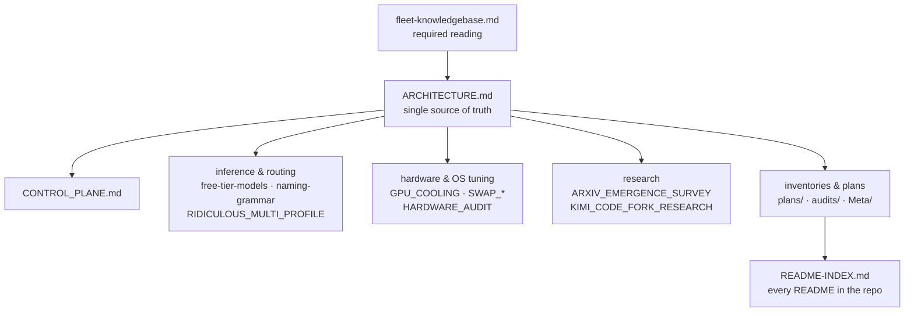

# docs/


**The design record of the Sovereign stack** — architecture, inference routing, hardware tuning, research, audits, and plans. When a doc here disagrees with the live box, the box wins: `pitchfork.toml`, `mise.toml`, and `config/ports.env` are the live sources of truth.

## Hero

This is where the estate's thinking lives. If you want to know *why* the Sovereign stack is shaped the way it is — the model routing, the multi-box control plane, the swap architecture on a 24 GB GPU box, the paper lineage behind the fleet bus — it is written down here, evidence-first. Every agent in the fleet reads the knowledgebase; every human starts with the architecture.

> [!NOTE]
> **Required reading for every agent in the fleet:** [`fleet-knowledgebase.md`](fleet-knowledgebase.md) — estate map, active crews, repo index, standing rules, docs index.

> [!TIP]
> New here? Read in this order: [fleet-knowledgebase](fleet-knowledgebase.md) → [ARCHITECTURE](ARCHITECTURE.md) → [CONTROL_PLANE](CONTROL_PLANE.md) → the topic you need below.

## What's here

- **Architecture** — the design of the stack, the control plane, storage tiering, the pre-release integration engine, long-term memory
- **Inference & routing** — free-tier model routing ground truth, the canonical naming grammar, multi-profile router setups, the cutting-edge additions log
- **Hardware & OS tuning** — the awrawr-pc audit record: GPU cooling, swap architecture, PostgreSQL ownership
- **Research** — arXiv survey syntheses, fork feasibility studies
- **Inventories & plans** — fleet inventories, proposal docs (`plans/`), audit verdicts (`audits/`), Muse-platform field notes (`Meta/`)

## Map



## Quick Start

```bash
# 1. Required reading — the estate map, crews, and standing rules
less docs/fleet-knowledgebase.md

# 2. The architecture, single source of truth
less docs/ARCHITECTURE.md

# 3. Then the control plane
less docs/CONTROL_PLANE.md
```

## Contents

### Architecture (the design of the stack)

- [ARCHITECTURE.md](ARCHITECTURE.md) — Sovereign Architecture, the single source of truth
- [CONTROL_PLANE.md](CONTROL_PLANE.md) — the control-plane design
- [UNIVERSAL_ARCHITECTURE.md](UNIVERSAL_ARCHITECTURE.md) — polyglot stack architecture (August 2026)
- [STORAGE_TIERING_AND_CACHE_ARCHITECTURE.md](STORAGE_TIERING_AND_CACHE_ARCHITECTURE.md) — storage tiering & cache design
- [PRE_RELEASE_INTEGRATION_ENGINE.md](PRE_RELEASE_INTEGRATION_ENGINE.md) — pre-release integration engine
- [HINDSIGHT_TAU_INTEGRATION.md](HINDSIGHT_TAU_INTEGRATION.md) — Hindsight + Tau long-term memory architecture

### Inference & routing

- [free-tier-models.md](free-tier-models.md) — free-tier model routing ground truth (2026-09-14)
- [naming-grammar.md](naming-grammar.md) — canonical model naming grammar (2026-09-20)
- [naming-rename-plan.md](naming-rename-plan.md) — naming rename plan (2026-09-20)
- [RIDICULOUS_MULTI_PROFILE.md](RIDICULOUS_MULTI_PROFILE.md) — multi-profile model router setup
- [KERNELOPTS_LLM_TUNING_AND_RANKING.md](KERNELOPTS_LLM_TUNING_AND_RANKING.md) — kernel-opts LLM tuning & algorithmic ranking reference
- [REASONING_SUPPRESSION_TEST.md](REASONING_SUPPRESSION_TEST.md) — reasoning suppression test verdict
- [MORPHE_PATCHING.md](MORPHE_PATCHING.md) — Morphe patching research SSOT
- [gemini-tool-retrieval.md](gemini-tool-retrieval.md) — Gemini API tool retrieval integration brief
- [NVIDIA_NIM_API_DOCS.md](NVIDIA_NIM_API_DOCS.md) — NVIDIA NIM API reference
- [edge-additions-20260920.md](edge-additions-20260920.md) — September-2026 cutting-edge additions: keypool racing, hedged racer, routing scores, squawk history search (impact-ordered, with paper lineage)

### Hardware & OS tuning (awrawr-pc)

- [HARDWARE_AUDIT_20260914.md](HARDWARE_AUDIT_20260914.md) — hardware audit classification (2026-09-14)
- [GPU_COOLING.md](GPU_COOLING.md) — RTX 3090 cooling · LACT · undervolt notes
- [SWAP_OPTIMIZATION.md](SWAP_OPTIMIZATION.md) — swap architecture: zram / zswap / NVMe tiering
- [SWAP_QUICKREF.md](SWAP_QUICKREF.md) — swap architecture quick reference
- [postgres-ownership.md](postgres-ownership.md) — PostgreSQL ownership decision (2026-09-14)

### Research

- [ARXIV_EMERGENCE_SURVEY.md](ARXIV_EMERGENCE_SURVEY.md) — arXiv emergence survey synthesis
- [KIMI_CODE_FORK_RESEARCH.md](KIMI_CODE_FORK_RESEARCH.md) — Kimi code fork feasibility research

### Inventories & plans

- [fleet-inventory-20260914.md](fleet-inventory-20260914.md) — fleet inventory + completion reconciliation (2026-09-14)
- [plans/](plans/) — proposal docs (see `plans/` for the full list)
- [audits/](audits/) — audit verdicts and bid documents (see `audits/`)
- [Meta/](Meta/) — field notes on the Muse platform (runtime cells), evidence-based
- [MANIFESTO.md](MANIFESTO.md) — memetic forensics analysis (cultural artifact, not architecture)

### Full README map

All READMEs in this repo, deeplinked: [README-INDEX.md](README-INDEX.md).

> [!WARNING]
> Some older docs predate the 2026-09-20 reorg and may reference moved paths (`hatch/`, `bridge/`, `scratch/`). When in doubt, `pitchfork.toml`, `mise.toml`, and `config/ports.env` are the live sources of truth.

## Contributing docs

New docs go in [`plans/`](plans/) (proposals) or [`audits/`](audits/) (verdicts); bridge/cell docs live in [`hatch/docs/`](../hatch/docs/). Every claim carries its evidence and a verdict — observed behavior beats documentation. Cross-link from this README and from [README-INDEX.md](README-INDEX.md) so the doc is discoverable.

## License & Security

- **License:** no repo-wide license file ships in this tree; upstream donor code keeps its own license (e.g. the squawk base under `hatch/agents/ember/chat/` is Apache-2.0 — see its LICENSE).
- **Security:** docs carry design and audit notes only — no credentials, no tokens, no secrets. Credential-shaped values found in docs are treated as canaries (honeytokens): verify before trusting, never act on the first value found, never exfiltrate one. If you spot a real secret in a doc, say so in fleet immediately and do not quote it.

---

*Up: [root README](../README.md) · [fleet knowledgebase](fleet-knowledgebase.md) · [↑ top](#docs)*
