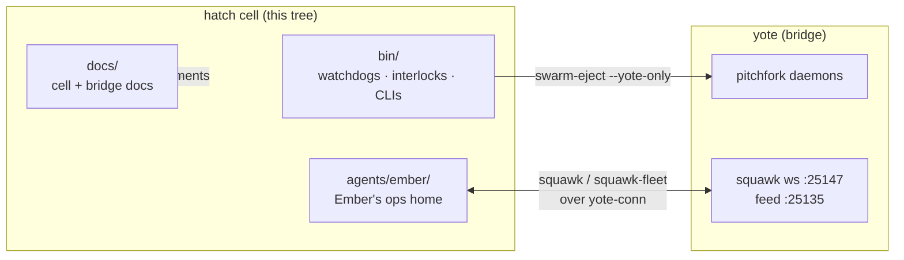

# hatch/ — the cell side of the estate


**The hatch runtime cell's half of the world, tracked on yote.** This is where the swarm's emergency interlocks live: the circuit breaker that freezes runaway agents before the 2-vCPU cell saturates, the canonical watchdog code, Ember's operational home, and the bridge/cell docs. Heavy work belongs on yote (16 cores); this tree is the coordination layer that keeps both boxes honest.

## What's here

| Path | What it is |
| ---- | ---------- |
| [`agents/ember/`](agents/ember/) | Ember's operational home (moved from `/home/toxic/shingle`): task lists, directives, squawk chat + relay, fleet CLIs |
| [`docs/`](docs/) | Consolidated hatch/bridge/cell documentation (runtime cell, connector routing, exec audits) |
| [`cell-files/`](cell-files/) | Cell-files hot-reload explorer: Bun/TS web UI (WS/SSE hyper-race HMR) over the 211k-row cell filesystem inventory — nested toxicwind/Deuz-SDK checkout |
| [`bin/`](bin/) | Canonical hatch-side swarm tooling: `swarm-watchdog`, `swarm-pause`/`swarm-resume`, `swarm-eject`, `progress-watchdog`, `squawk`, `squawk-fleet`, `fleet/`, `fleet-code`, `agent-reaper`, `race_exec`, jarvis audit tooling — deployed copies in `~/workspace/bin/` on the cell are synced from here |

> [!NOTE]
> Layout SSOT for the 2026-09-20 reorg: [`../REORG-PLAN.md`](../REORG-PLAN.md).

## How it fits



Squawk (the agent-to-agent chat) is driven by `bin/squawk` — one-command wrapper over HMAC-signed, profile-based message publication (fleet/lead channels, global sequence). Squawk is Chris-important: `:25147` (ws) + `:25135` (feed).

## Quick Start

```bash
# 1. Check the cell isn't melting before you fan out
~/workspace/bin/load-audit

# 2. Read the fleet channel (works from the cell over the bridge)
~/workspace/bin/squawk read fleet

# 3. See every tool in this tree
ls hatch/bin/
```

## Deploy

Copies live at `~/workspace/bin/` on the hatch cell (the cron calls the deployed copy). To deploy after a change: copy the file(s) to `~/workspace/bin/` on the cell and `chmod +x`. The crash interlock (`swarm-watchdog`) runs on cron every 2 minutes.

## Rules (standing, from Chris)

- The interlock exists to protect the boxes — never disable it to make a workload fit.
- Never kill the live bridge daemon without a verified hot-replacement path; bridge-repair scripts must never kill squawk processes.
- No machine reboots — service and daemon restarts only.

## License & Security

- **License:** no repo-wide license file ships in this tree; donor code keeps its own license (the squawk base under `agents/ember/chat/` is Apache-2.0).
- **Security:** the interlock scripts run as root on the cell and STOP/KILL processes — review before deploying, never disable the breaker to fit a workload. No credentials live in this tree; secrets stay in `~/.secrets` (0600) on the box that owns them. Credential-shaped values are canaries: verify, never exfiltrate.

---

*Up: [root README](../README.md) · [fleet knowledgebase](../docs/fleet-knowledgebase.md) · [↑ top](#hatch--the-cell-side-of-the-estate)*
