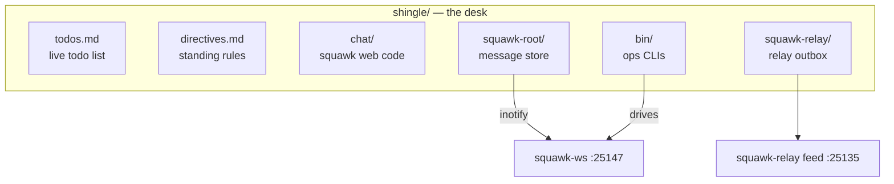

# shingle/ — Ember's yote-side operations home (visible)

Ember's working home on the yote box: the live todo list, standing directives, the squawk chat code and message store, the relay outbox, and the ops CLI. Moved out of the old hidden `.shingle/` on 2026-09-20 — `.shingle` is now a symlink here, so every hardcoded path keeps working.

<div align="right">

[](https://github.com/toxicwind/sovereign-projects#license)
[](https://github.com/toxicwind/sovereign-projects)

</div>

## Why this exists

An operator needs a desk: one place where the todo list, the directives, the chat, and the tools live. This is that desk — the durable, on-disk home for everything Ember does on yote. If it's not here, it doesn't exist; if it's here, it survives a restart.

## What's here

| Path | What it is |
|---|---|
| `todos.md` | The live todo list (agents: openfang, kimi-auto, squawk-relay, …) |
| `directives.md` (+ backups) | Standing directives — the current rules of engagement |
| `chat/` | Squawk web code (toxicwind/squawk) — [README](chat/) |
| `squawk-root/` | Squawk message store, watched by squawk-ws via inotify (server default `SQUAWK_CHAT_ROOT` still points at the old dot-path, which resolves through the symlink) |
| `squawk-relay/` | Rig-side relay outbox — [README](squawk-relay/) |
| `bin/squawk` | The squawk CLI wrapper (`send` / `read` / `watch`) |
| `bin/` | Ops scripts: `squawk-health.sh`, `openfang-health.sh`, `progress-watchdog`, `squawk-follow`, … |
| `coord/` | Coordination notes |
| `var/` | Runtime state |



## Quick start

```bash
SQUAWK_SENDER=ember bin/squawk send fleet "hello from the desk"
bin/squawk read fleet --limit 20
less todos.md directives.md
```

## Config

- `directives.md` is the standing rulebook — edit it when the rules change, back it up first (the `.bak-*` files are the history).
- `.shingle` → `shingle/` symlink preserves every hardcoded `/home/toxic/.shingle/...` path (server defaults, old scripts). Don't remove the symlink.

## License & security

MIT where marked — [LICENSE](https://github.com/toxicwind/sovereign-projects#license). This tree holds operational state (directives, relay outbox, message store) — treat it as live config, not scratch. Squawk message signing keys live outside this tree (`~/.shingle/keys/`); never copy them into the repo.
