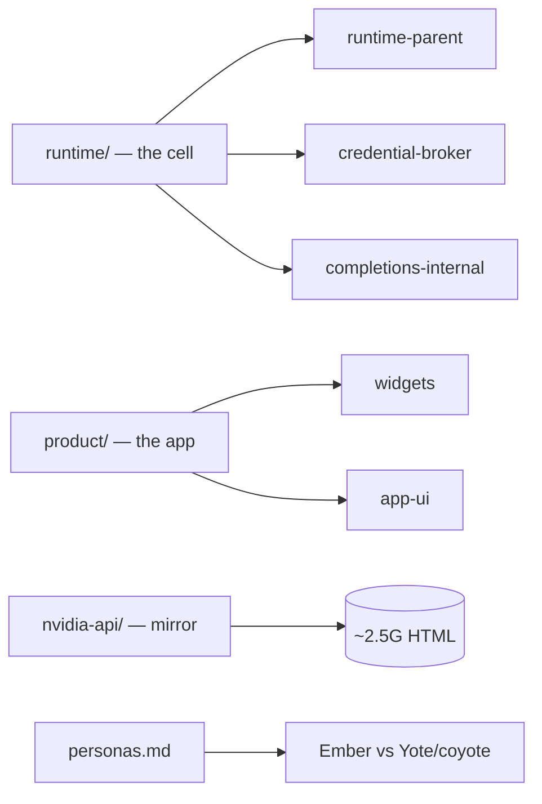

# hatch-docs

Private internal docs — firsthand investigations of the Hatch/Jarvis runtime,
done **from inside the cell**. Every doc separates **observed** (tool output,
files, env vars actually seen) from **inferred** (reasonable but unverified).
Behavior outranks documentation here; help pages are treated as claims, not
truth.

> ## Why this repo exists
>
> Official docs describe the runtime as designed. These docs describe it as
> **built** — measured from the inside, one tool call at a time. When the two
> disagree, the observation wins and the discrepancy is recorded, not smoothed
> over.

## Map

## `runtime/` — how this runtime works

- **[runtime-parent.md](./runtime/runtime-parent.md)** — the supervisor that owns `/run/hatch/`, and
  authd's parent. The full subsystem map: noded, ~70 privsep services, sandbox,
  egress, resume — and the one shape everything follows.
  - [What the parent is](./runtime/runtime-parent.md#what-the-parent-is)
  - [The family: /run/hatch/ children](./runtime/runtime-parent.md#the-family-runhatch-children-and-what-each-does)
  - [The parent's functions](./runtime/runtime-parent.md#the-parents-functions-in-plain-language)
  - [The design pattern, deobfuscated](./runtime/runtime-parent.md#the-design-pattern-deobfuscated)
  - [Observed vs inferred](./runtime/runtime-parent.md#observed-vs-inferred)

- **[credential-broker.md](./runtime/credential-broker.md)** — the credential broker in plain language:
  surrogate issuance, egress substitution, all 9 members of
  `dynamic_credentials.py`, gate locations, the `allowlist_not_allowed` verdict
  (zero hits, exhaustive search), and the bridge token lifecycle.
  - [The full flow](./runtime/credential-broker.md#the-full-flow-plainly)
  - [The module, function by function](./runtime/credential-broker.md#the-module-function-by-function)
  - [Where the gates live](./runtime/credential-broker.md#where-the-gates-live)
  - [What the broker enforces](./runtime/credential-broker.md#what-the-broker-itself-enforces-not-editable-from-here)
  - [On `allowlist_not_allowed`](./runtime/credential-broker.md#on-allowlist_not_allowed)
  - [Bridge token lifecycle](./runtime/credential-broker.md#bridge-token-lifecycle-broker-deep-2026-09-19)

- **[completions-internal.md](./runtime/completions-internal.md)** — what serves this conversation: model
  identity (Muse Spark, `meta/muse-spark`, 200k context), the completions path,
  full trace-context anatomy, workload classes and lanes, the unexplained
  `req:fallback:` prefix, sibling models (Muse Image/Video).
  - [Model identity](./runtime/completions-internal.md#model-identity-authoritative-sources-first)
  - [The completions path](./runtime/completions-internal.md#the-completions-path-observed-from-inside-the-cell)
  - [Workload classes and lanes](./runtime/completions-internal.md#workload-classes-and-lanes-completions)
  - [The socket zoo](./runtime/completions-internal.md#the-surrounding-socket-zoo-env-names-only)
  - [Observed vs inferred](./runtime/completions-internal.md#observed-vs-inferred)

## `product/` — how the agent drives the Muse product

- **[README](./product/README.md)** — index: which surface a given output belongs on.
- **[app-ui.md](./product/app-ui.md)** — driving the app chrome with the `ui`
  namespace (`ui.list` / `ui.navigate` / `ui.set`); `ui.navigate` vs the
  `navigation` widget.
- **[widgets/](./product/widgets/)** — the full widget system: kinds, embed
  tokens, state bridge, HTML authoring rules, surfaces, and the
  widget/artifact/file decision framework.
- Meta's canonical product docs (`~/docs/`) are read-only; these are the
  agent's working notes, not a replacement.

## `nvidia-api/` — local NVIDIA docs mirror

Mirrored 2026-09-21. Public NVIDIA API and developer documentation, fetched
with polite wget crawls and stored as browsable local HTML (links converted).
See [nvidia-api/README.md](./nvidia-api/README.md) for per-section source
roots, page counts, and refresh notes.

| Section | Source |
|---|---|
| `api-reference/` | docs.api.nvidia.com — NGC REST, per-model NIM refs, Cloud Functions, Attestation |
| `nim/` | docs.nvidia.com/nim — NIM microservices, all model families |
| `nvcf/` | docs.nvidia.com/nvcf — NVCF API, CLI, architecture |
| `ngc/` | docs.nvidia.com/ngc — NGC user/catalog/registry guides |
| `ngc-cli/` | docs.ngc.nvidia.com/cli — NGC CLI command reference |
| `nvcf-github/` | github.com/NVIDIA/nvcf — docs/ tree + README |

## personas.md — Ember/hatch vs Yote/coyote

[personas.md](./personas.md) — persona sweep re-run 2026-09-20 (the durable
record; prior sweep 2026-09-19 left findings only in memory notes). All repo
sources verified live via the GitHub API.

## Conventions used across these docs

- **Observed vs inferred, always.** A claim is either backed by a tool result
  or it is marked as inference. No blended mush.
- **Identifiers quoted verbatim.** Runtime names (`JARVIS_INFERENCE_PROXY_SOCK`,
  `space-inference.sock`) are the runtime's own wording — recorded, not judged.
  Chris's preferred term for the model-serving path is "completions".
- **Infra IDs are not model names.** UUIDs in env vars name serving
  infrastructure, never model identity.

---

## Estate docs

- **Fleet knowledgebase** — the canonical estate map, active crews, repo index,
  standing rules, and docs index (source of truth; this README does not
  duplicate it):
  <https://github.com/toxicwind/sovereign-projects/blob/main/docs/fleet-knowledgebase.md>
- **Master README** — the doc-graph root:
  <https://github.com/toxicwind/sovereign-projects/blob/main/README.md>
