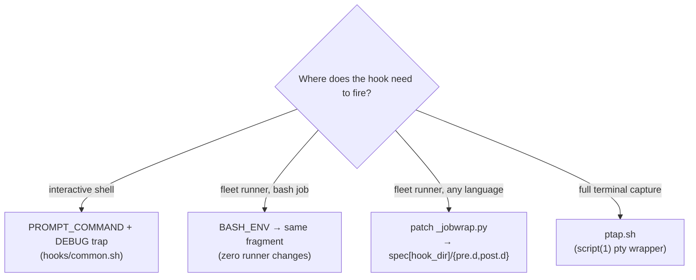

# hook-spike-20260915 🪝

A one-day hook-mechanism spike (2026-09-15, ~03:40 UTC, awrawr-pc / Arch).
**Question:** how to add hooks to (a) `~/.bashrc` (interactive shells) and
(b) the fleet job runner (`/home/toxic/fleet/jobs/bin/job`, repo
`toxicwind/fleet-jobs`).

**Testing only — no live files were touched.** All tests ran in an isolated
harness: fake HOME dirs, a scratch copy of the runner (`FLEET_JOBS_ROOT`
redirected), interactive shells under a real pty via `script(1)`.

> ## TL;DR — no single winner; a small kit, one mechanism per context
>
> | Context | Mechanism | Overhead |
> |---|---|---|
> | Interactive bash (`~/.bashrc`) | **Dual-mode fragment** (`hooks/common.sh`): `PROMPT_COMMAND` (precmd) + `DEBUG` trap (preexec), idempotent, chain-preserving | ~5 µs/prompt, ~39 µs/command |
> | Runner, bash jobs | **`BASH_ENV`** pointing at the same fragment (one-shot mode) — zero runner changes | ~µs (one log line) |
> | Runner, any-language jobs | **Native pre/post hooks**: patch `_jobwrap.py` to run `spec["hook_dir"]/{pre.d,post.d}` (patch: `results/runner-hook-patch.diff`) | ~0.75 ms/hook spawn |
> | Terminal traffic tap (on demand) | **`ptap.sh`**: `script(1)`-based pty wrapper, verbatim ESC capture, 0600 logs, rotation, rc propagation | ~24 ms per tapped invocation |

## Candidate results

### 1. PROMPT_COMMAND append/chain — WORKS (interactive only)

- **Fires:** yes, before every prompt in interactive shells (verified via marker log).
- **Overhead:** ~5 µs per prompt (hook body microbenchmark); in-pty delta
  measurement put it below the noise floor (~3 µs). Negligible.
- **Failure modes (all verified):** hook `return 1` → shell survives, `$?` of
  the real command is **not** clobbered (`false` → next command saw
  `GOT_RC=1` — pty transcript in evidence). Command-not-found inside hook →
  error printed per prompt, shell fine. Hook writing to stdout → lands before
  the prompt, parsing unaffected.
- **Composability:** existing `PROMPT_COMMAND` preserved; order is base-then-hook.
  **Caveat (verified):** an appended hook sees the *previous element's* exit
  code, not the real command's — if exit codes matter, the hook must be
  **first** in the chain or capture `$?` before anything else runs.
- **Idempotent:** double-source installs once (guard var).
- **Runner context:** does **NOT** fire under `bash -i -c` (verified with
  clean HOME).

### 2. DEBUG trap / preexec-style — WORKS (interactive AND non-interactive)

Fires before each command, including non-interactive shells. Pairs with
`PROMPT_COMMAND` to form the dual-mode fragment in `hooks/common.sh`.

### 3. Runner-native hooks — no hook points exist today; patch point identified

The runner (`_jobwrap.py`) has **no** pre/post hook mechanism. The identified
patch point: run `spec["hook_dir"]/{pre.d,post.d}` around job execution.
Reference patch preserved in `results/runner-hook-patch.diff`.

### 4. Wrapper/shim — dual-mode fragment + on-demand pty tap — WORKS, recommended core

The recommended composition: `common.sh` everywhere (interactive via
`PROMPT_COMMAND`+`DEBUG`, runner bash jobs via `BASH_ENV`), plus `ptap.sh`
when verbatim terminal capture is needed.

## Fragments (`hooks/`)

| File | Role |
|---|---|
| [`hooks/common.sh`](./hooks/common.sh) | Dual-mode fragment — the recommended core |
| [`hooks/dbg.sh`](./hooks/dbg.sh) | DEBUG-trap experiments |
| [`hooks/envsnap.sh`](./hooks/envsnap.sh) | Environment snapshot fragment |
| [`hooks/pcmd.sh`](./hooks/pcmd.sh) | PROMPT_COMMAND chain experiments |
| [`hooks/ptap.sh`](./hooks/ptap.sh) | On-demand pty traffic tap |

## Evidence (`results/`)

Raw marker logs per candidate (`markers-*`), hookdir snapshots, env-snap
test log, and the runner patch. Full findings, failure-mode matrix, and
exact insertion snippets live in [**REPORT.md**](./REPORT.md).

## Handoff

Findings handed to the research side at `/home/toxic/sync-hooks/hooks-findings.md`
(see REPORT.md §"Handoff"). This repo is the durable record — the spike is
done, the kit is documented; no further work scheduled.
