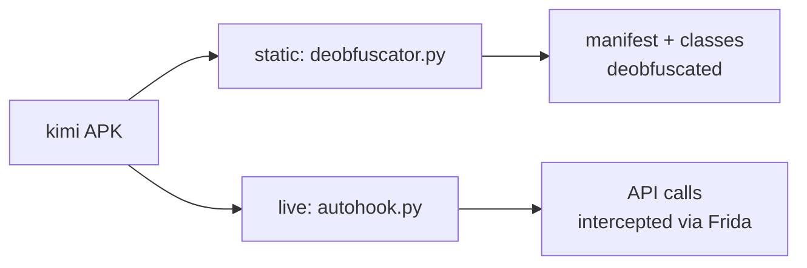

# Kimi Chat APK Audit Suite 📱


Bulletproof APK audit tooling for **com.moonshot.kimichat v3.0.7** —
static deobfuscation plus live Frida interception, both written
defense-in-depth against every environment failure mode encountered
during real audits.

> ## Why this repo exists
>
> Auditing a hardened APK dies a hundred small deaths — missing tools,
> corrupted downloads, FUSE permission issues, encoding explosions, the
> device disconnecting mid-session. Every script here is the
> **"Bulletproof Edition"**: it detects what's wrong, says so plainly,
> and degrades instead of crashing.

## The kit



| File | Role |
|---|---|
| [`deobfuscator.py`](./deobfuscator.py) | **Static deobfuscation** (476 lines). Handles: missing tools, corrupted APK, FUSE permission issues, encoding errors, missing dependencies, partial extraction, obfuscated manifests |
| [`autohook.py`](./autohook.py) | **Live APK interception via Frida** (142 lines). Bulletproof against: missing frida, device not connected, package not found, script errors, keyboard interrupts, zombie processes |
| [`mobile_user_agents.json`](./mobile_user_agents.json) | Mobile user-agent corpus for audit traffic shaping |
| [`requirements.txt`](./requirements.txt) | Full audit toolchain |

## Quickstart

```bash
pip install -r requirements.txt

# Static pass
python3 deobfuscator.py /path/to/kimichat-3.0.7.apk

# Live pass (Frida, USB device; env-overridable)
export FRIDA_TIMEOUT=30   # default 30s
export FRIDA_DEVICE=usb   # default usb
python3 autohook.py
```

## Toolchain (`requirements.txt`)

androguard · pyaxmlparser · frida-tools · objection · quark-engine ·
apkid · mitmproxy · z3-solver — static analysis, dynamic instrumentation,
malware triage, and traffic interception in one install.

## GitLab mirror (optional)

```bash
cat ~/.ssh/id_gitlab_apk.pub   # add to GitLab
git remote add gitlab git@gitlab.com:YOURNAME/kimi-apk-audit.git
git push -u gitlab main
```

---

**Scope:** security research on our own estate's app — audit findings, not
exploit kits. Methodology is fair game; target-specific bypasses stay
internal.
