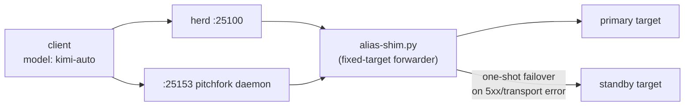

# kimi-auto 🎯

Stable `kimi-auto` model alias for the [herd](https://github.com/toxicwind/sovereign-projects)
router. One model id; the **router config** decides what serves behind it.

> ## Why this repo exists
>
> Callers want a single model id that never goes stale. Instead of a
> resolver process picking models, the alias is **router-configured**:
> `herd.d/kimi-auto.yaml` declares the target and herd's `--watch-config`
> reloads it event-driven on save. Change what `kimi-auto` serves by editing
> two flags in the fragment — nothing else to touch.

## Architecture

**Router-configured by design (v3.0).** There is no selector, no resolver,
no probing, no pacing, no timers, and no model-family preference anywhere in
this package. `herd.d/kimi-auto.yaml` declares a fixed `--target` (plus an
optional `--standby`) for the generic alias forwarder
(`sovereign/config/herd.d/alias-shim.py`); herd `--watch-config` reloads the
fragment event-driven on save. To change what `kimi-auto` serves, edit the
two flags in the fragment — nothing else to touch.

This is Chris's standing rule: **Kimi-named tooling never selects models.
Routers are separate from model-specific code.** Model selection belongs to
router configuration alone, and any-family models (including non-Kimi) must
work through Kimi-named paths. Proven 2026-09-20: `model: "kimi-auto"`
served exact output from `mistral/ministral-14b-latest` (finish `stop`).

Routing (last verified against `herd.d/kimi-auto.yaml`, 2026-09-20 —
re-check the fragment live before quoting):
- primary: `mistral/ministral-14b-latest`
- standby: `toolcall-local/qwen3.5-9b-tool` (one-shot failover on 5xx/transport error)

Moonshot is HTTP 429 (billing suspended) — retarget to `moonshot/kimi-k2.6`
when billing is restored (Chris's money call).

## Two doors, one routing

herd's `kimi-auto` cmd entry and the `:25153` pitchfork daemon run the same
forwarder with the same flags. The shim is a fixed-target forwarder — it
rewrites the model id, passes Authorization through, streams SSE verbatim,
fails loudly (upstream errors surface as-is, never masked), and rejects
self-routes (508). Health (`/health`) reports the configured target/standby
honestly.

## Files

| File | Role |
|------|------|
| [`herd.d/kimi-auto.yaml`](./herd.d/kimi-auto.yaml) | **Router config.** The route, the target, the standby. This file IS the model selection. |
| [`README.md`](./README.md) | This file. |
| [`OPPORTUNITIES.md`](./OPPORTUNITIES.md) | Killer-feature hunt list for the alias track. |

## History

- **v3.0 (2026-09-20)** — Router-config cutover. `resolver.py`, `loop.sh`,
  and `shim.py` retired (history preserved in git): they owned model
  selection, probing, and pacing in tool code, which violates the
  routers-are-separate rule. Routing now lives entirely in
  `herd.d/kimi-auto.yaml`; the forwarder is the shared generic
  `alias-shim.py`. Non-Kimi proof: `UNLOCK-PROOF-7X3Q` served exact from a
  non-Kimi backend through the Kimi-named path on both doors.
- v2.0 — Model-agnostic resolver (retired in v3.0).
- v1.x — Kimi-only resolver (retired).

## Docs

- Master README / estate map: <https://github.com/toxicwind/sovereign-projects>
- Fleet knowledgebase (required reading): `docs/fleet-knowledgebase.md` in
  [sovereign-projects](https://github.com/toxicwind/sovereign-projects)
- Forwarder source: `config/herd.d/alias-shim.py` in sovereign-projects
