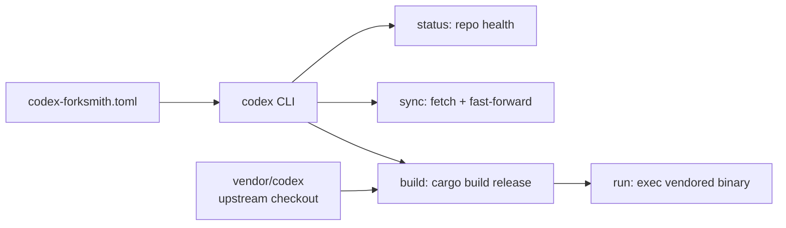

# Codex Forksmith 🦀


A Rust-native control plane for a vendored `codex` workspace — one predictable
CLI over the messy lifecycle of vendoring upstream OpenAI Codex, patching it,
building it, and running it from automation or a human shell.

## Status: early skeleton

This repo is the **scaffolding, not the finished tool**. What exists today:

- `codex-forksmith.toml` — the real configuration contract: repo paths,
  remotes/branches, and build settings (see [Configuration](#configuration)).
- `Cargo.toml` — workspace manifest declaring the planned crate set.
- `crates/ast-driver/` — crate manifest only (`codex-ast-driver`); no sources
  yet.
- `README.md.bak` — leftover 4-line backup stub from an earlier edit pass.

What does **not** exist in this snapshot:

- `src/` for the root `codex-forksmith` crate — the `[[bin]]` target has no
  sources, so nothing builds yet.
- The other workspace members declared in `Cargo.toml`
  (`crates/cocci-driver`, `crates/core`, `crates/pkg`, `crates/registry`,
  `crates/updater-cli`, `crates/wrapper`) — manifests not present; the
  workspace does not currently resolve.
- `vendor/codex` — the vendored upstream checkout the config points at.
- A `LICENSE` file — no license text is on record in this snapshot.

> The detailed `codex status` / `codex sync` / `codex build` / `codex run`
> surface described in earlier README revisions is the **planned** interface,
> not implemented code. It is preserved below under
> [Planned CLI surface](#planned-cli-surface).

## Intended design



One wrapper, machine-friendly output, safe to call from agents: `status` exits
non-zero only on merge conflicts or a missing artifact; `sync` prints a single
`SYNC_RESULT` summary line for agent parsing.

## Configuration

`codex-forksmith.toml` (present and authoritative):

```toml
version = 1

[workspace]
root = "."

[repo]
path = "vendor/codex"
local_remote = "origin"
local_branch = "main"
upstream_remote = "upstream"
upstream_branch = "main"

[build]
profile = "release"
workspace = "codex-rs"
binary_relpath = "codex-rs/target/release/codex"
```

The control plane reads repo identity (local vs upstream remotes, tracked
branches) and build targets (release profile, expected binary path) from here —
edit this file to point the tool at a different checkout.

## Planned CLI surface

> ⚠️ Planned — not implemented in this snapshot. Tracked here so the scaffold
> and the docs agree on the target.

- `codex status` — branch/HEAD, working-tree cleanliness, ahead/behind vs
  `origin/<branch>` and `upstream/<branch>`, merge-conflict and missing-artifact
  detection.
- `codex sync [--dry-run]` — fetch configured remotes, fast-forward when safe,
  idempotent, prints a `SYNC_RESULT` summary line.
- `codex build` — `cargo build` (release profile) in the vendored workspace,
  prints the artifact path; auto-enables `sccache` as `RUSTC_WRAPPER` when
  available.
- `codex run -- <args>` (or `codex <args>`) — ensure the binary exists
  (auto-build if missing), then exec it with inherited stdio.
- Loader overrides: `codex --loader-status`, `--loader-sync`,
  `--loader-build`, `--loader-help`.

## Planned workspace crates

Declared in `Cargo.toml` (only `ast-driver`'s manifest is present):

| Crate | Intended role |
|---|---|
| `crates/ast-driver` | AST-driven adapters for the update pipeline |
| `crates/cocci-driver` | Coccinelle-style semantic-patch driver |
| `crates/core` | Orchestration primitives and core types |
| `crates/registry` | JSON registry helpers for patch sets |
| `crates/pkg` | Packaging helpers |
| `crates/updater-cli` | Updater command surface |
| `crates/wrapper` | Small wrapper/launcher |

## Build

```bash
cargo build --workspace
```

> Currently unverified — the workspace manifest references member crates that
> are not present in this snapshot, so expect resolution failures until the
> skeletons land.

## Roadmap

1. Land crate skeletons so `cargo build --workspace` resolves.
2. Implement `status` / `sync` per the contract above.
3. Wire `codex-forksmith.toml` parsing into the root binary.
4. Add `LICENSE` (none on record in this snapshot).

## License

No `LICENSE` file is present in this snapshot — license is undecided.
