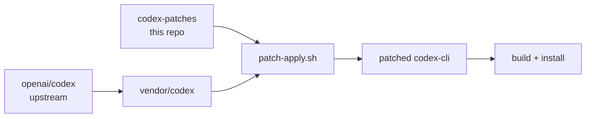

<div align="center">

# Codex Community Patches 📦

Small, focused patches that extend or fix the OpenAI Codex CLI without waiting on upstream merges.


</div>

This repository hosts **production-ready `git format-patch` files** that apply
directly to a vendored clone of the upstream Codex CLI. It is designed to be
consumed by tooling like
**[`codex-updater`](https://github.com/toxicwind/codex-updater)** (declared as
its `patches/community` submodule), but you can also apply the patches manually
with `git am`.

## What's inside

| Patch | Subject | What it does |
|---|---|---|
| `0001-cli-infra-and-wiring.patch` | `cli: add sessions/resume/export/bookmarks/doctor plumbing` | Series 1/5 — shared infra and wiring for the CLI feature set |
| `0002-sessions-command.patch` | `cli(sessions): list sessions with --json and columns` | Series 2/5 — session listing with JSON and column output |
| `0003-chat-resume-and-history-export.patch` | `cli(chat): add --resume picker and --session; history export` | Series 3/5 — resume picker, session pinning, history export |
| `0004-bookmarks-command.patch` | `cli(bookmarks): tag/untag/list sessions with sidecar DB` | Series 4/5 — session bookmarks backed by a sidecar DB |
| `0005-doctor-command.patch` | `cli(doctor): environment checks and endpoint reachability` | Series 5/5 — `doctor` diagnostics for env + endpoints |
| `0006-unified-exec-raise-streaming-horizon.patch` | `feat(unified-exec): raise streaming horizon` | Raises the unified-exec streaming horizon |
| `0007-read-file-broaden-slice-window.patch` | `feat(read-file): broaden slice window` | Broadens the read-file slice window |
| `0008-unified-exec-fast-path-cat-sed-previews.patch` | `feat(unified-exec): fast-path cat/sed previews` | Fast-path `cat`/`sed` previews in unified exec |

(Subjects quoted verbatim from the patch headers.)

- Each patch is created with `git format-patch --binary -1` to preserve renames
  and assets.
- Patches target the **CLI package** inside the upstream repo (commonly
  `codex-cli/`).

> If your upstream uses a different CLI folder (e.g. `cli/`), consumers should
> remap paths at apply-time. `codex-updater` does this automatically.



## Quick start (manual apply)

```bash
# 1) Get the upstream source
git clone https://github.com/openai/codex.git vendor/codex
cd vendor/codex

# 2) Apply one or more patches
git am /path/to/codex-patches/0001-*.patch /path/to/codex-patches/0002-*.patch

# 3) Build & test the CLI
pnpm i && pnpm build  # or: npm ci && npm run build
node codex-cli/dist/index.js --help
```

## Using with `codex-updater`

`codex-updater` vendors the upstream as a submodule and can apply these patches automatically. Typical layout:

```
codex-updater/
├─ vendor/codex                 # upstream submodule
├─ patches/
│  ├─ community (submodule -> this repo)
│  └─ local     (ignored; your private WIP patches)
└─ scripts/
   ├─ patch-apply.sh            # applies community + local
   ├─ patch-new.sh              # captures staged changes into patches/local
   └─ patch-export.sh           # promotes local → community
```

## Patch authoring guidelines

* **One change per patch**. Prefer 3 smaller patches over 1 mega-patch.
* Use a **clear subject line**:

  * `feat(cli/sessions): add --json and --limit`
  * `fix(chat): persist --resume across cwd`
  * `docs(history): document export formats`
* Generate with `git format-patch --binary -1` so renames and binary assets
  survive.
* Keep patches rebased against a recent upstream commit; note the base commit in
  the patch body when it matters.

## Environment

Copy `.env.example` to `.env` and tweak the keys you care about — consumers of
this repo (notably `codex-updater`'s scripts) auto-load it.

## License

Intended license: **WTFPL**. No `LICENSE` file is present in this snapshot —
one should be added to match the badge and the authoring intent.
