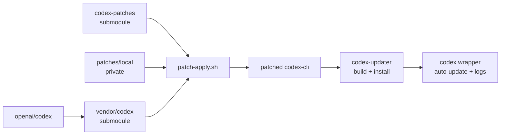

<div align="center">

# Codex Updater ♻️

Make the OpenAI Codex CLI your own without playing tag with upstream releases.


</div>

**Codex Updater** is a cross-distro toolkit that vendors the upstream **OpenAI
Codex** repo, applies community/private patches, builds a versioned CLI, and
installs it to a user prefix. It ships a wrapper that adds auto-updates,
logging, and commit-aware caching so you only rebuild when upstream actually
changes.

## What it is

- **Vendored upstream** at `vendor/codex` (git submodule → `openai/codex`,
  declared in `.gitmodules` — run `git submodule update --init --recursive`
  after cloning; the submodule is not initialized in a fresh clone)
- **Community patches** at `patches/community` (git submodule →
  [`toxicwind/codex-patches`](https://github.com/toxicwind/codex-patches))
- **Local patches** at `patches/local` (gitignored; your private queue)
- **`codex`** — the wrapper: on-demand updates, background auto-update, build
  logging
- **`codex-updater`** — the builder/installer: cross-distro bootstrap, build,
  install to user prefix
- **`run.sh`** — push helper: pushes submodule(s) first, then the superproject,
  with GitHub sanity checks

> **Snapshot note:** the `scripts/` directory in this snapshot ships
> `bootstrap.sh`, `bootstrap.ps1`, and `install-deps.sh`. The
> `patch-apply.sh` / `patch-new.sh` / `patch-export.sh` / `codex-build.sh` /
> `packager.sh` scripts referenced below are the intended patching workflow —
> they are not present in this snapshot.



## Features

- Commit-aware caching: rebuilds only when upstream or patches change
- Tag-/commit-aware versions: `codex --version` surfaces Git tags when
  available, otherwise `<YYYY.MMDD.HHMM+sha>` so you know exactly which
  upstream commit is installed
- Cross-distro bootstrap (apt, dnf/dnf5/yum, pacman, zypper, apk, Linuxbrew)
- Wrapper UX: on-demand updates, background auto-update, and logs with build
  info
- Dev workspace is opt-in: set `CODEX_WRAPPER_USE_DEV_WORKSPACE=1` if you truly
  want builds to come from `~/development/codex-updater`; by default the
  wrapper pulls the cached upstream clone so `codex resume` no longer triggers
  a full rebuild whenever your local checkout is dirty
- **Multi-OS CI**: patch + build + smoke tests on Linux and macOS across Node
  LTSes (`.github/workflows/ci.yml`, `patch-check.yml`, `release.yml`)

## Requirements

- Linux or WSL; macOS supported via CI and local builds
- Rust toolchain (installed automatically via `rustup` if missing)
- OpenSSL dev headers (installed when possible)
- Node.js (for upstream CLI build; CI tests Node 18/20/22)

## Install

```bash
chmod +x codex codex-updater
mkdir -p ~/.local/bin-core
cp codex codex-updater ~/.local/bin-core/

codex --wrapper-update
codex --wrapper-version
```

> **Note:** The wrapper aliases `codex` → `codex-updater`. It performs a
> background auto-update on a 24h interval, but it no longer forces a rebuild
> on every single invocation. Export `CODEX_WRAPPER_ALWAYS_UPDATE=1` if you
> want a pre-flight rebuild before each launch.

## Configuration

### Environment files

Both executables auto-load the first readable `.env` they can find in this
order:

1. Path supplied via `CODEX_ENV_FILE`
2. `$HOME/.config/codex-updater/.env`
3. An `.env` that lives next to the script/binary (inside this repo before
   install)

The repo ships `.env.example`; copy it to `.env`, tweak the keys you care
about, and the wrappers pick them up automatically — no more random `export …`
lines in your shell profile.

## Repo layout

```
.
├─ codex                 # lightweight wrapper (delegates, updates, logs)
├─ codex-updater         # builder/installer for upstream codex
├─ run.sh                # push submodule(s) first, then superproject
├─ vendor/
│  └─ codex              # upstream submodule (openai/codex) — init required
├─ patches/
│  ├─ community          # submodule → toxicwind/codex-patches
│  └─ local              # your private patches (gitignored)
└─ scripts/
   ├─ bootstrap.sh       # cross-distro bootstrap
   ├─ bootstrap.ps1      # Windows bootstrap
   └─ install-deps.sh    # dependency installer
```

## Intended patching workflow

> The scripts below are the intended workflow; they are not present in this
> snapshot (see snapshot note above).

```bash
# 0) Make sure submodules are present
git submodule update --init --recursive

# 1) Apply patches (community + local) onto upstream
./scripts/patch-apply.sh

# 2) Build upstream CLI and run quick smoke tests
./scripts/codex-build.sh

# 3) Make a change inside vendor/codex (CLI)
( cd vendor/codex && $EDITOR codex-cli/src/sessions.ts && git add -A )

# 4) Capture your change as a patch
./scripts/patch-new.sh "feat(cli/sessions): add --json and --limit flags"

# 5) Test the patch again from a clean state
git -C vendor/codex reset --hard HEAD~1
./scripts/patch-apply.sh && ./scripts/codex-build.sh

# 6) Promote your patch to the public community repo
./scripts/patch-export.sh patches/local/0001-feat-cli-sessions-add-json-and-limit.patch
```

## How it works

1. **Updater** detects the current upstream commit + patchset hash and builds
   only when that **tuple changes**.
2. **Patches** are applied with `git am` in order: community → local.
3. **Build** uses the upstream package manager (`pnpm` or `npm`); **wrapper**
   registers build metadata.
4. **Wrapper** can trigger on-demand update or run on an interval (opt-in env
   var).

## Development

* Keep scripts POSIX-friendly; avoid hard distro assumptions
* Patches should be targeted, reviewable, and rebased as needed
* `CHANGELOG.md` tracks releases (currently at `v0.1.0` — initial drop)

## Security & License

* Private reporting: see `SECURITY.md`
* License: WTFPL v2 (see `LICENSE`)
