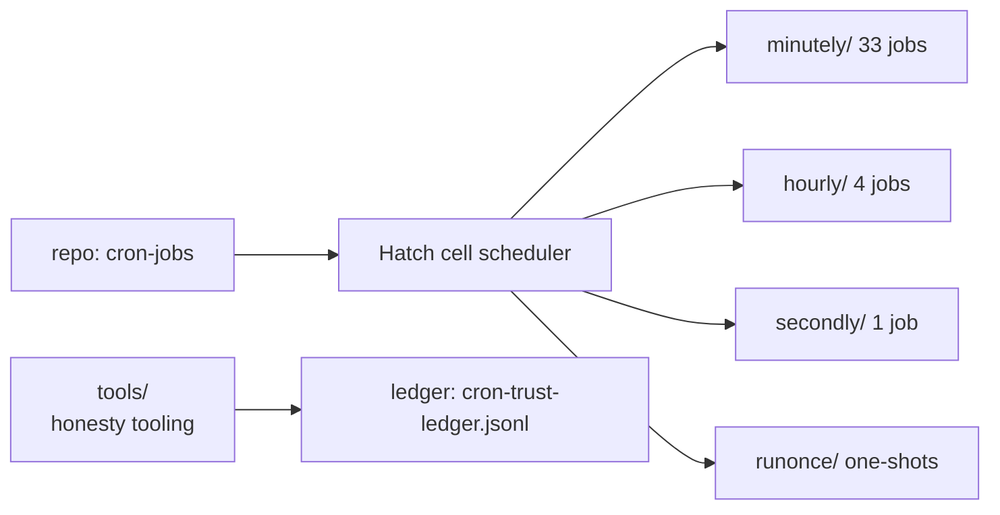

# cron-jobs ⏰


Live scheduled-job definitions for the Hatch cell scheduler. **These files are
the source of truth the scheduler reads — edits here change live behavior.**

> ⚠️ **PUSH EVERYTHING.** No local-only edits to live prompts. If you edit a
> job, commit and push; an unpushed edit is a lie the scheduler never sees.

## Layout

Job files live under granularity directories and are named for what they do:

```
<granularity>/<job-name>__<schedule>.md
```

| Directory | Jobs | Cadence in filename |
|---|---|---|
| `minutely/` | 33 | `__interval@<every>` — e.g. `bridge-watchdog__interval@5m.md` |
| `hourly/` | 4 | `__interval@1h` |
| `secondly/` | 1 | `__interval@30s` — `sidechat-watch-squawk__interval@30s.md` |
| `runonce/` | 10 | `__runonce@<ISO timestamp>` — one-shot jobs (dated 2026-09-16) |
| `_archive/` | 24 | retired/superseded job definitions |
| `tools/` | — | versioned source for the scheduler honesty tooling |



## Job file format

Every job is a Markdown file with YAML frontmatter followed by the prompt body.
Verified schema (from `minutely/ask-complete-watchdog__interval@15m.md`):

```yaml
---
id: ask-complete-watchdog          # unique job id
title: Ask-complete watchdog (15m)
enabled: true
mode: task
schedule:
  kind: interval
  timezone: America/Denver
  at: 2026-09-17T01:25:36          # anchor; `every` sets the cadence
  every: 15m
timeout_secs: 600
delivery:
  - surface: side_chat
    to: f7ef50c8-df84-4f9a-bb0d-1229d63e5b58
metadata:
  originating_channel_context_json: '{...}'
  presentation_locale: en-US
---
<the prompt the scheduler runs>
```

Frontmatter keys: `id`, `title`, `enabled`, `mode`, `schedule` (`kind`,
`timezone`, `at`, `every`), `timeout_secs`, `delivery`, `metadata`.

## tools/

Versioned source for the scheduler honesty tooling. Live copies run from
`~/workspace/bin/`; this directory is the durable, pushed record. See
[`tools/README.md`](tools/README.md) for the full rundown.

- `cron-trust-monitor` — 15-minute watchdog: classifies live runs into honest
  statuses (genuine / vetoed / overlap-skip / no-op / quota-deferred / coalesced
  / failed / timeout / ambiguous), writes the ledger and per-job state, and
  reactively remediates (auto-stagger overlapping schedules, bump timeouts).
- `cron-honest-status` — CLI over the same classifier: `--classify` for piped
  `cron.runs` JSON, `--state` for the honest table, `--ledger` for the monitor
  health trend.
- `bench-run.sh` — permanent tau benchmark harness invoked nightly by the
  `tau-bench-nightly` schedule (daily 03:30 MDT).
- `orphan-reaper`, `cell-backup-manifest` — supporting ops tooling.

## Working with this repo

```bash
# Add a job: create minutely/<name>__interval@<every>.md with the frontmatter above
# Retire a job: move it to _archive/ (don't delete — history matters)
# Then ALWAYS:
git add -A && git commit -m "cron: <what changed>" && git push
```

- Keep `enabled: false` (not deletion) for jobs you want to pause — the file
  stays as the record.
- One-shot jobs go in `runonce/` with the fire-at timestamp in the filename.
- Never hand-edit the scheduler's live state to match the repo; it's the other
  way around — the repo is the source of truth.

## License

No `LICENSE` file is present in this snapshot. Private ops repo.
