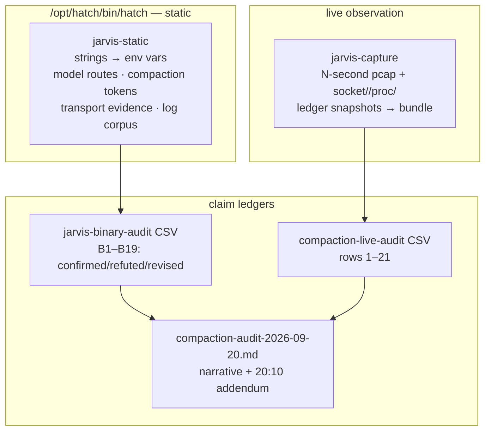

# audit-jarvis — Jarvis/Hatch live audit, 2026-09-20

Deep, evidence-graded audit of the Hatch/Jarvis daemon (`/opt/hatch/bin/hatch`, Rust workspace `hatch-engine`, v0.1.0 commit `c9ee57f462d`), its compaction subsystem, and the observable boundaries of the runtime cell. Per Chris's directive: missing binaries are fetched, never blockers; observed behavior beats documentation; every claim carries its evidence and a verdict.

<div align="right">

[](https://github.com/toxicwind/sovereign-projects#license)
[](https://github.com/toxicwind/sovereign-projects)

</div>

## Why this exists

The compaction subsystem decides when your context gets summarized — silently, in the background, with the summary quality directly affecting your work. Nobody had proven how it actually behaved. This audit proved it: with the binary's own log strings, ledger correlation, and kernel-level observation walls named and dated. It's the reference for every "why did my context compact?" question since.

## What we proved (live, this box)

- **Eager background compaction is real** — a full lifecycle proven in the binary's own log strings: `started` → `artifact ready for background persist` → `persisted` / `failed to persist` → `produced no checkpoint` / `discarded stale artifact` / `invalidated`. Plus a glued telemetry vocabulary (`eager_background_compaction_*`, exact substring counts) and per-stage `*_total_ms` timing metrics.
- **The ledger cannot attribute compactions to the eager path.** The fleet `agent_compactions` table has no eager/execution-mode column, so the `threshold` trigger label collapses eager-adopted and synchronous compactions. The 94k–235k `tokens_before` spread is consistent with both eager adoption and estimate noise — attribution needs per-compaction path data the ledger doesn't carry.
- **Trigger is a host-side launch parameter**, not session-mutable: 10 write surfaces checked, all negative. `/etc/hatch` is host-re-rendered (staged override wiped 2026-09-20 19:26 MDT) — not a durable surface.
- **Inference transport is WebSocket over unix socket** (`/run/hatch/proxy/inference.sock`, tungstenite 0.29), not gRPC. Compaction decisions execute server-side (`azure/avocado-compaction-v1`).
- **Cell egress IS capturable** (tcpdump 4.99.4 fetched via DoH/1.1.1.1): plaintext `CONNECT` to the egress proxy `:3128` gives SNI-equivalent visibility of *our own* traffic. The daemon's inference flows live in the host netns and never traverse the cell.
- **Active probing of PID 67 is blocked at a verified kernel wall** (ptrace/strace/environ/ns denied); **passive observation stays open** (`/run/hatch/sandbox/space-inference.sock` is visible and listening; socket snapshots + pcap + ledger correlation work).



## Tooling (durable, committed)

| Tool | Purpose |
|---|---|
| `../bin/jarvis-static` | Reproducible static-analysis pipeline: strings → env-var inventory, model-route inventory, stem-anchored compaction-token extraction, transport evidence, human-readable log-message corpus. Re-runnable after a daemon rebuild. |
| `../bin/jarvis-capture` | Bounded one-shot live capture (NOT a daemon): N-second pcap of cell egress + socket/`/proc`/ledger snapshots → timestamped bundle + `SUMMARY.txt`. Invoke manually around real work. |
| `../bin/tcpdump` + `../bin/pcap-install.sh` | Packet-capture wrapper (`-Z root`, `$HOME`-relative) and its reproducible installer (DoH via 1.1.1.1 → Ubuntu archive debs → `pcaproot/`). |

## Quick start

```bash
../bin/jarvis-static        # regenerate all inventories from the live binary
../bin/jarvis-capture 60    # 60s bounded capture → captures/<timestamp>/ + SUMMARY.txt
```

## Dataframes

- `jarvis-binary-audit-2026-09-20.csv` — claim/evidence/verdict ledger for the binary findings (B1–B19). Verdicts: `confirmed` / `refuted` / `revised`; heuristic steps are labeled as such.
- `compaction-live-audit-2026-09-20.csv` — claim ledger for the live probing (rows 1–21, incl. revisions that downgrade premature "impossible" verdicts).
- `compaction-audit-2026-09-20.md` — narrative audit with 2026-09-20 20:10 MDT addendum.
- `jarvis-env-vars.txt`, `jarvis-model-routes.txt`, `jarvis-*-tokens.txt`, `jarvis-compaction-logmsgs.txt`, `jarvis-transport.txt`, `jarvis-compaction-offsets.txt` — machine-readable inventories regenerated by `jarvis-static`.
- `captures/` — timestamped `jarvis-capture` bundles.

## Method notes (read before citing)

- The daemon's telemetry vocabulary is **build-time concatenated in rodata with no separators**. Token boundaries are recovered by stem-anchored segmentation (heuristic); the stem inventory itself is exact (substring-verified, counts in file headers). Lifecycle claims rest on the human-readable log strings, which are exact.
- No credentials are persisted anywhere in this tree. The egress proxy credential visible in process environments is redacted from all artifacts.
- Never signal or restart the live daemon (PID 67) from the cell.

## License & security

MIT where marked — [LICENSE](https://github.com/toxicwind/sovereign-projects#license). This audit deliberately stayed on the observation side of the kernel wall: passive reads, never active probing of the live daemon. Keep it that way — ptrace/strace against PID 67 is a verified dead end *and* a live-daemon risk. All credentials are redacted from every artifact by policy.
