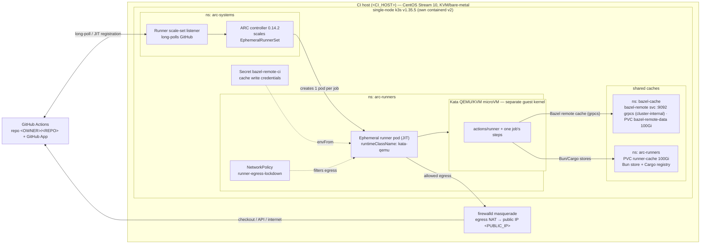

<div align="right">

[](https://github.com/toxicwind/sovereign-projects#license)
[](https://github.com/toxicwind/sovereign-projects)

</div>

# Self-hosted Kata CI

Hardware-isolated, scale-to-zero GitHub Actions on your own metal: **every CI job on the self-hosted `omp-kata` label runs inside its own throwaway Kata Containers QEMU/KVM microVM** — its own guest kernel, one job, then destroyed.

> Cloud runners bill you for trust you don't need and isolation you can't verify. This setup flips it: a single bare-metal host runs one-node k3s, ARC watches GitHub for queued jobs, and each job boots a fresh microVM that can never inherit state from a previous job. PRs deliberately run on GitHub-hosted runners, so untrusted code never reaches the shared caches.

These docs are a **from-scratch setup guide** — read this overview, then follow the numbered guides in order.

## Features

- **One job = one VM** — JIT-registered ephemeral runners; no templating, no pooling, no cross-job state
- **Scale-to-zero** — `minRunners: 0` / `maxRunners: 8`; idle fleet costs nothing
- **Host-kernel isolation** — jobs see the microVM's guest kernel, never the host's
- **No external registry** — runner image built on the host, imported straight into k3s containerd
- **Shared in-cluster cache** — bazel-remote (Bazel action/CAS) plus a PVC for Bun/Cargo downloads; cache traffic stays on the host
- **Untrusted-PR firewall** — PRs run on GitHub-hosted runners, never on the self-hosted fleet

## Architecture



## Quick start

```bash
ls /dev/kvm && kubectl version --client && helm version
```

If that passes (KVM present, `kubectl` and `helm` on the host), start with [01-host-and-cluster.md](01-host-and-cluster.md) and work the numbered guides in order.

## License & Security

**License:** MIT — see [LICENSE](https://github.com/toxicwind/sovereign-projects#license).

**Security:** this design exists for security — untrusted PR code runs only on GitHub-hosted runners, never in the self-hosted microVMs. Secret *values* never appear in these docs (placeholders only, see below). Runner egress is locked down by NetworkPolicy and NATs through the host.

## End-to-end job lifecycle

1. A workflow job targeting the self-hosted label (`runs-on:`) is **queued** on GitHub.
2. The **scale-set listener** in `arc-systems` is long-polling the GitHub Actions service and receives the job-assignment message.
3. The listener signals demand to the **ARC controller**, which scales the **EphemeralRunnerSet** up by one.
4. The controller creates a single **JIT-registered ephemeral runner pod** in `arc-runners`, with `runtimeClassName: kata-qemu` and the `bazel-remote-ci` secret injected via `envFrom`.
5. containerd hands the pod to the Kata shim, which **boots a fresh QEMU/KVM microVM** (own guest kernel; the container rootfs is shared in over virtio-fs). No templating — every job gets a clean VM.
6. The runner agent inside the microVM **registers just-in-time and picks up exactly one job**. Steps run isolated from the host, using bazel-remote for Bazel action/CAS caches, mounted PVC paths for package caches, and NAT egress for the public internet, all constrained by the `runner-egress-lockdown` NetworkPolicy.
7. The job finishes; the ephemeral runner **deregisters and the pod (and its microVM) is destroyed** — never reused.
8. When no jobs remain queued, the EphemeralRunnerSet **scales back to zero**, leaving no idle runners or VMs.

## Component map

| Component | What it is | Version | Documented in |
|---|---|---|---|
| Host + k3s cluster | Bare-metal CentOS Stream 10 node, single-node k3s (own containerd v2, Flannel CNI; Traefik + servicelb disabled so host nginx keeps :80/:443); firewalld provides NAT egress | k3s `v1.35.5+k3s1` | [01-host-and-cluster.md](01-host-and-cluster.md) |
| Kata Containers runtime | QEMU/KVM microVM runtime: containerd drop-in registering `kata-qemu` + the `kata-qemu` RuntimeClass | Kata `3.31.0` | [02-kata-runtime.md](02-kata-runtime.md) |
| Preloaded runner image | Custom `actions/runner` image (build toolchain, Bun, Rust nightly + cross targets, native-build deps) built on the host and imported into k3s containerd — no registry | local dated tag | [03-runner-image.md](03-runner-image.md) |
| ARC (runner scale set) | actions-runner-controller, `gha-runner-scale-set` flavor: controller in `arc-systems`, one scale set + listener, GitHub App auth | ARC `0.14.2` | [04-arc-and-caching.md](04-arc-and-caching.md) |
| Shared caches | bazel-remote `v2.6.2` (`svc bazel-remote:9092` grpcs, cluster-internal only, 100Gi PVC) is the Bazel action/CAS cache; `arc-runners/runner-cache` (100Gi PVC) holds Bun/Cargo downloads; the `bazel-remote-ci` secret and egress NetworkPolicy wire access | in-cluster services/storage | [04-arc-and-caching.md](04-arc-and-caching.md) |

## Prerequisites

- **A Linux host with hardware virtualization.** Intel VT-x or AMD-V enabled, KVM available (`/dev/kvm` present and accessible). Bare metal is simplest; on a VM you need working nested virtualization. The reference host is 32 vCPU / 125 GiB RAM — size to roughly `maxRunners × per-job resources` plus cluster overhead.
- **Root (or full sudo)** on that host: you will install k3s, Kata, kernel modules, firewall rules, and a container image.
- **A public-ish egress path.** The host must reach GitHub; runner microVMs NAT out through the host's public IP. No inbound ports are required for the runners (the listener uses outbound long-poll).
- **A GitHub repository** to attach runners to, and a **GitHub App** (recommended) or PAT installed on it with permissions to manage self-hosted runners. You will record the App ID, installation ID, and private key as a Kubernetes secret.
- **CLI tooling on the host:** `kubectl` and `helm` (k3s bundles a kubectl), plus Docker/buildkit for building the runner image (see [03-runner-image.md](03-runner-image.md)).

## Redaction & placeholders

The configs in this doc set are copied verbatim from the live host and then redacted. Wherever you see one of these tokens, substitute your own value:

| Placeholder | Substitute with |
|---|---|
| `<CI_HOST>` | Your CI host's hostname / SSH target |
| `<PUBLIC_IP>` | The host's public IPv4 address |
| `<TAILNET_IP>` | Your Tailscale/tailnet admin IP(s) (the generic CGNAT range `100.64.0.0/10` is kept as-is) |
| `<OWNER>/<REPO>` | Your GitHub repository owner and name |
| `<GITHUB_APP_ID>` | Your GitHub App ID |
| `<GITHUB_APP_INSTALLATION_ID>` | Your GitHub App installation ID |
| `<GITHUB_APP_PRIVATE_KEY>` | Your GitHub App private key (PEM) |
| `<S3_ACCESS_KEY>` / `<S3_SECRET_KEY>` | Legacy RustFS/S3 credentials (only while the legacy sccache stack survives) |
| `<PLACEHOLDER>` | Any other password/key/token (named in context where it appears) |

Intentionally **kept as-is** (not sensitive, needed to follow along): the pod CIDR `10.42.0.0/16`, the service CIDR `10.43.0.0/16`, the CoreDNS service IP `10.43.0.10`, in-cluster service DNS names and ports (including `bazel-remote.bazel-cache.svc.cluster.local:9092` and NodePort `30992`), and all version numbers.

## Recommended setup order

Work through the numbered guides in order — each builds on the previous:

1. **[01-host-and-cluster.md](01-host-and-cluster.md)** — Host prep (KVM, firewall/NAT) and the single-node k3s install, networking, and CNI.
2. **[02-kata-runtime.md](02-kata-runtime.md)** — Install Kata Containers, wire it into k3s' containerd, and register the `kata-qemu` RuntimeClass.
3. **[03-runner-image.md](03-runner-image.md)** — Build the preloaded runner image and import it into k3s containerd.
4. **[04-arc-and-caching.md](04-arc-and-caching.md)** — Install ARC and the runner scale set, deploy the bazel-remote cache (`infra/bazel-remote/setup.sh`), add the runner cache PVC for Bun/Cargo, wire up the `bazel-remote-ci` secret, and apply the egress NetworkPolicy.
