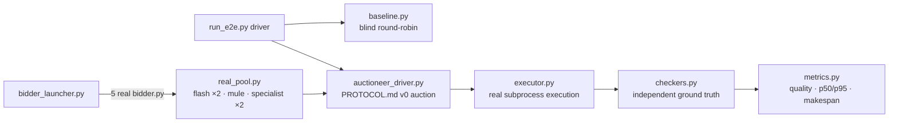

# bid-market e2e harness (T2-E2E)

End-to-end testing for the squawk bid-marketplace. **E2E-REAL: no mocks.** Real bidder.py OS processes, real HMAC-signed squawk messages per PROTOCOL.md v0, real task execution, and independent ground-truth verification of every result.

<div align="right">

[](https://github.com/toxicwind/sovereign-projects#license)
[](https://github.com/toxicwind/sovereign-projects)

</div>

## Why this exists

A marketplace whose tests mock the bidders proves nothing about the marketplace. This harness runs the real thing: five genuine bidder processes, the real auction protocol, real shell/python execution — and then checks every claimed result against an *independent* ground-truth recompute. If the market lies, the checker catches it. That's the whole point: trust comes from verification, not from the market grading its own homework.

## Features

- **No mocks** — real `bidder.py` processes, real HMAC-signed messages, real execution.
- **16 real tasks** — 4 categories × 4, with seeded fixture generators.
- **Independent checkers** — pure-Python recompute from fixtures; claimed-ok-but-checker-failed counts as *false completion*.
- **Baseline comparison** — naive blind round-robin dispatcher vs. the real auction, so you can measure what the auction buys you.
- **Allocation-quality metrics** — % assigned to the oracle-best bidder, p50/p95 latencies, makespan.
- **Event-driven IPC** — FIFOs and inotify throughout; no poll loops.



## Layout

| File | Role |
|---|---|
| `tasks.py` | 16 real tasks (4 categories × 4), seeded fixture generators |
| `checkers.py` | INDEPENDENT ground-truth checkers (pure-Python recompute from fixtures) |
| `profiles.py` | e2e bidder profiles + oracle (first baseline iteration) |
| `real_pool.py` | The REAL pool: flash/mule/specialist mapping + oracle |
| `executor.py` | Real task execution (subprocess) + capability gate + speed/failure model |
| `worker.py` | Baseline worker: real process, event-driven FIFO wake, atomic claims |
| `baseline.py` | Naive blind round-robin dispatcher (`--pool e2e\|real`) |
| `auctioneer_driver.py` | Test-harness auctioneer: implements PROTOCOL.md v0 auction exactly (bid window + deterministic tie-break); retires when the real auctioneer lands |
| `market_adapter.py` | Seam to the real marketplace (WIRED=True, PROTOCOL.md v0) |
| `bidder_launcher.py` | Spawns the 5 REAL bidder.py processes |
| `metrics.py` | Allocation quality, p50/p95 latencies, completion/false-completion, makespan |
| `run_e2e.py` | Driver: selftest / baseline / market / verify / report |

## Quick start (on yote)

```bash
cd /home/toxic/sovereign/killer-features/bid-market/e2e
python3 run_e2e.py selftest --run-dir /tmp/e2e-selftest
python3 run_e2e.py market --run-dir /tmp/e2e-market --batch e2e1
python3 run_e2e.py report --market /tmp/e2e-market/ledger.json \
    --baseline /tmp/e2e-baseline-real/ledger.json --out E2E-REPORT.md
```

## The bidder pool (real)

`bidder-flash`, `bidder-flash-2`, `bidder-mule`, `bidder-specialist`, `bidder-specialist-2` — real bidder.py daemons with the team's flash/mule/specialist profiles and bid heuristics.

Oracle (from the market's own model: max capability_match, tie → min cost): shell tasks → flash, python tasks → specialist.

## Metrics

| Metric | What it measures |
|---|---|
| **allocation quality** | % assigned to the oracle-best bidder |
| **assign latency p50/p95** | task_post → assign (includes the bid window) |
| **completion latency p50/p95** | task_post → verified result |
| **completion rate** | checker-passing / total |
| **false-completion rate** | claimed-ok but checker-failed / claimed-ok |
| **makespan** | first post → last verified completion |

## License & security

MIT where marked — [LICENSE](https://github.com/toxicwind/sovereign-projects#license). The harness spawns real OS processes that execute real payloads — run it on yote, never on a box you can't afford to dirty. `false-completion rate` is the metric that matters most: a market that claims success without the checker agreeing is worse than no market at all.
