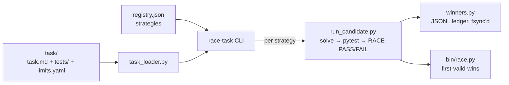

# code-racer — harness core

Race candidate code strategies against each other. First solution **passing the task's real acceptance tests** wins — slow is a kind of wrong, broken is disqualified.

<div align="right">

[](https://github.com/toxicwind/sovereign-projects#license)
[](https://github.com/toxicwind/sovereign-projects)

</div>

## Why this exists

Choosing a code strategy by vibes is how you ship the slow one. This harness makes strategy selection empirical: register N solvers, run them against the same task with real pytest acceptance tests, and the first *passing* solution wins. E2E real — no mocks. Strategies are real subprocesses; tests are real pytest runs in isolated testbeds; the winners ledger is fsync'd.

## Features

- **First-passing-wins** — validity = exit 0 AND `RACE-PASS` on stdout; only emitted when pytest passes.
- **Per-hop latency** — solve_s, test_s, total_s, wall_s measured everywhere.
- **Pluggable strategies** — append to `strategies/registry.json`; your solver writes `<outdir>/solution.py`.
- **Frozen contract** — `INTERFACE.md` is the harness↔adapter interface (v1).
- **Audit trail** — per-race `runs/` JSON, fsync'd JSONL winners ledger, plus the global HFT winners log.
- **HFT racer inside** — `bin/race.py` (first-valid-wins, fail-fast), ported from the hft-latency skill.



## Layout

```
code-racer/
├── race-task            # CLI: race-task <task-dir> --strategies all|a,b --timeout N
├── task_loader.py       # task-spec loader (task.md + tests/ + limits.yaml)
├── registry.py          # candidate registry (strategies/registry.json)
├── run_candidate.py     # one contestant: solve -> pytest -> RACE-PASS/RACE-FAIL
├── winners.py           # JSONL winners ledger
├── bin/race.py          # HFT racer (first-valid-wins, fail-fast) — ported from
├── bin/measure.py      #   the hft-latency skill
├── strategies/registry.json   # registered strategies
├── strategies/demo/     # demo strategies (smoke test)
├── tasks/smoke-two-sum/ # smoke task with real pytest acceptance tests
├── winners/             # per-task JSONL ledgers
├── runs/                # generated strategies.json per race (audit trail)
└── INTERFACE.md         # frozen contract between harness and strategy adapters
```

## Quick start

```bash
cd /home/toxic/sovereign/killer-features/code-racer
./race-task tasks/smoke-two-sum --strategies all
```

Expected: `demo-fast` wins (~1s), `demo-slow` valid but slower, `demo-broken` invalid (tests fail) — winner is always a *passing* solution. Narrow the field with `--strategies demo-fast,demo-slow --timeout 30`.

## Add a strategy

Append to `strategies/registry.json`:

```json
{"name": "my-solver",
 "cmd": ["python3", "/abs/path/my_solver.py", "{outdir}"]}
```

Your solver must write `<outdir>/solution.py`. See INTERFACE.md for the full frozen contract.

## Add a task

```
tasks/<name>/task.md      # problem statement
tasks/<name>/tests/       # pytest tests; `import solution` must work
tasks/<name>/limits.yaml  # solve_timeout_s / test_timeout_s / workers
```

Per-strategy `timeout_s` in the registry overrides the task solve cap.

## Design notes

- E2E real: no mocks. Strategies are real subprocesses; acceptance tests are real pytest runs in isolated testbed dirs.
- Validity = exit 0 AND stdout match `RACE-PASS` in race.py; run_candidate only emits that when pytest passes on the produced solution.
- Per-hop latency measured everywhere: solve_s, test_s, total_s, wall_s.
- Ledger at `winners/code-racer-<task>.jsonl` (fsync'd); race.py also logs to the global HFT winners log for the race-optimizer daemon.

## License & security

MIT where marked — [LICENSE](https://github.com/toxicwind/sovereign-projects#license). Strategies are arbitrary code run as subprocesses — the harness trusts the registry, so only register solvers you (or the fleet) wrote. Testbeds are isolated per run; don't run untrusted solvers on a box you can't rebuild.
