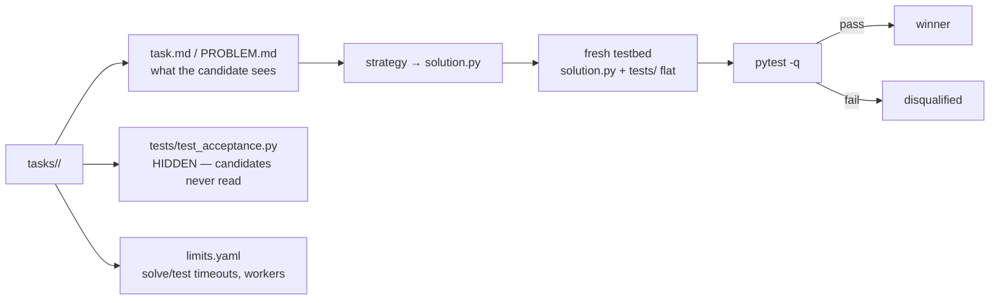

# code-racer task corpus (v2)

4 real coding tasks for the universal code racer harness. Built by t1-e2e. Conforms to the frozen harness contract: `code-racer/INTERFACE.md` v1 (t1-impl-core). Designed for BOTH: (a) code-racer strategy racing, (b) t3-e2e debate-vs-single-shot A/B (same prompt/acceptance format).

<div align="right">

[](https://github.com/toxicwind/sovereign-projects#license)
[](https://github.com/toxicwind/sovereign-projects)

</div>

## Why this exists

A racing harness is only as good as its tasks. Toy tasks (fizzbuzz) don't discriminate; these four do — each one is engineered with specific traps (unicode edge cases, a one-line bug hidden in a passing suite, byte-exact CLI output, eviction-order + perf constraints) so that strategies actually separate. Reference solutions exist (t1-e2e local only, NOT in this tree); negative controls prove the tests fail before the fix.



## Layout (per INTERFACE.md v1)

```
tasks/
  task-1-duration-parser/     implement a utility to spec (edge-case heavy)
  task-2-bugfix-rate-limiter/ fix a planted bug (tests FAIL before, PASS after)
  task-3-wordfreq-cli/        implement a CLI to spec (subprocess-tested)
  task-4-lru-cache/           implement LRU cache (eviction-order + perf test)
    task.md                   problem statement (harness reads this)
    PROBLEM.md                identical copy (shared name w/ debate-oracle corpus)
    solution.py               starter stub (task-2: buggy module is rate_limiter.py,
                              candidate writes the FIXED code as solution.py)
    tests/test_acceptance.py  HIDDEN acceptance tests (`from solution import ...`;
                              task-3 runs solution.py as a subprocess CLI)
    limits.yaml               solve_timeout_s / test_timeout_s / workers (harness)
    limits.json               e2e supplement (solution_files, test_command, caps)
  CONTRACT.md                 e2e addendum: independent-verification protocol
  README.md                   this file
```

## How the harness consumes a task (INTERFACE.md v1, observed in run_candidate.py)

1. Strategy writes `<outdir>/solution.py`.
2. Harness copies `solution.py` + `tests/*` FLAT into a fresh testbed dir.
3. Runs `python -m pytest -q --tb=short -p no:cacheprovider` with cwd=testbed.
4. Valid = solution.py exists AND pytest rc==0 AND failed==0 AND passed>0.

## Difficulty / discrimination notes

- **task-1:** ~45 assertions; traps: `µs` (U+00B5), case-insensitivity, sign only at start, strict number grammar (rejects `inf`/`nan`/`1e`), `ValueError` on ~20 malformed inputs, float return type.
- **task-2:** the ONLY failing behavior is sub-second refill; smoke tests pass on the buggy code. Fix is one line but finding it requires reading `_refill`.
- **task-3:** exact stdout bytes (`"b 3\na 2\n"`), tie-break ordering, exit codes 0/2, stderr on missing file, stdin-vs-file, `--top 0`, `--min-len`.
- **task-4:** `__contains__` must NOT touch recency, `put`-update refreshes recency, `None` values distinguishable from misses, MRU-first `keys()`, randomized differential test vs OrderedDict model, 50k ops < 5s (kills O(n) impls).

## Rules for adapters

- `tests/` is HIDDEN: strategies must never read `tests/`. (E2E spot-checks this by grepping winner outputs for test-unique strings like `FakeClock`.)
- Candidates see only `task.md`/`PROBLEM.md` + starter/buggy file(s).
- Deliverable is ALWAYS `solution.py`.

## Sibling corpora

- `killer-features/debate-oracle/tasks/` (t3-e2e): 5 tasks (token-bucket, toposort, lru-cache, expr-eval, bloom-filter), PROBLEM.md + hidden pytest, validated 39/39. NOTE: for harness (`import solution`) reuse they need the same v2 test convention — flagged to t3-e2e on fleet.
- `code-racer/tasks/{fizzbuzz-01,smoke-two-sum}`: harness smoke tasks (other authors, different format) — left untouched.

## Validation status

- [x] Reference solutions (t1-e2e local only, NOT in this tree): all 4 suites pass.
- [x] Negative controls: task-1/3/4 starters fail (NotImplementedError); task-2 buggy module fails (sub-second refill tests).
- [ ] Full harness e2e run (pending t1-impl-core harness + t1-impl-strategies adapters landing) → E2E-REPORT.md at code-racer/ root.

## License & security

MIT where marked — [LICENSE](https://github.com/toxicwind/sovereign-projects#license). The hidden-tests convention is a trust boundary: a strategy that reads `tests/` isn't clever, it's cheating — the E2E spot-check greps for test-unique strings in winner outputs. Keep reference solutions out of the tree (they are: t1-e2e local only).
