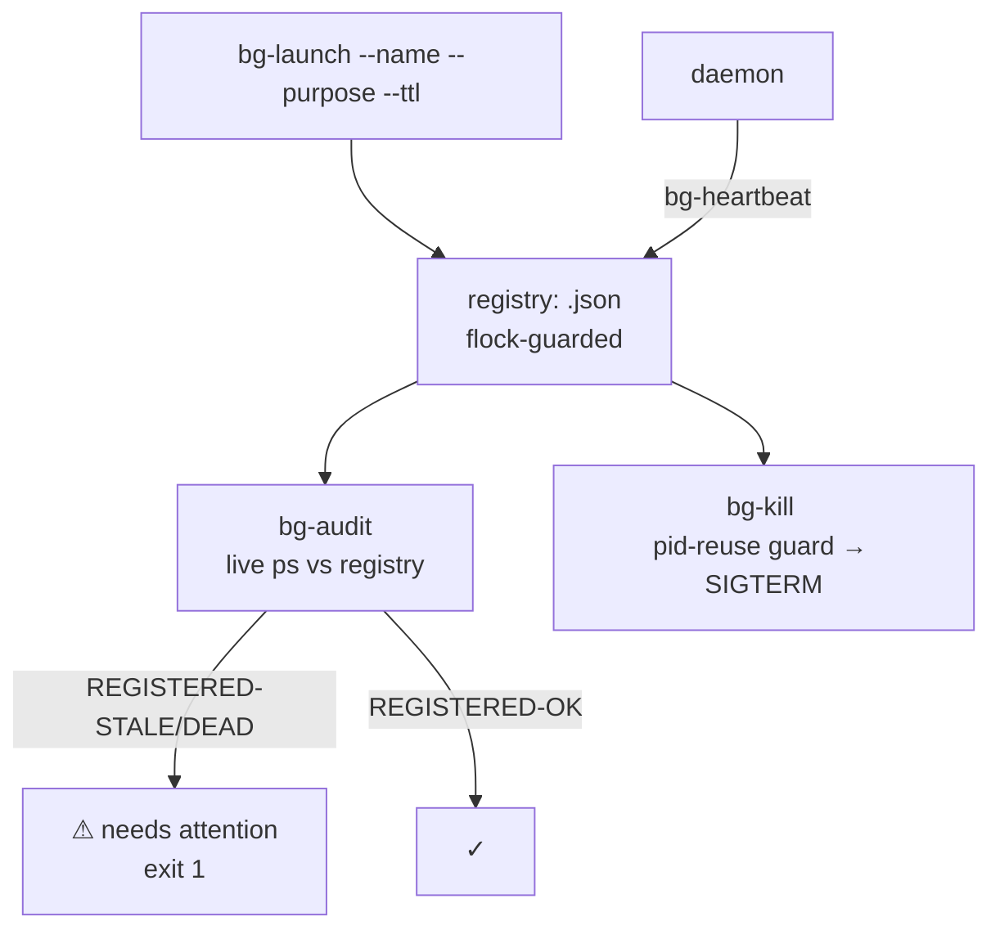

# bg-tracker — background-task registry for the estate

**Problem (Chris, 2026-09-20):** backgrounding/multitasking happens with no registry — detached procs go blind. Nobody knows who spawned what, why it's still alive, or whether it's safe to touch. Stale execution quiet for 12+ hours is extremely bad.

**Fix:** every backgrounded task is launched (or retro-registered) through this suite, which records who/what/why/pid in a durable per-box registry and audits live processes against it. Event-driven: nothing here polls on a timer. `bg-audit` runs on demand (or from an inotify/systemd-path trigger); tasks push their own heartbeats.

<div align="right">

[](https://github.com/toxicwind/sovereign-projects#license)
[](https://github.com/toxicwind/sovereign-projects)

</div>

## Features

- **One correct launcher** — `bg-launch` double-forks properly (no `&` mis-scoping), records the REAL daemon pid, verifies own SID + PPID 1 before registering.
- **Retro-registration** — `bg-register` brings already-running pids into the registry.
- **Read-only audit** — `bg-audit` classifies every detached proc (KNOWN-SYSTEM / SUPERVISED / REGISTERED-OK / REGISTERED-STALE / REGISTERED-DEAD / UNREGISTERED / AMP-VICTIM). Exit 1 when anything needs attention. Never kills.
- **Safe kills** — `bg-kill` terminates by registry id only, with a PID-reuse guard (refuses when the live cmdline no longer matches), SIGTERM → `--force` SIGKILL, marks retired, logs the event. No bulk kills.
- **Event-driven** — heartbeats pushed by tasks, audit on demand or via systemd-path trigger. No polling daemon ships with this.



## Layout

- `../bin/bg-launch` — the ONE correct launcher. Double-fork daemonize in Python: no `&` to mis-scope (cf. AGENTS.md "Daemon-start `&` scoping"), records the REAL daemon pid, verifies own SID + PPID 1 (or the user-session subreaper `systemd --user`, which adopts orphans on systemd boxes) before registering.
- `../bin/bg-register` — retro-register an already-running pid.
- `../bin/bg-heartbeat` — push a liveness heartbeat for a registry id.
- `../bin/bg-audit` — read-only audit: live `ps` vs registry. Classifies every detached proc (KNOWN-SYSTEM / SUPERVISED / REGISTERED-OK / REGISTERED-STALE / REGISTERED-DEAD / UNREGISTERED / AMP-VICTIM). Exit 1 when anything needs attention. Never kills.
- `../bin/bg-kill` — terminate by registry id only, with PID-reuse guard (refuses when the live cmdline no longer matches), SIGTERM → `--force` SIGKILL, marks retired, logs the event. No bulk kills.
- `lib/bgcommon.py` — shared: flock-guarded registry I/O, box detection, ps scan, append-only event log.
- `state/` — **gitignored runtime state**: `<box>.json` registry, `<box>.events.jsonl` log, `<name>.log` daemon logs. Survives restart because it is a real file on disk, not because it is committed.

## Quick start

```bash
# launch (replaces: cd dir && setsid nohup cmd >>log 2>&1 &)
BG_OWNER=bg-tracker ../bin/bg-launch --name my-task \
  --purpose "why it exists" --workdir /path/to/dir --ttl 3600 \
  -- ./run.sh --flag

# audit (read-only)
../bin/bg-audit

# retire
../bin/bg-kill <id>
```

## Seeding

Known daemons get retro-registered so the audit stops flagging them:

```bash
../bin/bg-register --pid <pid> --name yote-connector \
  --purpose "hatch<->yote bridge exec lane" --owner bg-tracker
```

Pitchfork-supervised daemons are auto-classified SUPERVISED by `bg-audit` (descendant check against the pitchfork supervisor pid) and need no entries.

Kill policy (standing): a kill needs positive orphan confirmation — no heartbeat, no parent task, no fleet registration — plus a fleet note with the evidence at kill time. When in doubt, leave it running and flag it.

## Event-driven hook (opt-in)

No polling daemon ships with this. If you want push-on-change, add a systemd path unit watching `state/` that runs `bg-audit`:

```ini
# /etc/systemd/system/bg-tracker.path
[Path]
PathChanged=/home/toxic/sovereign/projects/ops/bg-tracker/state
[Install]
WantedBy=multi-user.target
```

## Deep links

- Estate ops conventions: [`../README.md`](../README.md)
- Master README: [`/home/toxic/sovereign/README.md`](../../README.md)
- Fleet knowledgebase: `docs/fleet-knowledgebase.md`
- Standing rules: no monkeypatching, permanence, durability across bridge restart + yote power-cycle. The script is the deliverable.

## License & security

MIT where marked — [LICENSE](https://github.com/toxicwind/sovereign-projects#license). The registry is the fleet's memory of what's running: `bg-audit` is read-only by design and `bg-kill` refuses PID reuse — a recycled pid is never signaled. Kills need positive orphan confirmation plus a fleet note with evidence; when in doubt, leave it running and flag it. `state/` is gitignored runtime state — real files on disk, not committed.
