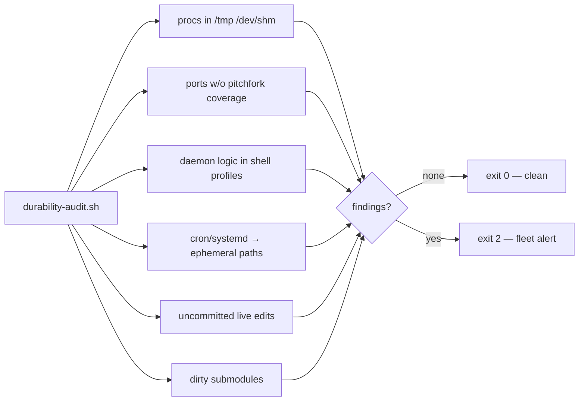

# ops/durability — estate durability guard

The permanent mechanism behind "no monkeypatching": hunts the recurring monkey-patch classes on this box and alerts to fleet **only when findings exist**. Alert on conditions, not on a timer.

<div align="right">

[](https://github.com/toxicwind/sovereign-projects#license)
[](https://github.com/toxicwind/sovereign-projects)

</div>

## Why this exists

"No monkeypatching" is a standing rule, but rules without enforcement are wishes. Runtime-only patches, daemons anchored in `/tmp`, uncommitted live edits — they all *work* until a restart proves they don't. This audit makes the rule machine-checkable: six hunt classes, one script, exit 2 when something smells. Every fix that survives this audit survives a reboot.

## What it hunts

`durability-audit.sh` checks six recurring monkey-patch classes:

1. Processes anchored in ephemeral paths (`/tmp`, `/dev/shm`) doing real jobs
2. Listening TCP ports with no `pitchfork.toml` daemon coverage
3. Shell profiles (`.bashrc`/`.profile`) containing daemon logic
4. Cron files / systemd units referencing ephemeral paths
5. Uncommitted live edits in `/home/toxic/sovereign` (state paths excluded)
6. Dirty submodules (bulk ops must be submodule-aware)



## Layout

| File | Role |
|---|---|
| `durability-audit.sh` | The audit (host-agnostic; `SOVEREIGN_REPO` env overrides repo path) |
| `allowlist.txt` | Cmdline substrings known-OK in ephemeral paths (session tooling, not services). Keep tight. |
| `systemd/` | `durability-audit.service` + `durability-audit.timer`; installed as symlinks in `~/.config/systemd/user/` so the repo stays the source of truth. Runs daily at 04:30, `Persistent=true`. |

## Quick start

```bash
/home/toxic/sovereign/ops/durability/durability-audit.sh          # print only
/home/toxic/sovereign/ops/durability/durability-audit.sh --alert  # print + fleet alert
```

## Install / reinstall

```bash
mkdir -p ~/.config/systemd/user
ln -sf /home/toxic/sovereign/ops/durability/systemd/durability-audit.service \
       ~/.config/systemd/user/durability-audit.service
ln -sf /home/toxic/sovereign/ops/durability/systemd/durability-audit.timer \
       ~/.config/systemd/user/durability-audit.timer
systemctl --user daemon-reload
systemctl --user enable --now durability-audit.timer
# prove it works:
systemctl --user start durability-audit.service
journalctl --user -u durability-audit.service -n 20
```

## History

- 2026-09-20 (anvil): created during the estate durability sweep. First findings: retired a vestigial nginx on :8901 (config in /tmp, served a nonexistent kodi-fleet/releases root, zero legitimate traffic) and killed a leftover inotify diagnostic (`/tmp/dir-trap.py`).

## License & security

MIT where marked — [LICENSE](https://github.com/toxicwind/sovereign-projects#license). The audit is read-only — it finds and reports, never fixes. Findings are evidence for a human decision, not an auto-remediation trigger: a daemon in `/tmp` might be a legit diagnostic. `allowlist.txt` is the known-good list — keep it tight, review additions.
