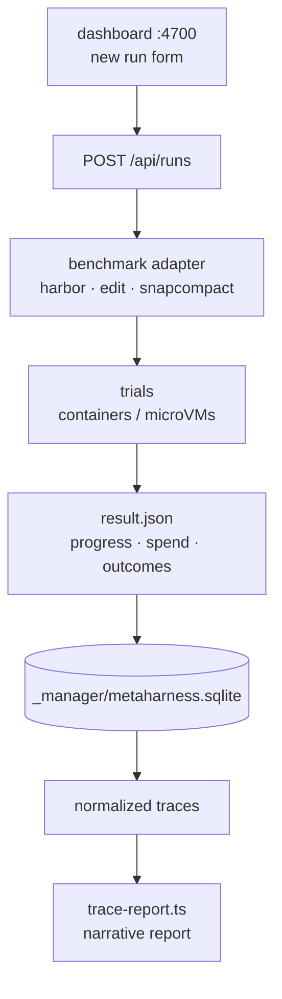

<div align="right">

[](https://github.com/toxicwind/sovereign-projects#license)
[](https://github.com/toxicwind/sovereign-projects)

</div>

# @oh-my-pi/pi-metaharness

One manager for repository benchmarks: Harbor, TypeScript-edit, and SnapCompact runs share the same experiment → run → trace model, SQLite store, REST/SSE API, and dashboard.

> Benchmarks rot into bespoke scripts — every harness with its own flags, its own logs, its own "where did that run go". Metaharness is the opposite: launch every benchmark from the same "new run" form, compare arms of one experiment side by side, and read normalized traces no matter which benchmark produced them.

## Features

- **Unified model** — experiments → runs → traces for Harbor, TS-edit, and SnapCompact alike
- **Dashboard + API** — one form launches every benchmark; REST/SSE for automation
- **Comparable arms** — register an experiment, launch arms that inherit sample + config from a sibling
- **Credential hygiene** — auth never enters task containers; a host gateway resolves provider keys
- **Native Terminal-Bench runner** — KVM microVM trials on Vibemon hosts, resumable epochs
- **Trace reports** — map/reduce a run trace into a narrative markdown report for ~$0.001

## Run lifecycle



```bash
# Dashboard + API on :4700; launch every benchmark from the same "new run" form
bun run serve --port 4700
```

## Quick start

```bash
bun run serve --port 4700
bun scripts/trace-report.ts <run> <trace>
```

## License & Security

**License:** MIT — see [LICENSE](https://github.com/toxicwind/sovereign-projects#license).

**Security:** provider credentials never enter task containers — a generated `models.yml` routes at the host pm2 auth-gateway, which resolves credentials host-side. In source-install mode the repo is bind-mounted read-only into task containers; fine for curated benchmarks, never point it at untrusted tasks. The reverse-tunneled gateway keeps keys out of task VMs on the Terminal-Bench runner too.

## How Harbor runs execute

1. **Local omp, not npm.** The runner bind-mounts the repo read-only into each task container (`--install source`) and runs omp straight from `packages/coding-agent/src/cli.ts` — TS edits apply to the next trial with no rebuild. A cached linux `node_modules` tree (built once per lockfile change inside `oven/bun`, stored in `<jobs-dir>/_bench/_deps/`) shadows the host's darwin one, and a linux `bun` binary is mounted at `/opt/omp/bin` — trial setup needs zero outbound network. Alternatives: `--install local` (tarball per run) or `--binary` (prebuilt `dist/omp-linux-*` binaries).
2. **Auth never enters containers.** A generated `models.yml` routes provider `baseUrl`s at the host pm2 auth-gateway; the gateway resolves credentials host-side.
3. **Harbor owns trials.** The runner/serve layer polls each trial's `result.json` for progress, spend, and outcomes.

## Server API

- `GET /` — experiments, runs, normalized traces, launch form for every benchmark
- `GET /api/experiments[?q=]` — experiment summaries (`q` filters by id/goal)
- `POST /api/experiments` — register an experiment: `{ "id": "sb2", "goal": "…" }` (id is the dash-free token job names group under: `sb2-n8` → `sb2`)
- `GET /api/experiments/:id` — arms, per-task matrix, calibrated projections
- `PUT /api/experiments/:id` — update goal and per-run role/note/label
- `POST /api/experiments/:id/arms` — launch a comparable arm (sample + config inherited from a sibling)
- `DELETE /api/experiments/:id` — delete every arm (DB rows **and** job dirs) plus the goal row; rejected while any arm runs
- `GET /api/runs[?experiment=&status=&benchmark=]` — uniform run rows: benchmark, score, progress, spend, tokens
- `POST /api/runs` — launch through a benchmark adapter:

```json
{
	"benchmark": "edit",
	"model": "anthropic/claude-opus-4-8",
	"tasks": 20,
	"concurrency": 4,
	"attempts": 2,
	"jobName": "edit-baseline",
	"role": "baseline",
	"goal": "compare edit strategies"
}
```

(`benchmark`: `harbor` | `edit` | `snapcompact`. Harbor uses `dataset`, `include`, `timeoutMultiplier`, `prewalk`; edit uses `include` as task IDs; SnapCompact uses `conditions` and treats `tasks` as the passage limit.)

- `GET /api/runs/:name` — `{ run, traces }` (syncs native artifacts on read)
- `POST /api/runs/:name/cancel` — cancel a manager-launched run
- `DELETE /api/runs/:name` — permanently delete a finished run (DB row **and** job dir); rejected while live
- `POST /api/runs/:name/resume` — resume an incomplete harbor run in place: completed trials (and spend) reused, interrupted/pending re-run, errored retried (`{ "filterErrorTypes": […] }` overrides the retry set, defaulting to every exception type in the job's `result.json`). Original launch flags recovered from `_bench/<name>/runner-config.json` or the run's `manager.json`
- `GET /api/runs/:name/traces/:trace[?raw=1]` — normalized or native trace
- `GET /api/events` — SSE stream of run-list snapshots (sent on change)

State lives in `<jobs-dir>/_manager/metaharness.sqlite`; the filesystem stays the source of truth and historical CLI runs are auto-discovered.

## Native Terminal-Bench 2.1 runner

`bench:tb` bypasses Harbor and Docker: boots each task's published OCI image as an x86_64 KVM microVM on a Vibemon host, streams omp's `--mode rpc` through `vmon exec --pipe`, runs the verifier in the same mutated VM, and writes resumable epochs plus artifacts under `runs/tb`.

```bash
bun run bench:tb --dataset /path/to/terminal-bench-2-1 --concurrency 4 --forever --budget 25
```

For the measured workstation defaults (seven-model pool, `:floor`, concurrency 20):

```bash
bun --cwd packages/metaharness run bench:tb-floor
```

Writes to `runs/tb-floor`; rerunning resumes an incomplete epoch or starts the next. Env overrides: `TB_JOBS_DIR`, `TB_CONCURRENCY`, `TB_DATASET`, `TB_BUDGET_USD`, `TB_ATTEMPTS`, `TB_FOREVER=1`. Extra CLI flags pass through and win.

Default pool: Ling 3.0 Flash, both DeepSeek V4 Flash routes (0731 + unversioned/0423), Nemotron 3.5 Lightning, Laguna S 2.1, Tencent Hy3, Step 3.7 Flash via OpenRouter `:floor` cheapest-provider routing (`--openrouter-variant default|nitro|online|exacto` to override; repeat `--model provider/id` to replace the pool). Targets the workstation's `xeon.internal` KVM host and `/work/vibevmm`; the runner cross-builds/caches a patched `vmon`, owns a privileged TAP broker for its lifetime, and reverse-tunnels the loopback omp auth gateway so credentials never enter task VMs. Infra overrides: `--vmon-host`, `--vmon-source`, `--vmon-bin`, `--vmon-home`, `--vmon-kernel`, `--vmon-agent`, `--gateway-url`.

## Harbor runner options (excerpt)

| Option | Default | Notes |
|---|---|---|
| `-m, --model <provider/model>` | `anthropic/claude-sonnet-4-6` | Repeatable |
| `-l, --tasks <N>` | `20` | Max tasks |
| `-n, --concurrency <N>` | `4` | Concurrent trials |
| `-k, --attempts <N>` | `1` | Attempts per task (pass@k) |
| `-d, --dataset <name>` | `terminal-bench@2.0` | Any Harbor dataset id |
| `-i/-x, --include/--exclude <glob>` | — | Task filters (repeatable) |
| `--timeout-multiplier <x>` | — | Scales task agent/verifier timeouts |
| `--agent-arg <arg>` | — | Extra arg forwarded verbatim to the in-container omp CLI (repeatable) |
| `--env <KEY[=VALUE]>` | — | Forward env into the omp container (repeatable); `KEY` alone forwards host value |
| `--binary <path>` | — | Prebuilt omp binary (repeat for arm64+x64) |
| `--install <source\|local\|published>` | `source` | `source` = repo bind-mount, `local` = tarball, `published` = npm `@oh-my-pi/pi-coding-agent` |
| `--environment <docker\|apple-container>` | `docker` | `apple-container` via Apple's `container` CLI (no Docker); gateway auto-forwarded from `192.168.64.1:4000` |
| `--gateway-url <url>` | `http://host.docker.internal:4000` | `http://192.168.64.1:4000` under apple-container |
| `--no-gateway` | off | Pass host provider keys into containers instead |
| `-o, --jobs-dir <path>` | `<repo>/runs/harbor` | Shared with the server |
| `--resume <name\|path>` | — | Resume that job dir via `harbor job resume` |
| `--filter-error-type <T>` | `CancelledError` | With `--resume`: also re-run completed trials erroring with type `T` (repeatable) |
| `--dry-run` | off | Print the harbor command + models.yml and exit |

## Outputs

- `<jobs-dir>/<jobName>/` — Harbor trial dirs (`result.json` per trial)
- `<jobs-dir>/_bench/<jobName>/report.md` — markdown summary table
- `<jobs-dir>/_bench/<jobName>/harbor.log` — full Harbor output
- `<jobs-dir>/_manager/logs/<jobName>.log` — runner output for API-launched runs

## Trace reports

`scripts/trace-report.ts` turns one run trace into a narrative markdown report (numbered Turn Log with one grounded sentence per assistant turn, harness notices in place, Story Arc, and failure analysis for failed runs). Map/reduces the normalized trace through two cheap OpenRouter models (defaults: `inclusionai/ling-2.6-flash` per turn, `openai/gpt-oss-120b` for the arc; ~$0.001 per report). API keys resolve through omp's auth storage.

```bash
bun scripts/trace-report.ts <run> <trace> [--focus "reviewer notes"] [--out report.md]
bun scripts/trace-report.ts "sb3-ntg|django__django-12325__ddQroP4"   # run|trace also accepted
```

Flags: `--base` (server, default `http://localhost:4700`), `--tiny` / `--synth` (`<provider>/<model-id>` overrides), `--focus` (reviewer context), `--concurrency` (default 8).

## Caveats

- **Network policy.** On Harbor's local Docker backend only **public** registries work; task containers reach models via the host gateway.
- **`--install source` reflects local TS changes** with no rebuild, but Rust natives load from the in-tree `packages/natives/native/pi_natives.linux-*.node` prebuilds — rebuild those when Rust changes (the loader skips the version sentinel for workspace loads, so a stale `.node` runs silently).
- **Source mode is single-arch.** The deps tree matches the docker daemon's native arch; trials on emulated images fail setup with an arch-mismatch error — use `--binary` for those.
- **The repo is visible (read-only) inside task containers** in source mode; fine for curated benchmarks, never for untrusted tasks.
- **Apple Container specifics.** Needs `brew install container && container system start` (macOS 26+, Apple silicon). `--host-network` and `--cleanup*` are docker-only; bind mounts are read-write (backend ignores `read_only`).
- **`--install local` reflects local TS changes** (inlined into `dist/cli.js`) but **not** uncommitted Rust natives — rebuild `packages/natives` per target first (version sentinel must match).
