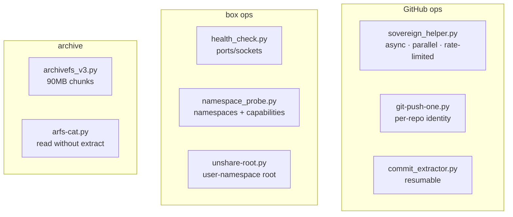

# sovereign-scripts

Python automation toolkit for Sovereign infrastructure — GitHub API ops, repo audits, archiving, sandboxing, and health checks. One directory of sharp tools, each doing one job.

<div align="right">

[](https://github.com/toxicwind/sovereign-projects#license)
[](https://github.com/toxicwind/sovereign-projects)

</div>

## Why this exists

Ops work is a long tail of small jobs — check a port, push a file, extract commits, audit a namespace. This package collects the ones that proved themselves into a toolkit with shared conventions: async and parallel where it matters, rate-limited against APIs, and documented per-script instead of in someone's shell history.

## Scripts

| Script | What it does |
|---|---|
| `sovereign_helper.py` | Master hook for GitHub API ops — async, parallel, rate-limited |
| `health_check.py` | Port/socket health checks for the Sovereign environment |
| `git-push-one.py` | Push one file to a GitHub repo with per-repo identity |
| `commit_extractor.py` | Bulk GitHub commit extraction with resumable state |
| `archivefs_v3.py` | Mount-like binary archive with 90MB chunking |
| `arfs-cat.py` | cat/ls files inside an ArchiveFS archive without extracting |
| `auto-hook-loader.py` | Load all auto-hooks from the agent hooks dir |
| `namespace_probe.py` | Linux namespace & capability audit |
| `cache_timing.py` | Cache side-channel timing probe (educational) |
| `unshare-root.py` | Run commands in an unshared user namespace as root |
| `mitm-proxy/` | MITM proxy helpers (`playwright_mitm.py`, `race_aware_loader.sh`) |
| `patches/` | Patch scripts (`browser_guard.py`) |



## Quick start

```bash
python3 health_check.py
python3 git-push-one.py --help
python3 commit_extractor.py --owner toxicwind --output ./commits
```

## Conventions

See `AGENTS.md` in this directory for repo conventions (per the original: repo rules live there).

## License & security

MIT where marked — [LICENSE](https://github.com/toxicwind/sovereign-projects#license). Several scripts here are dual-use by nature (`cache_timing.py`, `mitm-proxy/`, `unshare-root.py`) — they're audit and research tooling for the estate's own boxes. Run them against your own infrastructure only. `git-push-one.py` uses per-repo identity — check which identity you're pushing as before you push.
