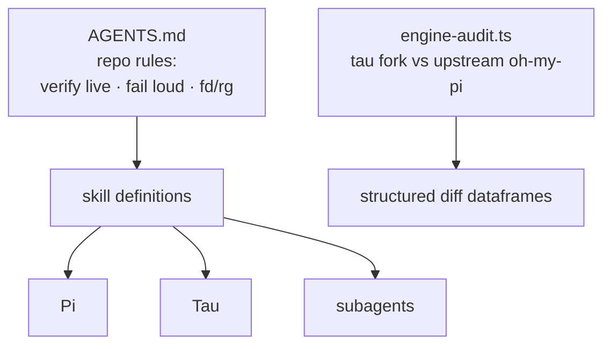

# sovereign-skills

Skill definitions, agent recipes, and behavioral conventions for the Sovereign ecosystem — consumed by Pi, Tau, and subagents. Keep definitions atomic, self-contained, and deterministic.

<div align="right">

[](https://github.com/toxicwind/sovereign-projects#license)
[](https://github.com/toxicwind/sovereign-projects)

</div>

## Why this exists

Agents across the estate (Pi, Tau, subagents) need the same behavioral contracts: how to audit an engine fork, what the repo rules are, how to fail. Skills are those contracts as files — atomic, self-contained, deterministic — versioned in one place instead of scattered across prompts and memories.

## What's here

| Path | What it is |
|---|---|
| `engine-audit.ts` | Audits the Tau engine fork against upstream oh-my-pi; emits structured diff dataframes |
| `AGENTS.md` | Contributor rules for this repo |



## Quick start

```bash
# audit the Tau engine vs upstream
bun run sovereign-skills/engine-audit.ts
```

## Adding a skill

1. Create `skills/<name>/SKILL.md` — atomic, self-contained, deterministic
2. Add `references/` for routing tables
3. Register in `skills.json`

## Conventions

See `AGENTS.md` for the repo rules: verify live before claiming, fail loud (never silence errors), prefer `fd`/`rg` over `find`/`grep`.

## License & security

MIT where marked — [LICENSE](https://github.com/toxicwind/sovereign-projects#license). Skills shape agent behavior estate-wide — a skill edit is a behavior change for every consumer. Review them like code, and keep them deterministic: a skill that behaves differently on each read isn't a contract.
