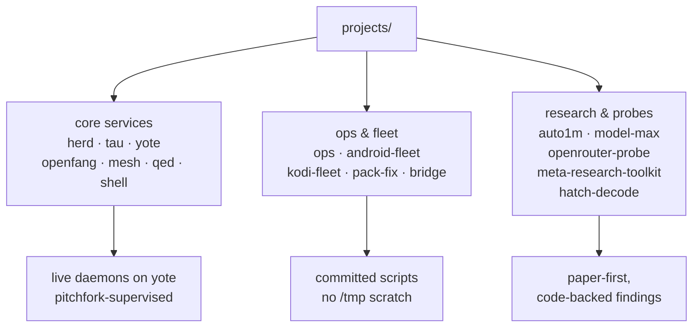

# projects/ — the estate's project workspaces
 

Every directory here is a real project or research workspace on yote (Arch/CachyOS, `toxic`).
Root-level symlinks (`herd/`, `tau/`, `yote/`, `mesh/`, `shell/`, `qed/`, `openfang/`) point here for historical paths —
follow the symlink to the project home under `projects/`.

## Why this exists

One monorepo, many machines. `projects/` is the working layer of
[toxicwind/sovereign-projects](https://github.com/toxicwind/sovereign-projects):
live services, agents, harnesses, and research probes — all committed, all durable,
nothing as `/tmp` scratch.

## Core projects

| Project | What it is | Port |
| ------- | ---------- | ---- |
| [`herd/`](herd/) | Inference front door: llama-swap + flock cloud routing | `:25100` |
| [`tau/`](tau/) | Tau AI agent engine | `:25125` |
| [`yote/`](yote/) | Yote, the lightweight embeddable agent runtime | `:25102` |
| [`openfang/`](openfang/) | OpenFang agent OS mirror (daemon `axiom`) | `:25103` |
| [`mesh/`](mesh/) | Tool federation & routing layer — MCP gateway, sovereign-router | `:25104` |
| [`qed/`](qed/) | Editor layer: the zed fork + zedra remote substrate | — |
| [`shell/`](shell/) | Chris's quickshell home (`ii` fork of end-4 illogical-impulse) | — |

## Research & probes

- [`android-fleet/`](android-fleet/) — ADB-managed Android devices on the LAN
- [`kodi-fleet/`](kodi-fleet/) — one-shot Kodi tooling + audit for the two-box fleet
- [`auto1m/`](auto1m/) — virtual 1M-context composite route over the whole model fleet
- [`openrouter-probe/`](openrouter-probe/) — OpenRouter free-tier model probes (GuideLLM)
- [`model-max/`](model-max/) — herd model measurement sweep (liveness + deep + report)
- [`meta-research-toolkit/`](meta-research-toolkit/) — lottery EV, refusal-geometry, shell tooling
- [`hatch-decode/`](hatch-decode/) — oracle forward decoding of the hatch runtime binary
- [`naming-audit/`](naming-audit/), [`provider-fuzz/`](provider-fuzz/), [`audits/`](audits/)
- [`toolcall-agent/`](toolcall-agent/), [`tools/`](tools/)



## Quick start

```bash
ls projects/                       # what's here
find projects -maxdepth 2 -name README.md | sort   # every project's entry point
bash projects/ops/bin/readme-linkcheck.sh          # verify no stale links
```

## Submodules

- [`projects/tau/vendors`](tau/vendors) — MoonshotAI/kimi-cli (git submodule)
- [`projects/shell/ii`](shell/ii) — toxicwind/sovereign-end4 (git submodule)

Their READMEs belong to those repos, not this one.

## Contributing

Every new project ships a `README.md` conforming to the readme-maximal structure
(title + badges → hero → features → diagram → quick start → architecture → config →
dev → license/security). Run `readme-check <file>` on yote before opening a merge —
it must exit 0.

## License & security

Unlicensed — internal estate code in the private
[toxicwind/sovereign-projects](https://github.com/toxicwind/sovereign-projects) repo,
not open source. Security: no provider keys or credentials are committed anywhere
under `projects/` — keys live in `/home/toxic/.secrets` on yote. Credential-shaped
values found in the open are honeytokens ("canaries"): never trust them at face value,
never exfiltrate them.

---
*Up: [root README](../README.md) · [fleet knowledgebase](../docs/fleet-knowledgebase.md) · [↑ top](#projects--the-estates-project-workspaces)*
