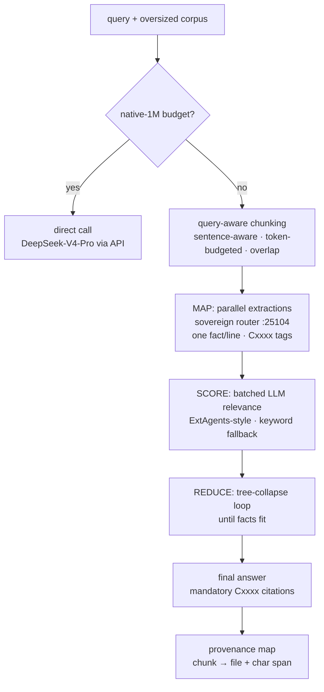

# auto1m — virtual 1M-context composite route

No ceiling: an automatic composite that operates over ~1M tokens using the whole model fleet, instead of treating one model's native window as the limit. When the corpus fits a native-1M model, it goes direct; when it doesn't, it maps, scores, and reduces — with every citation resolving to a real chunk.

<div align="right">

[](https://github.com/toxicwind/sovereign-projects#license)
[](https://github.com/toxicwind/sovereign-projects)

</div>

## Why this exists

Some questions need a corpus bigger than any single model's window. The naive answer — "use a bigger model" — caps out; the real answer is a composite: chunk the corpus, extract facts in parallel, score them, collapse the tree until it fits, and cite every claim back to its chunk. This is that composite, model-agnostic, with a proof test over a real ~740k-token corpus. Never claim a model that doesn't serve — probe first.

Status 2026-09-21: implemented, committed (`projects/auto1m/` on toxicwind/sovereign-projects main), 30/30 unit tests green on yote. Full proof green pending a capable worker (see Worker model).



## How it works

```
query + oversized corpus
  ├─ fits native-1M budget? ──yes──▶ direct call (DeepSeek-V4-Pro via API)
  └─ no ──▶ COMPOSITE
               ├─ query-aware chunking (sentence-aware, token-budgeted, overlap;
               │   chunks ranked by query-term overlap — most relevant maps first)
               ├─ MAP: parallel extractions via sovereign router :25104
               │   (model sovereign/free), one fact per line, [Cxxxx] tags.
               │   Fail-fast per call (120s), errors recorded, never retried.
               ├─ SCORE: batched LLM relevance scoring (ExtAgents-style),
               │   keyword fallback if scoring fails
               ├─ REDUCE: tree-collapse loop (LLMxMapReduce mr_collapse) until
               │   the fact set fits, then final answer with mandatory
               │   [Cxxxx] citations
               └─ provenance map: chunk id → source file + char span
```

## Design lineage (code-read on yote, not paper-skimmed)

- `projects/llm-mapreduce/LLMxMapReduce_V1/Generator.py` — `chunk_docs` (budget = window − prompt − max_tokens), `mr_map` thread-pool fan-out, `mr_collapse` tree loop, `mr_reduce` with chunk provenance labels.
- `projects/extagents/src/pipeline.py` — info scoring + score-sorted selection, exponential candidate counts, early exit.

Paper-only candidates (Parallel Context Compaction, Divide-and-Conquer cautionary paper) were dropped: no code repos.

## Quick start

```bash
# composite over a directory of docs (forces composite even if it would fit direct)
python3 auto1m.py --query "..." --corpus /path/to/docs --force-composite --out result.json
# single file
python3 auto1m.py --query "..." --corpus notes.md --out result.json
# proof test: ~700k-token real-doc corpus, 3-fact cross-chunk question
AUTO1M_MODEL=<honest-worker> python3 test_auto1m.py
```

## Environment

| Var | Default | Meaning |
|---|---|---|
| `AUTO1M_ROUTER` | `http://127.0.0.1:25104` | OpenAI-compatible chat endpoint (sovereign router on yote) |
| `AUTO1M_MODEL` | `sovereign/free` | map/score/reduce worker (see below) |
| `AUTO1M_DIRECT_MODEL` | `deepseek/deepseek-v4-pro-0813` | native-1M direct lane (must serve via router) |
| `AUTO1M_WORKERS` | `8` | parallel map threads |
| `AUTO1M_RETRIES` | `3` | bounded retry on transient 503/429 only |

## Worker model

Map/score/reduce calls default to `sovereign/free` (task spec: the Sovereign Router picks the worker and fails over). Override with `AUTO1M_MODEL`:

```bash
AUTO1M_MODEL=beellama/qwen-flash-256k python3 test_auto1m.py
```

Measured, not assumed (2026-09-21, live probes on yote):

- `sovereign/free` on :25104 served the local **EXAONE-4.0-1.2B** (1.6s/call). Perfect mini-extraction on a toy chunk, but on real doc chunks it echoed schema words ("chunk", "ok", "facts", "secs") instead of extracting, and inverted/hallucinated facts on the full corpus. Not a proof-capable worker.
- `deepseek/deepseek-v4-pro-0813` listed on :25104/v1/models but 503'd (OpenRouter 429 / provider outage wave; at one point ALL :25104 chat completions 503'd with every provider circuit open or lane-dead).
- Local herd models (qwen-flash-256k/64k, gemma-128k) returned HTTP 200 with EMPTY content (broken backend); only EXAONE-4.0-1.2B produced text.
- Briefly, `gemini/gemini-3.5-flash` routed to the REAL keyed nvidia/nemotron-3-super-120b-a12b but returned truncated output, then the route flapped 503. The keyed nemotron lane itself passed a genuine 1M needle retrieval earlier the same day (1m-prober, 41.4s) — the lane is real, its router circuit is flapping.
- A strong-worker watcher (`watch_strong.py`) polls nvidia/nemotron-3-super-120b-a12b, mistral/mistral-small-latest, gemini/gemini-3.5-flash every 10 min and runs the full proof the moment one serves cleanly (non-truncated, quality 1.0, proper [Cxxxx] tags).

The architecture is model-agnostic: proof runs name the actual serving worker in `test-evidence.json`. Never claim a model that doesn't serve — probe first. Probe scripts: `tools/` in the repo.

`sovereign/free` stays the DEFAULT because it is the router's auto-pick lane (Elo + health) — but the proof test names the worker that actually served.

## Proof (2026-09-21)

`test_auto1m.py` runs the composite (forced) over a real ~740k-token corpus:

- `docs/fleet-knowledgebase.md` — Q1 (yote hardware) + Q2 (1m-prober results)
- `corpus/completions-internal.md` — Q3 (completions model + context window); fetched from canonical toxicwind/hatch-docs `runtime/completions-internal.md` (see `corpus/SOURCE.md`)
- `docs/` + `projects/tau/docs/` — real doc trees as corpus weight

Three cross-document questions. Every EXPECT needle was grep-verified in the actual corpus files — no aspirational needles (the original cell prototype's Q2/Q3 needles never existed in the corpus; fixed 2026-09-21). The test self-validates: it exits non-zero before any LLM call if a corpus file or needle is missing.

Pass criteria: composite lane chosen for all questions, all EXPECT phrases present, every `[Cxxxx]` citation resolves to a real chunk in the provenance map (no dangling), citations span at least 2 distinct source files, citations rewritten fail-closed if the model fabricates one. Evidence: `test-evidence.json` (router, serving model, per-question stats, verdict).

## Non-goals

- Does not modify `sovereign-router-ts`, herd, or any live config — it is a consumer of the routers, and model selection belongs to router config.
- No local 1M inference: DeepSeek-V4-Pro is 1.6T MoE — the direct lane is API-only, never local.
- Token estimates are chars/4 (no tiktoken on yote); budgets are conservative.

## License & security

MIT where marked — [LICENSE](https://github.com/toxicwind/sovereign-projects#license). The proof's integrity rule is stated in the pass criteria: citations that don't resolve to real chunks fail closed, and fabricated citations are rewritten, not passed through. `test-evidence.json` names the actual serving worker — never present a composite answer as model-direct.
