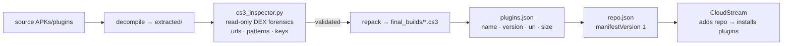

# gayxxx-sovereign — CloudStream CS3 plugin repository

A CloudStream extension repository: **19 CS3 plugins repacked from validated DEX** (ZIP archives with `classes.dex`). Add it to CloudStream via `repo.json` and the app pulls the plugin list from `plugins.json`.

<div align="right">

[](https://github.com/toxicwind/sovereign-projects#license)
[](https://github.com/toxicwind/sovereign-projects)

</div>

## Why this exists

CloudStream loads video-source plugins from extension repositories. This package is the full pipeline for one such repository: decompile and extract candidate plugins, forensically inspect the DEX, repack the validated ones as `.cs3`, and publish the `repo.json` / `plugins.json` manifests CloudStream consumes. Every plugin in `final_builds/` was repacked from a DEX that passed inspection — "Fixed repository" means no broken repacks.

## What's here

| Path | Role |
|---|---|
| `repo.json` | Repository manifest — points CloudStream at `plugins.json` |
| `plugins.json` | Plugin list: name, version, language, authors, tvTypes, download URL, file size |
| `final_builds/` | **19 validated `.cs3` plugins** (the shippable artifacts) |
| `builds/` | Intermediate builds |
| `extracted/` | Decompiled sources under inspection |
| `cs3_inspector.py` | Read-only forensic DEX inspector (stdlib only) |
| `EXTRACTION_REPORT.md` | Full decompilation & extraction report (2026-05-25): per-plugin URL hits, regex patterns, extracted keys |
| `AGENTS.md` | Repo conventions |



Each `plugins.json` entry carries: `name`, `internalName`, `description`, `iconUrl`, `apiVersion`, `url` (the `.cs3` download), `fileSize`, `version`, `language`, `authors`, `tvTypes`, `status`, `repositoryUrl`.

## Quick start

Add to CloudStream:

```
https://raw.githubusercontent.com/toxicwind/gayxxx-sovereign/main/repo.json
```

Inspect a plugin without installing anything:

```bash
python3 cs3_inspector.py final_builds/GayStream.cs3
```

## License & security

MIT where marked — [LICENSE](https://github.com/toxicwind/sovereign-projects#license). `cs3_inspector.py` is read-only by design — it extracts strings and patterns from DEX files, it never executes plugin code. Treat any `.cs3` from outside `final_builds/` as untrusted until it passes the same inspection pipeline.
