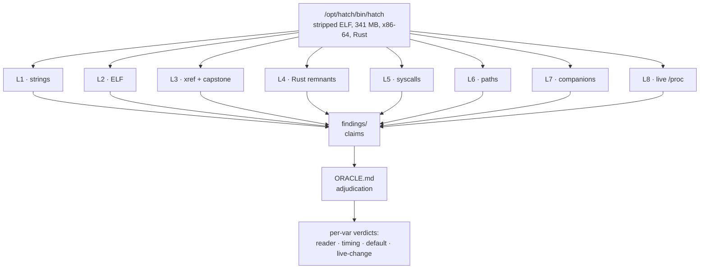

<div align="right">

[](https://github.com/toxicwind/sovereign-projects)
[](https://github.com/toxicwind/sovereign-projects)

</div>

# hatch-decode — oracle forward decoding of `/opt/hatch/bin/hatch`

> **Why should you care?** The runtime daemon that owns your cell has 158 environment
> knobs baked in — most undocumented. This project statically decodes *every*
> `JARVIS_*` variable: what reads it, when, the compiled default, and whether a
> change takes effect without a restart. No ptrace, no guessing: eight orthogonal
> analysis lanes emit evidence, and an oracle adjudicates per-variable verdicts.

## The 8 orthogonal lanes

Each lane answers one question about the binary. Lanes write claims into
`findings/`; the oracle ([`ORACLE.md`](ORACLE.md)) resolves lane conflicts with
evidence, never by vote.

| Lane | Script | Method | Question answered |
|------|--------|--------|-------------------|
| L1 | `lanes/lane1_strings.sh` | strings-context mining, one pass | per-var adjacent evidence: defaults, log lines, error text |
| L2 | `lanes/lane2_elf.sh` | ELF/dynamic structure | imports, sections, `.rustc`, build-id |
| L3 | `lanes/lane3_xref.py` | fast-xref: byte-scan `.text` for RIP-relative LEAs targeting each var string + capstone windows | instruction-level read sites per var |
| L4 | `lanes/lane4_rust.sh` | Rust remnants | module paths (`hatch::`), panic sites, lazy-init markers (`OnceLock`, `get_or_init`) |
| L5 | `lanes/lane5_syscalls.sh` | syscall/import surface | inotify/fanotify/signal/epoll — any reload mechanism? |
| L6 | `lanes/lane6_paths.sh` | path-constant sweep | every baked-in `/etc /run /opt /var` path — what files it touches |
| L7 | `lanes/lane7_companions.sh` | companion binaries + launcher scripts | does `spawnd` read the vars? who sets what, when? |
| L8 | `lanes/lane8_live.sh` | live observation without ptrace | `/proc/67` cmdline/maps/fd, sockets, `/etc/hatch` mtimes |

## How it fits together



Target: `/opt/hatch/bin/hatch` — stripped ELF, 341MB, x86-64, Rust, imports
`getenv@GLIBC_2.2.5`. The daemon that owns this runtime cell.

Goal: for every `JARVIS_*` env knob, determine **what reads it**, **when**
(startup-once into a config struct vs lazily per use), the **compiled default**,
and whether a value change can take effect **without a daemon restart**.

## Quick start

```bash
cd projects/hatch-decode/lanes && chmod +x lane* && ./lane1_strings.sh   # any lane; each writes to ../findings/
ls ../findings/                                                          # per-lane claim files
cat ../ORACLE.md                                                         # how verdicts get adjudicated
```

## Oracle forward decoding

Lanes emit **claims** into `findings/`. The oracle (`ORACLE.md`) adjudicates:
per-var verdicts — reader, timing, default, live-change path, confidence.
Forward = binary → meaning; the oracle resolves lane conflicts with evidence,
never by vote.

Deep dives live in sub-passes:

| Pass | Focus |
|------|-------|
| [`pass3/`](pass3/README.md) | static decode with reader-supplied-length discipline — 158 exact `JARVIS_*` names, compiled defaults, reader addresses, call-site shapes |

## Tooling notes

- Cell: binutils + `pip install capstone` (done 2026-09-20). No `paru` here.
- yote (Arch/CachyOS, `paru`): for deeper lanes — `paru -S radare2 ghidra`
  (ghidra headless decompile), `x64dbg`-class work stays manual.
- Repos: capstone (PyPI) for disasm windows; anything heavier gets its own lane doc.

## Standing findings

- 2026-09-20: 131 unique `JARVIS_*` strings in the binary (`findings/jarvis_vars.txt`).
- 2026-09-20: `/etc/hatch/env.override` is **not** a durable ops surface — the host
  re-provisioned `/etc/hatch` wholesale at 19:26 MDT, wiping a staged
  `JARVIS_AVOCADO_COMPACTION_TRIGGER_TOKENS=170000`. Durable path must be
  wherever the host renders it from (host-side, outside the cell).

## License + security

Licensed under the sovereign-projects monorepo terms (MIT family —
see the [herd fork license](../herd/LICENSE.md)). This project is
**read-only analysis by design**: it decodes the binary statically and
observes `/proc` — it never ptrace-attaches, never patches, and never
writes to `/etc/hatch`. Verdicts that need a live effect are escalated
out of band, not applied here.

---
*Up: [master README](../../README.md) · [projects/](../README.md)*
