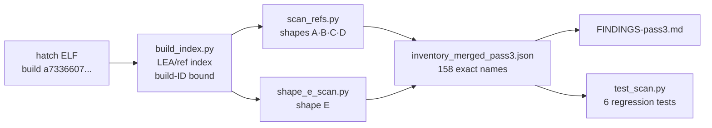

<div align="right">

[](https://github.com/toxicwind/sovereign-projects)
[](https://github.com/toxicwind/sovereign-projects)

</div>

# hatch-decode pass 3 — the exact `JARVIS_*` inventory

> **Why should you care?** Passes 1–2 counted `JARVIS_*` strings; pass 3 pins down
> the *exact* inventory with reader-supplied-length discipline — 158 exact names,
> compiled defaults, reader addresses, and call-site shapes. It even found 8
> "removed" vars that had merely moved to a new SIMD constant-pool idiom. Every
> artifact is bound to the binary's build ID, so stale indexes are rejected, not
> silently trusted.

Static decode of `/opt/hatch/bin/hatch` (`hatch 0.1.0 (e86e3030628)`,
build ID `a733660761e017bf523cc4be3e467cddf3c4e639`), continuing pass 1
(`0734b5ca`) and pass 2 (`76fed7d2`).

## What it does

Recovers the exact `JARVIS_*` environment-variable inventory from the
binary with reader-supplied-length discipline (no packed-symbol fusion),
plus compiled defaults, reader addresses, and call-site shapes.

Reader shapes — how the binary references each name:

- **A** — RIP-relative `lea` into `.rodata` + exact supplied length (+
  optional default immediate), verified with Capstone.
- **B** — absolute immediates.
- **C** — static `&str {ptr,len}` records in `.data.rel.ro`.
- **D** — length-less LEAs resolved through voted exact names.
- **E** *(new in pass 3)* — SIMD constant pools `.rodata.cst16` /
  `.rodata.cst32` with the new `(name, name_len, default)` reader idiom.



## Files

| file | purpose |
|---|---|
| `build_index.py` | build-ID-bound persistent LEA/absolute-ref index of the binary |
| `scan_refs.py` | shapes A/B/C/D scanner → `inventory_pass3.json`, `sites_pass3.json` |
| `shape_e_scan.py` | shape-E scanner → `inventory_shape_e.json` |
| `inventory_merged_pass3.json` | **canonical: 158 exact names** |
| `FINDINGS-pass3.md` | full findings (dual defaults, resolver, inventory delta) |
| `test_scan.py` | regression tests (`python3 test_scan.py`) |
| `requirements.txt` | pinned `capstone==5.0.7` |

## Quick start

```bash
pip install -r requirements.txt && python3 build_index.py   # ~10s, writes ref_index.json (build-bound)
python3 scan_refs.py && python3 shape_e_scan.py             # ~70s on the hatch cell
python3 test_scan.py                                        # 6 regression tests
```

Every artifact records the binary build ID; the index is rejected when
the binary is rebuilt (addresses go stale across builds).

## Key results

- 158 exact names; the 8 vars pass 2 thought removed (incl.
  `JARVIS_COMPACTION_HEARTBEAT_SECS`, default still 30) had moved to the
  cst-pool idiom — nothing was removed.
- `JARVIS_MODEL_STREAM_CHUNK_IDLE_TIMEOUT_MS` dual defaults adjudicated:
  90000 (interactive) / 180000 (cron), flag-selected in fn 0xda0f7b0.
- Avocado trigger resolver live at 0x9a5bdc0 (200000/150000, fail-fast
  intact); dispatch is once-per-process lazy (`lock cmpxchg`).
- Eager compaction module source-attributed:
  `hatch-engine/crates/hatch-agent/src/session/impl_session/eager_compaction.rs`.

## License + security

Licensed under the sovereign-projects monorepo terms (MIT family —
see the [herd fork license](../../herd/LICENSE.md)). Read-only static
analysis: disassembly windows via Capstone, no execution of the target
binary, no ptrace, no writes outside this directory.

---
*Up: [hatch-decode](../README.md) · [master README](../../../README.md)*
