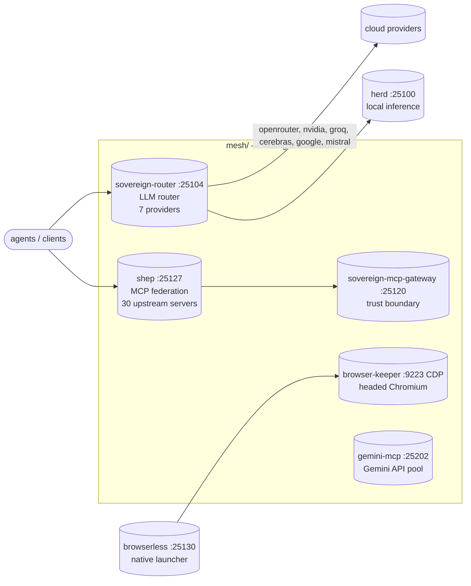

# Mesh — Tool Federation & Routing Layer

*One endpoint in front of everything: MCP federation, multi-provider LLM routing, and browser automation for the sovereign fleet.*

 

**mesh/** is where the sovereign estate's traffic gets managed: every tool an agent can call and every model it can think with is federated, routed, health-checked, and load-balanced here. Local inference is owned by herd (`:25100`); mesh owns everything that decides *where a request goes next*.

## Why this exists

- **One gateway for tools** — `shep` fronts 30 upstream MCP servers with quarantine, BM25 tool discovery, and security scanning, so agents see one `retrieve_tools` call instead of hundreds of schemas.
- **One gateway for models** — the sovereign router fans a single OpenAI-compatible request across 7 providers with strategy-based failover, circuit breakers, and sticky sessions.
- **Zero-cost by default** — the `free` strategy races local GPU inference against every `:free` cloud model; cost-sensitive agents never touch a paid endpoint by accident.
- **A browser that remembers** — the browser-keeper is one persistent headed Chromium; logins, tabs, and state survive across tasks instead of being respawned per call.

## What's here

```text
mesh/
├── gateway/                    # vendored mcpproxy-go source — the engine behind shep (:25127)
│   ├── bench/                  # reproducible benchmark harness (token reduction, discovery accuracy)
│   ├── contrib/linux-repos/    # signed apt/yum repo publisher (CI release tooling)
│   └── specs/                  # spec-kit feature specifications index
├── router/
│   ├── sovereign-router-ts/    # THE LIVE ROUTER (Bun, :25104, /ui) — 7 providers
│   ├── sovereign-mcp-gateway/  # trust boundary + circuit breakers + sticky affinity (:25120)
│   ├── flock-py/               # Python FastAPI router (v2, reference)
│   ├── flock-router/           # TS/Bun router variant (4-way AST race)
│   └── free_zed_gateway/       # free-LLM gateway concept (folded into the `free` strategy)
├── browserless/                # browserless.io MCP server + native launcher (:25130) + keeper (:9223)
├── gemini-mcp/                 # first-class Gemini API MCP server (:25202, multi-key pool)
├── ast-matrix/                 # archived router research package (sovereign_complete_pkg)
├── flock-pkg/                  # frozen flock extraction snapshot (was ast-matrix/)
├── squawk/ squawk-ws/          # fleet messaging: WhatsApp relay (:25135) + WS push server (:25147)
├── secretsmith/                # Secret Service CLI (secret-tool lineage)
├── bin/                        # mesh operator scripts
├── config.yml                  # unified mesh config — model roles, port mappings
└── research/ data/              # provider discovery scripts, model catalog dumps
```

## Routing map



## Quick Start

```bash
curl -sf http://127.0.0.1:25127/health    # shep (MCP federation)
curl -sf http://127.0.0.1:25104/health    # sovereign-router
curl -sf http://127.0.0.1:25100/v1/models  # herd (local inference)
```

## shep — MCP federation (:25127)

**shep** (renamed from mcpproxy) serves one endpoint in front of **30 upstream MCP servers**: quarantine for new servers, BM25 tool discovery, health checks, and security scanning. Live config: `sovereign-projects/mesh/gateway/mcp_config.json` (pitchfork `shep` daemon). The engine source is vendored at `gateway/` (upstream: smart-mcp-proxy/mcpproxy-go); the reproducible benchmark evidence lives at `gateway/bench/`.

## sovereign-router (:25104)

The TypeScript router is the live multi-provider gateway: 7 providers (llama-swap, openrouter, nvidia, groq, cerebras, google, mistral), 7-strategy routing, built-in `/ui` dashboard. Override per request:

```bash
curl -H "X-Sovereign-Strategy: free" http://127.0.0.1:25104/v1/chat/completions
```

| Strategy | Behavior |
| -------- | -------- |
| `hybrid` (default) | sticky → ast_race → circuit_chain |
| `free` | races local llama-swap + every `:free` cloud model (zero-cost) |
| `ast_race` | parallel fan-out, first AST/code-shaped response wins |
| `sticky_affinity` | session-pinned routing for multi-turn |
| `weighted_elo` | ELO-weighted selection from success/latency history |
| `circuit_chain` | sequential with open/half-open circuit breakers |
| `fifo_matrix` | bounded FIFO queue (back-pressure) |

## Sovereign MCP gateway (:25120)

`router/sovereign-mcp-gateway/` is a trust boundary in front of upstream MCP servers: per-upstream circuit breakers quarantine poisoned servers, `notifications/initialized` pins sticky sessions, and `tools/list` is served as a provenance-namespaced union (`<upstream>__<tool>`) with 502 failover.

## Relationship to herd

Herd owns local inference (`:25100`). Mesh owns routing and federation, and points at herd as the local leg:

```yaml
openai-compatible:
  baseUrl: http://127.0.0.1:25100/v1
```

## Ops notes (2026-09-17)

- mesh-hub (:25115) was down and was brought back up via pitchfork (`pitchfork start mesh-hub`). `/health` returns 200. If pitchfork shows herd as errored while `:25100` serves 200, that is stale supervisor ownership — the healthy detached daemon holds the port; do not kill it or start a second instance.
- `config.yml` declares a default free-tier intent (`openrouter/inclusionai/ling-3.0-flash-fin:free:high`), but nothing consumes it — declared intent, not active routing. The live free pool is `freeCandidates()` in `router/sovereign-router-ts/router_config.ts`. Ling passed the gate 2026-09-17 (corrected 8/8 benchmark, warm TTFT < 2 s) and is in the pool: 14 candidates verified live, router restarted via pitchfork, `/health` 200. See `docs/free-tier-models.md` for the full record.

## Gemini API Tool Retrieval EAP

The Gemini API Early Access Program for Tool Retrieval is directly relevant to shep: `defer_loading: true` offloads tool schemas server-side and a retrieval meta-tool lets the model search a large tool catalog dynamically — designed for 30+ tool catalogs, exactly shep's shape (30 upstream MCP servers). Docs: <https://ai.google.dev/gemini-api/docs/tool-retrieval>

- Platform fixes confirmed by Google (2026-09-07): HTTP 400 on deferred tools with parameters fixed fleet-wide; token-accounting fix for uncalled deferred tools rolling out.
- Integration target: NATIVE Gemini path — POST `/v1beta/interactions` on `gemini-flash-tool-retrieval` with the EAP key, server-side mode with shep's 30-server union as `mcp_server` entries + `defer_loading: true`. NOT the OpenAI-compat `/v1beta/openai` path (no EAP semantics there), and NOT nim-proxy. Full spec in `docs/gemini-tool-retrieval.md`; LLM-friendly API reference in `docs/gemini-tool-retrieval-reference.md`. BLOCKED on depleted prepay credits.

## squawk — fleet messaging (moved here 2026-09-19)

Squawk source used to live scattered at the home root (`~/squawk`, `~/squawk-ws`); it now lives here as `squawk/` (fleet relay, `:25135`) and `squawk-ws/` (fleet WS push server, `:25147`). `~/squawk` and `~/squawk-ws` remain as compatibility symlinks. Pitchfork daemons `squawk-ws`, `squawk-feed`, and `squawk-ws-client` point at these paths; the systemd `squawk-watchdog.timer` keeps the pitchfork supervisor alive.

mise tasks (sovereign `mise.toml`): `up-squawk`, `down-squawk`, `up/down/restart-squawk-ws`, `up/down/restart-squawk-feed`, `health-squawk-ws`, `health-squawk-feed`.

## Dev / contributing

The mesh is a sovereign estate component — contributions land as commits in the sovereign-projects repo. Vendored code (`gateway/`) tracks upstream smart-mcp-proxy/mcpproxy-go; keep local diffs minimal and documented so re-vends stay clean. Ops changes (pitchfork wiring, port assignments) go through `sovereign/` config with an owned restart sequence — never kill+start a daemon in a single command.

## License & Security

- Mesh-native code follows the sovereign-projects repo licensing. Vendored `gateway/` is MIT (upstream smart-mcp-proxy/mcpproxy-go) — see `gateway/LICENSE`.
- Security posture: shep quarantines unapproved MCP servers and runs Docker-based security scanners (Snyk, Semgrep, Trivy) against quarantined servers before approval; tool-call intent is validated against annotations (`call_tool_read` can never reach a destructive tool); the sovereign-mcp-gateway is a trust boundary with per-upstream circuit breakers. API keys and tokens live only in 0600 files under `/home/toxic/` (`~/.secrets`, `~/.browserless/.env`, `~/.gemini_mcp_token`) — never in this repo, never in logs.
