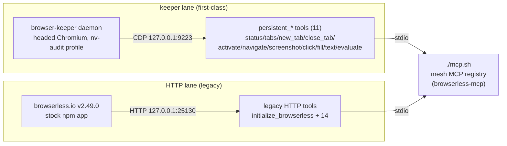

# Browserless — Sovereign Mesh

*Headed browser automation for the fleet: one MCP server, one persistent Chromium, zero dead sessions.*

   

## Why this exists

- **One persistent browser, not a thousand tabs** — MCP tasks drive the browser-keeper's headed Chromium through `persistent_*` tools, so logins, tabs, and state survive across tasks instead of being spawned and scrapped per call.
- **Never half-working** — the MCP server is stdio-only and *refuses to start* if the keeper's CDP endpoint is down. Fail loud beats half-broken every time.
- **Native, not forked** — the live browserless.io v2.49.0 server is stock npm output; all the ops layer (launcher, pitchfork wiring, env) lives here, so upgrades never fight a fork.

## Two lanes — don't confuse them



The MCP server is **stdio only** — no port, no daemon. MCP clients spawn `./mcp.sh` per session. `persistent_*` is the first-class path (headed, logged-in, state survives across tasks); the `:25130` HTTP tools are the legacy lane and several are honestly documented as broken against v2.49.0 in their tool descriptions.

## Quick Start

```bash
cd projects/mesh/browserless
npm install && npm run build   # tsc -> dist/ (dist/ and node_modules/ are gitignored)
./mcp.sh                       # stdio MCP server; refuses to start if the keeper CDP is down
```

## Deployment: native launcher

The live deployment never forked browserless code. `/home/toxic/.browserless/app` is stock **browserless.io v2.49.0** (SSPL, npm-installed — build output and `node_modules` are runtime artifacts, not tracked here). The ops layer, carried in this project (first built for the ITVX use case — see `usecases/itvx.md`):

- `server/run.sh` — native launcher: sources the token from 0600 `/home/toxic/.browserless/.env`, binds `127.0.0.1`, port from `BROWSERLESS_PORT` (25130), `PLAYWRIGHT_BROWSERS_PATH=/home/toxic/.browserless/browsers`, `CONNECTION_TIMEOUT=60000`, `CONCURRENT=10`, `NODE_ENV=production`, then `exec node /home/toxic/.browserless/app/build/index.js`.
- Pitchfork daemon `[daemons.browserless]` on **:25130** (canonical section in `server/pitchfork.fragment.toml`; live section in `/home/toxic/sovereign/pitchfork.toml`). Owned restart sequence: `pitchfork stop browserless` → verify dead via `ss` → `pitchfork clean --daemon browserless` → `pitchfork start browserless` from `/home/toxic/sovereign` (or the `bin/pitchfork-restart` wrapper).
- `config/ports.env`: `BROWSERLESS_PORT=25130` (collision resolved 2026-09-14 — browserless keeps 25130).

## Token rule (non-negotiable)

The server token lives **only** in `/home/toxic/.browserless/.env` (mode 0600). It is sourced at launch, never printed, never logged, never committed. `server/.env.example` and `env.example` carry empty values. `.gitignore` carries the token-scrub patterns (`*.pat`, `.env*`, `*secret*`, `*token*`).

## Layout

```text
projects/mesh/browserless/
├── src/                    # MCP server (index.ts, client.ts, simple-server.ts, types.ts)
├── keeper/                 # browser-keeper: the persistent headed Chromium (:9223 CDP)
├── viewer/                 # agent-viewer gate (RETIRED 2026-09-21; tailnet-only now)
├── server/
│   ├── run.sh              # native launcher (pitchfork runs this)
│   ├── .env.example        # documents the 0600 /home/toxic/.browserless/.env shape
│   └── pitchfork.fragment.toml  # canonical [daemons.browserless] section
├── config.json             # live endpoint: 127.0.0.1:25130 (token intentionally null)
├── env.example             # MCP client env template (live defaults)
├── Dockerfile / docker-compose.yml  # legacy docker path (native launcher is live)
├── smithery.yaml           # smithery packaging
├── ref/browserless_api_reference.md
├── test-*.js               # feature test scripts
└── TEST_RESULTS.md         # historical feature test results
```

## Running the server

```bash
# via pitchfork (canonical)
/home/toxic/sovereign/bin/pitchfork-restart browserless
# liveness (no token needed to prove it's serving — 401 means the gate is up)
curl -s -o /dev/null -w '%{http_code}\n' http://127.0.0.1:25130/pressure
# authenticated check (token stays in this shell; only the status code leaves it)
set -a; . /home/toxic/.browserless/.env; set +a
curl -s -o /dev/null -w '%{http_code}\n' "http://127.0.0.1:25130/pressure?token=$BROWSERLESS_TOKEN"
```

## Running the MCP server

```bash
cd projects/mesh/browserless
npm ci            # or npm install
npm run build     # tsc -> dist/
# stdio MCP server, talks to the live 127.0.0.1:25130 by default
# keeper-wired launcher (first-class): stdio, no port/daemon — 26 tools incl.
# 11 persistent_* -> keeper CDP 127.0.0.1:9223
./mcp.sh
```

Registered in the mesh MCP registry (`/home/toxic/projects/my-ai-tools/configs/mcp-registry.json`) as `browserless-mcp`. See `keeper/README.md` for the serve path and e2e evidence. `node dist/simple-server.js` runs a simpler single-purpose server (env-driven URL, defaults to the live endpoint).

### Rebuild from a clean checkout

`dist/` and `node_modules/` are gitignored build artifacts — rebuild them:

```bash
cd projects/mesh/browserless
/usr/bin/node --version   # want v24.x; the mise node 22.12.0 npm is BROKEN
                          # on yote (missing nopt module) — never use bare
                          # `npm` under mise node 22
npm install && npm run build   # tsc -> dist/
npm test                       # smoke suite vs the LIVE keeper (scratch tab)
./mcp.sh                       # stdio MCP server; refuses to start if the
                               # keeper CDP is down (BROWSER_MCP_ALLOW_NO_KEEPER=1 bypasses)
```

### Smoke suite

`npm test` runs `smoke/keeper-smoke.mjs` against the **live** keeper: status → tabs → new_tab (scratch) → activate → navigate → evaluate → pageText → screenshot → error-path codes → close_tab → status. The scratch tab is closed afterwards; existing tabs are never touched. Exit 0 = all pass.

`initialize_browserless` defaults to host `127.0.0.1`, port `25130` — the live mesh server. `simple-server.ts` builds its URL from `BROWSERLESS_PROTOCOL/HOST/PORT` with the same defaults.

## Feature status

Working against the live server: content extraction (`/content`), PDF generation (`/pdf`). Screenshot timed out under test load; `/function` needed a different payload format; `/export` and `/performance` are not in this server build. Details: `TEST_RESULTS.md` (historical run against the old docker endpoint; re-run `test-all-features.js` to refresh).

## Dev / contributing

Changes land as commits in the sovereign-projects repo. The vendored npm app is never patched — if a behavior needs changing, it goes into `src/` (the MCP server) or the launcher layer, not into `/home/toxic/.browserless/app`. Test against the live keeper before pushing; the smoke suite is the gate.

## License & Security

- MCP server source follows the sovereign-projects repo licensing; the browserless.io server itself is SSPL (stock npm install, untouched).
- Security: the server token lives only in `/home/toxic/.browserless/.env` (0600), sourced at launch and never logged; gitignore scrubs token-shaped files; the MCP server refuses to start without a live keeper rather than serving degraded. See also the isolated display in `keeper/README.md` — the agent Chromium never renders in the user's own desktop session.

## Links

- Mesh overview: `projects/mesh/README.md`
- Keeper serve path: `keeper/README.md`
- Fleet knowledgebase: `docs/fleet-knowledgebase.md`
- Upstream MCP project this was merged from: Lizzard-Solutions/browserless-mcp
