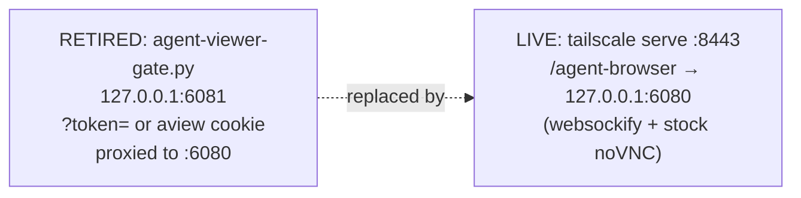

# agent-viewer-gate — RETIRED

*The token-gated front door for the agent's noVNC viewer. Retired 2026-09-21 — kept as reference only.*

  

> **Retired 2026-09-21 (Forge).** Chris: the token gate was not wanted — the viewer is tailscale/network/agent access only. `/agent-browser` is now served tailnet-only via `tailscale serve` on `:8443`, straight from websockify `:6080` (see `projects/yote/ops/funnel-map.sh` SERVE_MAP). This script is no longer a pitchfork daemon and `:6081` no longer listens.



## Quick Start

There is nothing to start — the gate is retired. The live viewer path:

```bash
# close the external route without touching the daemons (as root)
tailscale serve --https=8443 --set-path /agent-browser off
```

Viewer URL (live): `https://github-mcp-host.tailc9ac71.ts.net:8443/agent-browser/vnc.html`

## What it was

The token-gated front door for the noVNC agent viewer (`:6080`, loopback-only, interactive). Listened on `127.0.0.1:6081`, required `?token=` (or the `aview` cookie), then proxied HTTP + websocket upgrades to `:6080`. The funnel once mounted it at `/agent-browser`.

The VNC password itself was never handled here — noVNC still prompts for it.

## Architecture (historical)

`agent-viewer-gate.py` was a single Python process: read the token from the query string or cookie, reject unauthenticated requests, and reverse-proxy both plain HTTP and websocket upgrades to the loopback websockify instance on `:6080`. It ran as a pitchfork daemon until 2026-09-21, when the token gate was retired in favor of the tailnet-only `tailscale serve` route.

## Dev / contributing

This file is frozen as historical reference. Any future viewer-front-door work starts from the live lane documented in `../keeper/README.md` ("Agent display + interactive viewer"), not from this script.

## License & Security

- Follows the sovereign-projects repo licensing.
- Security note (historical): even when live, this gate never saw the VNC password — VNC auth stayed between noVNC and Xvnc. The current live route relies on tailnet identity as the access control, per Chris's explicit call; there is no public exposure of the viewer.
