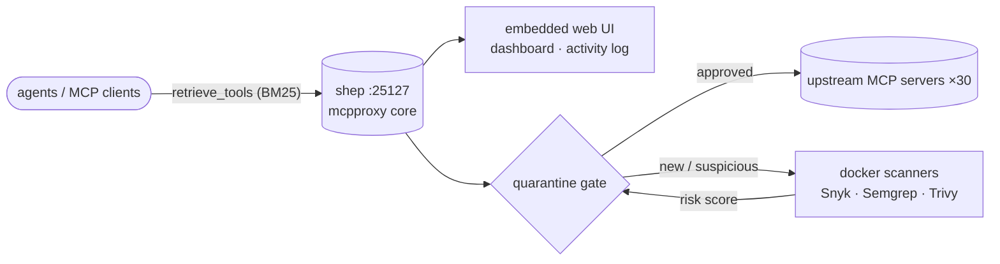

# MCPProxy — vendored gateway engine (shep)

*One safe endpoint in front of every MCP server. Vendored upstream source for **shep**, the sovereign mesh's MCP federation daemon (`:25127`).*

  

> **Mesh context.** This directory is the vendored source of [smart-mcp-proxy/mcpproxy-go](https://github.com/smart-mcp-proxy/mcpproxy-go) — the engine behind **shep**, which fronts 30 upstream MCP servers on the mesh. The sovereign deployment is configured in `sovereign-projects/mesh/gateway/mcp_config.json` and runs as the pitchfork `shep` daemon on `:25127`. Vendored code tracks upstream; keep local diffs minimal so re-vends stay clean.

<div align="center">

[](https://github.com/smart-mcp-proxy/mcpproxy-go/releases)
[](https://github.com/smart-mcp-proxy/mcpproxy-go/actions/workflows/unit-tests.yml)
[](https://goreportcard.com/report/github.com/smart-mcp-proxy/mcpproxy-go)
[](https://pkg.go.dev/github.com/smart-mcp-proxy/mcpproxy-go)
[](LICENSE)
[](https://github.com/smart-mcp-proxy/mcpproxy-go/stargazers)

</div>

<p align="center">
  
</p>

<p align="center">
  <strong>📺 <a href="https://youtu.be/2aKrgJnbbcw">Watch the full walkthrough</a></strong> &nbsp;·&nbsp;
  <strong>📚 <a href="https://docs.mcpproxy.app/">Read the docs</a></strong> &nbsp;·&nbsp;
  <strong>🌐 <a href="https://mcpproxy.app">mcpproxy.app</a></strong>
</p>

> The demo above shows the **embedded web UI**. The MCPProxy **core is a single binary for macOS, Linux, and Windows** — the web UI ships inside it, with no extra service to run. On **macOS**, an optional **menu-bar app** adds one-click convenience (start/stop, server health, quarantine, logs).

## Why MCPProxy?

- **Scale beyond API limits** – Federate hundreds of MCP servers while bypassing Cursor's 40-tool limit and OpenAI's 128-function cap.
- **Save tokens & accelerate responses** – Agents load just one `retrieve_tools` function instead of hundreds of schemas. Research shows ~99 % token reduction with **43 % accuracy improvement**.
- **Advanced security protection** – Automatic quarantine blocks Tool Poisoning Attacks until you manually approve new servers.
- **Pluggable security scanners** – Run Snyk, Semgrep, Trivy, Cisco, and other Docker-based scanners against quarantined servers before you approve them; findings are normalized to SARIF with a composite risk score. See [Security scanner plugins](https://docs.mcpproxy.app/features/security-scanner-plugins/).
- **Works offline & cross-platform** – A single core binary for macOS (Intel & Apple Silicon), Windows (x64 & ARM64), and Linux (x64 & ARM64), with the **web UI embedded**. macOS additionally ships an optional menu-bar app.

## shep on the mesh



In the sovereign deployment, agents see a handful of built-in MCPProxy tools instead of hundreds of upstream schemas. Shep's config (`mcp_config.json`) declares the 30 upstream servers; the quarantine gate holds new servers until approved; BM25 `retrieve_tools` keeps agent context small. The reproducible numbers behind the token-reduction claims are measured by `bench/` — see [bench/README.md](bench/README.md).

---

## Quick Start

### 1. Install

**macOS (Recommended — DMG Installer):**

Download the latest DMG installer for your architecture:
- **Apple Silicon (M1/M2):** [Download DMG](https://github.com/smart-mcp-proxy/mcpproxy-go/releases/latest) → `mcpproxy-*-darwin-arm64.dmg`
- **Intel Mac:** [Download DMG](https://github.com/smart-mcp-proxy/mcpproxy-go/releases/latest) → `mcpproxy-*-darwin-amd64.dmg`

**Windows (Recommended — Installer):**

Download the latest Windows installer for your architecture:
- **x64 (64-bit):** [Download Installer](https://github.com/smart-mcp-proxy/mcpproxy-go/releases/latest) → `mcpproxy-setup-*-amd64.exe`
- **ARM64:** [Download Installer](https://github.com/smart-mcp-proxy/mcpproxy-go/releases/latest) → `mcpproxy-setup-*-arm64.exe`

The installer automatically installs both `mcpproxy.exe` (core server) and `mcpproxy-tray.exe` (system tray app), adds MCPProxy to your system PATH, and creates Start Menu shortcuts. Silent install: `.\mcpproxy-setup.exe /VERYSILENT`.

**Alternative install methods:**

macOS (Homebrew):
```bash
# macOS — GUI tray app (recommended):
brew install --cask smart-mcp-proxy/mcpproxy/mcpproxy

# macOS / Linux — headless CLI only:
brew install smart-mcp-proxy/mcpproxy/mcpproxy
```

Linux (Debian/Ubuntu) — apt repository, auto-updates via `apt upgrade`:
```bash
sudo install -m 0755 -d /etc/apt/keyrings
curl -fsSL https://apt.mcpproxy.app/mcpproxy.gpg \
  | sudo tee /etc/apt/keyrings/mcpproxy.gpg > /dev/null
echo "deb [arch=$(dpkg --print-architecture) signed-by=/etc/apt/keyrings/mcpproxy.gpg] https://apt.mcpproxy.app stable main" \
  | sudo tee /etc/apt/sources.list.d/mcpproxy.list > /dev/null
sudo apt update && sudo apt install mcpproxy
```

Linux (Fedora / RHEL / Rocky / AlmaLinux) — dnf repository, auto-updates via `dnf upgrade`:
```bash
sudo dnf config-manager --add-repo https://rpm.mcpproxy.app/mcpproxy.repo
sudo dnf install -y mcpproxy
```

Arch Linux (AUR): [`mcpproxy-bin`](https://aur.archlinux.org/packages/mcpproxy-bin)
```bash
yay -S mcpproxy-bin
```

The apt and dnf packages ship a hardened `systemd` unit and start the service automatically. Repository signing key fingerprint: `3B6F A1AD 5D53 59DA 51F1  8DDC E1B5 9B9B A1CB 8A3B`.

Anywhere with Go 1.25+:
```bash
go install github.com/smart-mcp-proxy/mcpproxy-go/cmd/mcpproxy@latest
```

### 2. Run

```bash
mcpproxy serve          # starts HTTP server on :8080 and shows tray
```

### 3. Add your first server

Create or edit `~/.mcpproxy/mcp_config.json`:

```jsonc
{
  "listen": "127.0.0.1:8080",
  "mcpServers": [
    { "name": "local-python", "command": "python", "args": ["-m", "my_server"], "protocol": "stdio", "enabled": true },
    { "name": "remote-http", "url": "http://localhost:3001", "protocol": "http", "enabled": true }
  ]
}
```

See [Configuration](https://docs.mcpproxy.app/configuration/config-file/) and [Upstream Servers](https://docs.mcpproxy.app/configuration/upstream-servers/) for the full reference.

---

## How AI Agents Work Through MCPProxy

Once connected, your agent sees a handful of built-in MCPProxy tools instead of hundreds of upstream schemas. A typical session has three beats — discover, call, audit — plus an optional preflight gate for unattended automations.

### 1. Discover — spend one query, not your context window

The agent asks for what it needs in plain keywords via `retrieve_tools`:

```json
{ "query": "create github issue", "limit": 5 }
```

MCPProxy runs a BM25 search across every connected server and returns only the top-ranked matches — each with a `call_with` hint recommending the right call variant for its annotations:

```json
{
  "tools": [
    { "name": "github:create_issue", "score": 0.89, "call_with": "call_tool_write" },
    { "name": "gitlab:create_issue", "score": 0.72, "call_with": "call_tool_write" }
  ]
}
```

This is where the token savings come from: the schemas of the hundreds of tools the agent *didn't* need never enter its context. The agent loads full schemas on demand with `describe_tool` (batch up to 5 ids) only for the tools it's about to use.

### 2. Call — with declared intent

The agent executes the tool through the variant matching its intent (`call_tool_read`, `call_tool_write`, or `call_tool_destructive`), addressing it as `server:tool`:

```json
{
  "name": "github:create_issue",
  "args_json": "{\"repo\": \"acme/api\", \"title\": \"Bug report\"}",
  "intent": { "operation_type": "write", "reason": "Filing bug per user request" }
}
```

MCPProxy validates the intent against the tool's annotations (a "read" call can't reach a destructive tool), checks quarantine and approval state, and scans arguments and responses for sensitive data before anything leaves the machine.

### 3. Audit — every call is on the record

Every call lands in the local [Activity Log](https://docs.mcpproxy.app/features/activity-log/) with a request ID, so you can reconstruct exactly what an agent did:

```bash
mcpproxy activity list                          # everything, newest first
mcpproxy activity list --request-id <id>        # one workflow, correlated
```

### Gate automations before they burn tokens

For recurring headless jobs (cron, CI, n8n), don't let the agent discover a missing tool the expensive way. One preflight command checks that every required tool is ready — without contacting any upstream server — and reports exactly why when it isn't (server quarantined, tool changed since approval, OAuth expired, typo'd id):

```bash
mcpproxy tools preflight gh-ops:sync_issues slack:post_message --wait 10s
case $? in
  0)  run-agent-session ;;   # all ready — go
  10) exit 75 ;;             # transient (server starting) — let the next cron tick retry
  11) page-operator ;;        # blocked — someone must approve / enable / log in
  12) fail-pipeline ;;       # unknown tool id — the automation itself is misconfigured
esac
```

See [Required-Tools Preflight](https://docs.mcpproxy.app/features/tools-preflight/) for the full reason taxonomy, REST endpoint, and GitHub Actions / n8n recipes.

---

## 🔐 Optional HTTPS Setup

MCPProxy works with HTTP by default for easy setup. HTTPS is optional and primarily useful for production environments or when stricter security is required.

### Quick HTTPS Setup

**1. Enable HTTPS** (choose one method):
```bash
# Method 1: Environment variable
export MCPPROXY_TLS_ENABLED=true
mcpproxy serve

# Method 2: Config file
# Edit ~/.mcpproxy/mcp_config.json and set "tls.enabled": true
```

**2. Trust the certificate** (one-time setup):
```bash
mcpproxy trust-cert
```

**3. Use HTTPS URLs**:
- MCP endpoint: `https://localhost:8080/mcp`
- Web UI: `https://localhost:8080/ui/`

### Certificate Management

- **Automatic generation**: Certificates created on first HTTPS startup
- **Multi-domain support**: Works with `localhost`, `127.0.0.1`, `::1`
- **Trust installation**: Use `mcpproxy trust-cert` to add to system keychain
- **Certificate location**: `~/.mcpproxy/certs/` (ca.pem, server.pem, server-key.pem)

### Troubleshooting HTTPS

```bash
mcpproxy trust-cert --force   # re-trust certificate
ls ~/.mcpproxy/certs/         # check certificate location
curl -k https://localhost:8080/api/v1/status   # test HTTPS connection
```

---

## Documentation

### Getting Started
- [Installation](https://docs.mcpproxy.app/getting-started/installation/)
- [Quick Start](https://docs.mcpproxy.app/getting-started/quick-start/)

### Configuration
- [Config File Reference](https://docs.mcpproxy.app/configuration/config-file/)
- [Upstream Servers](https://docs.mcpproxy.app/configuration/upstream-servers/)
- [Environment Variables](https://docs.mcpproxy.app/configuration/environment-variables/)

### Features
- [Search & Tool Discovery](https://docs.mcpproxy.app/features/search-discovery/)
- [Security Quarantine](https://docs.mcpproxy.app/features/security-quarantine/)
- [Security Scanner Plugins](https://docs.mcpproxy.app/features/security-scanner-plugins/)
- [Docker Security Isolation](https://docs.mcpproxy.app/features/docker-isolation/)
- [Secrets & Keyring Integration](https://docs.mcpproxy.app/features/keyring-integration/)
- [OAuth Authentication](https://docs.mcpproxy.app/features/oauth-authentication/)
- [Code Execution](https://docs.mcpproxy.app/features/code-execution/)
- [Activity Log](https://docs.mcpproxy.app/features/activity-log/)
- [Required-Tools Preflight](https://docs.mcpproxy.app/features/tools-preflight/)
- [Agent Tokens](https://docs.mcpproxy.app/features/agent-tokens/)
- [Sensitive Data Detection](https://docs.mcpproxy.app/features/sensitive-data-detection/)

### CLI Reference
- [Command Reference](https://docs.mcpproxy.app/cli/command-reference/)
- [Management Commands](https://docs.mcpproxy.app/cli/management-commands/)
- [Activity Commands](https://docs.mcpproxy.app/cli/activity-commands/)
- [Security Commands](https://docs.mcpproxy.app/cli/security-commands/)

### API
- [REST API](https://docs.mcpproxy.app/api/rest-api/)
- [MCP Protocol](https://docs.mcpproxy.app/api/mcp-protocol/)

---

## Dev / contributing

We welcome issues, feature ideas, and PRs! (Upstream: contribute to [smart-mcp-proxy/mcpproxy-go](https://github.com/smart-mcp-proxy/mcpproxy-go); mesh-local fixes go to the sovereign-projects repo with minimal local diffs.)

### Development Setup

```bash
make dev-setup                # Install swag, frontend deps, Playwright
brew install prek             # Install pre-commit hook runner (or: uv tool install prek)
prek install                  # Install pre-commit hooks
prek install --hook-type pre-push  # Install pre-push hooks
```

### Pre-commit Hooks

We use [prek](https://github.com/j178/prek) to catch issues before they reach CI:

| Hook | Stage | What it does |
|------|-------|-------------|
| `gofmt` | pre-commit | Auto-formats staged Go files |
| `trailing-whitespace` | pre-commit | Removes trailing whitespace |
| `end-of-file-fixer` | pre-commit | Ensures files end with newline |
| `check-merge-conflict` | pre-commit | Detects merge conflict markers |
| `swagger-verify` | pre-push | Fails if OpenAPI spec is out of date |
| `go-build` | pre-push | Verifies the project compiles |

Run hooks manually: `prek run --all-files`

### Build & Test

```bash
make build          # Build frontend + backend
make swagger        # Regenerate OpenAPI spec
make test           # Unit tests
make test-e2e       # E2E tests
make lint           # Run linters
```

## License & Security

- **License:** MIT — see [LICENSE](LICENSE). (Vendored copy carries the upstream license; the sovereign deployment config around it follows the sovereign-projects repo licensing.)
- **Security posture:** automatic quarantine blocks tool-poisoning attacks until new servers are manually approved; pluggable Docker-based security scanners (Snyk, Semgrep, Trivy, Cisco) scan quarantined servers with findings normalized to SARIF + a composite risk score; intent is validated against tool annotations on every call; arguments and responses are scanned for sensitive data; every call lands in the local activity log with a request ID. Report upstream vulnerabilities to the [smart-mcp-proxy/mcpproxy-go](https://github.com/smart-mcp-proxy/mcpproxy-go) maintainers.
