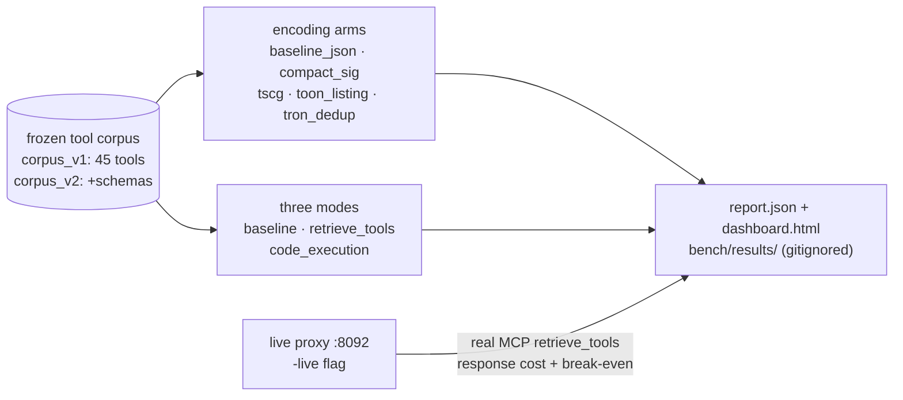

# mcpproxy benchmark harness

*The reproducible numbers behind the marketing claims: token reduction, discovery accuracy, and latency for MCP tool federation — measured, not asserted.*

  

## Why this exists

- **Claims need receipts** — compares three ways an agent can be wired to upstream MCP tools (direct, `retrieve_tools`, `code_execution`) with deterministic, LLM-free measurement.
- **Never drifts from production** — the per-mode tool catalogs are derived directly from the live server tool builders (`buildCallToolModeTools` / `buildCodeExecModeTools` in `internal/server/mcp_routing.go`), so the benchmark can never measure a stale tool set.
- **Honest provenance** — every headline number in the v2 report carries a badge: `measured` (observed on the wire), `computed` (deterministic arithmetic), or `estimated` (a model with documented assumptions).



> Roadmap item #19 (MCP-42) + Spec 083. In-repo (`bench/`), reproducible, intended to be refreshed on release. Reports are **never committed** (Spec 065 CN-003); only code, fixtures, and this methodology are versioned.

## Quick Start

```bash
go run ./bench/cmd/bench            # scores the committed Spec 065 corpus (v1 report)
make bench-discovery                # Spec 083 profiler: all encoding arms on corpus_v2 (v2 report)
go test ./bench/...                 # unit + invariant tests
```

Output: `report.json` and a self-contained `dashboard.html` in `bench/results/` (gitignored).

## The three modes

| Mode | What the agent sees in context | mcpproxy server |
|------|--------------------------------|-----------------|
| `baseline` | Every upstream tool definition, loaded directly | (no proxy discovery) |
| `retrieve_tools` | `retrieve_tools` + `call_tool_read/write/destructive` + `read_cache` + `code_execution` + management tools; tools found on demand via BM25 | `callToolServer` |
| `code_execution` | `code_execution` + `retrieve_tools` + management tools; many tools orchestrated from sandboxed JS in one round-trip | `codeExecServer` |

Both proxy modes also append the shared **management tool set** — `upstream_servers`, `quarantine_security`, `search_servers`, `list_registries` — that the live routing-mode servers expose. These count against the proxy context cost: omitting them undercounts that cost and inflates the savings.

### Current deterministic result

Over the 45-tool Spec 065 reference corpus, counting **tool name + description only** (schemas excluded uniformly), `cl100k_base`:

| Mode | Context tools | Tokens | Savings vs. baseline |
|------|---------------|--------|----------------------|
| `baseline` | 45 | 1730 | — |
| `retrieve_tools` | 10 | 1431 | **~17%** |
| `code_execution` | 6 | 986 | **~43%** |

These are deliberately modest: the proxy context here is the *full* per-mode tool set, and the corpus is small. Savings grow toward the asymptote as the upstream tool count rises (the baseline grows linearly while the proxy context stays fixed) — always quote the corpus size alongside a percentage. Reproduce with `go run ./bench/cmd/bench`.

### Scoring rubric — token reduction

- **Tool universe**: the frozen Spec 065 snapshot `specs/065-evaluation-foundation/datasets/corpus_v1.tools.json` — 45 tools across 7 no-auth reference servers. Frozen + versioned so scoring never runs against a drifting corpus (CN-002).
- **Tokenizer**: `tiktoken cl100k_base`, a widely-used reproducible BPE. It is a **model-agnostic estimator** — see the tokenizer caveat under "Known limitations" before quoting an absolute number.
- **Proxy-mode tools**: the *complete* per-mode catalog, derived from the live server builders — discovery, the call-tool variants, `code_execution`, **and the shared management tool set**. Nothing the agent actually sees is dropped from the proxy cost.
- **Cost of a tool**: `name + "\n" + description`. JSON input schemas are excluded **uniformly** across all modes (the committed corpus snapshot does not carry schemas). The Spec 083 profiler measures schema-bearing renderings on `corpus_v2` instead.
- **Savings** for a mode `m`: `1 - tokens(m) / tokens(baseline)`.

## Discovery-effectiveness profiler (Spec 083)

Answers three questions the v1 harness could not: **what does a `retrieve_tools` response actually cost** over the real MCP protocol, **which tool-definition encoding is cheapest** without wrecking retrieval quality, and **do the in-house numbers survive external corpora and an independent linter**. Output is a versioned **v2 report** conforming to `specs/083-discovery-profiler/contracts/report-v2.schema.json`.

One command:

```bash
make bench-discovery
# = npm ci --prefix bench/tscg  (pinned @tscg/core, one-time)
#   + go run ./bench/cmd/bench -corpus-v2 ... -arms all -out bench/results
# → bench/results/report.json (v2) + bench/results/dashboard.html
# CI runs this same target.
```

Offline (deterministic, no network):

```bash
go run ./bench/cmd/bench \
  -corpus-v2 specs/083-discovery-profiler/datasets/corpus_v2.tools.json \
  -arms baseline_json,compact_sig,tscg,toon_listing \
  -out bench/results
```

TSCG arm prerequisite: `npm ci --prefix bench/tscg` (Node ≥20). Without it the arm reports `skipped: node runtime unavailable` (allowed locally, fails SC-002 in CI).

Live (response cost + break-even + latency):

```bash
# 1. Boot the snapshot proxy (same as existing bench live mode)
go build -o mcpproxy ./cmd/mcpproxy
./mcpproxy serve --config specs/065-evaluation-foundation/datasets/snapshot-servers.config.json \
  --listen 127.0.0.1:8092 &   # MCPPROXY_API_KEY=<redacted>

# 2. Run live measurement (real MCP retrieve_tools calls per golden query)
go run ./bench/cmd/bench -live \
  -proxy http://127.0.0.1:8092 -api-key eval-corpus-snapshot \
  -golden specs/065-evaluation-foundation/datasets/retrieval_golden_v1.json \
  -out bench/results
```

Independent LAP verdict (what CI runs):

```bash
uvx --from lap-score==0.8.0 lap lint \
  --mcp-url "http://127.0.0.1:8092/mcp?apikey=eval-corpus-snapshot" --json > bench/results/lap.json
```

### Encoding arms

An **arm** is one deterministic way of rendering tool definitions into agent-context text (`bench/arms/`; behavioral contract in `specs/083-discovery-profiler/contracts/arm-interface.md`). Arms are byte-deterministic, fail explicitly instead of truncating silently (an unencodable tool is a counted *skip*), and declare whether they alter what the retrieval index ingests — index-altering arms are scored for retrieval quality through the production Bleve index, where the baseline arm must reproduce the golden-set recall@5 = 0.68 ± 0.05 (SC-003 gate).

| Arm | What it renders | Index-altering | Lower-bound |
|-----|-----------------|:---:|:---:|
| `baseline_json` | Full definition, canonical JSON schema. THE canonical renderer: naive-menu count, every savings denominator, and the break-even input | no | no |
| `compact_sig` | Flat signature `fetch(url:string, max_length?:int)\|Fetches a URL…` — required vs `opt?` params, descriptions preserved verbatim | yes | no |
| `tscg` | Reference TSCG compiler (pinned `@tscg/core@1.4.3` via `bench/tscg/shim.mjs`). Rewrites/elides description filler, so savings are a **lower bound** | yes | yes |
| `toon_listing` | Official [TOON](https://github.com/toon-format) encoding of `{name, description, inputSchema}` per tool | yes | no |
| `tron_dedup` | In-tree TRON-style named-class schema dedup: byte-identical canonical schemas declared once in the listing preamble | yes | no |
| `toon_results` | Pseudo-arm over **tool-call outputs**, not definitions: committed `result_fixtures_v1.json` payloads as TOON vs compact-JSON | n/a | no |

### Live response cost, break-even, and session estimates

- **Real MCP protocol.** `bench/mcpcall.go` speaks streamable-HTTP MCP against the proxy's `/mcp` endpoint and calls `retrieve_tools` for every golden query — capturing the exact response text an agent's context ingests, plus client-measured latency. Provenance: `measured`.
- **Span-based component attribution** (`bench/respcost.go`). Per-query tokens split into `input_schemas` / `descriptions` / `usage_instructions` / `metadata` / `other`. Each token is attributed to the span owning its starting byte — components sum *exactly* to the total. Percentiles: p50/p95/max + mean.
- **Break-even** (`bench/breakeven.go`): `break_even_calls = (naive_full_menu_tokens − proxy_menu_tokens) / mean_response_tokens`, all three inputs echoed in the row so the number is recomputable. Provenance: `computed`.
- **Session-cost estimator** (`bench/session.go`) — an ESTIMATE: `session_cost(arm, calls) = proxy_menu + calls × mean_response(arm) × (1 + retry_rate(arm))` for `calls ∈ {1,3,5,10}`. Retry-rate defaults are literature-derived (0.0 for format-native JSON/compact/TSCG/TRON; 0.05 for `toon_listing`, per arXiv:2605.29676 §5). Provenance: `estimated`, always.

## Live run — full schemas + accuracy + latency

```bash
# 1. Boot the reproducible substrate (proxy + 7 no-auth reference servers)
docker compose -f bench/docker-compose.yml up --build -d

# 2. Score against the running proxy (writes bench/results/live_report.json + v2 report)
go run ./bench/cmd/bench -live -proxy http://127.0.0.1:8092 -api-key eval-corpus-snapshot
```

What it adds over the offline token run:

- **Exact token number (full schemas).** Pulls `GET /api/v1/tools` for the upstream tools *with their full JSON input schemas* and counts them against the proxy modes. **Safety valve (MCP-3161):** if any proxy tool is missing a schema, the run **withholds the headline %** and reports raw token totals only (`authoritative_headline: false`) — never quote a withheld run.
- **Accuracy.** Replays `retrieval_golden_v1.json` through the proxy's BM25 search and scores **Recall@{1,3,5,10}, MRR, nDCG@10, MAP**. Deterministic (BM25), single run (`runs_averaged: 1`). The `retrieval` block conforms to the Spec 065 `score-report.schema.json` shape.
- **Latency.** Client-measured per-query search latency (p50/p95/p99/max) vs. the one-shot cost of loading all tools. Measured client-side on purpose: the server's `SearchToolsResponse.took` field is currently a `"0ms"` stub.

### Compact arm / flip gates (Spec 085, `-flip-gates`)

`-live -flip-gates` replays the golden set through the proxy's **MCP** `retrieve_tools` twice per query — once with `detail=full`, once with `detail=compact` — and emits flip-gate metrics under `flip_gates` in `live_report.json`: per-query ranked-ID identity across modes (gate: 100%), full vs compact response-token distributions (gate: ≥50% median reduction), and the lossy-signature rate via the shared `internal/toolsig` grammar (gate: <20%).

## Dataset sources & provenance

Full details and regeneration procedures: `specs/083-discovery-profiler/datasets/README.md` (immutability rule: a refresh is `*_v3.*`, never an edit of a committed `*_v2.*` file).

- **Spec 065 datasets** (`specs/065-evaluation-foundation/datasets/`): the 45-tool `corpus_v1` snapshot (name+description) and `retrieval_golden_v1.json`, generated from 7 permissively reachable no-auth reference servers (filesystem, git, memory, sqlite, fetch, time, sequential-thinking).
- **`corpus_v2.tools.json`** (committed): the same 45 tools exported **with full JSON input schemas** — the universe for all encoding-arm comparisons. Captured 2026-07-14, canonicalized. The export reads the **Bleve index** (`scripts/gen-corpus-v2.sh`), not `GET /api/v1/tools` (that REST endpoint currently serves stub schemas); the index is the authoritative record of what the retrieval funnel ingests.
- **`result_fixtures_v1.json`** (committed): 6 deterministic tool-call outputs captured once through the proxy from 5 reference servers for the `toon_results` arm.
- **LiveMCPTool snapshot** (`specs/083-discovery-profiler/datasets/livemcptool_snapshot/`, committed): frozen copy of the LiveMCPBench tool corpus — **70 servers / 527 tools**, pinned Hugging Face revision `ddea2d24` ([ICIP/LiveMCPBench](https://huggingface.co/datasets/ICIP/LiveMCPBench), arXiv:2508.01780). **Apache-2.0**, redistributed with the mandatory attribution in the snapshot's `ATTRIBUTION.md`. Token/scale measurement only — its task annotations are unqualified free text, so relevance labels are *not derivable*.
- **ToolRet** (never committed): upstream `mangopy/ToolRet-Tools` + `ToolRet-Queries` carry **no stated license**, so the harness **fetches at runtime only** (`scripts/fetch-toolret.sh`) into the gitignored `bench/results/cache/` and never writes ToolRet bytes into git. Retrieval scoring runs on a seeded query subset (`-subset`/`-seed`): same revision + seed + size ⇒ byte-identical subset.
- **TSCG shim** (`bench/tscg/`): committed `shim.mjs` + `package-lock.json` pinning `@tscg/core@1.4.3`; `npm ci --prefix bench/tscg` (Node ≥20) reproduces the exact runtime everywhere, including CI.

## Known limitations (read before quoting a number)

- **Tokenizer caveat — absolute numbers are estimates.** All token counts use `tiktoken cl100k_base` as a reproducible, model-agnostic, offline estimator. It can **underestimate other tokenizers (e.g. Claude's) by up to ~60%**, so never quote an absolute token count as a Claude cost — but **relative savings between arms and modes are stable** across vocabularies, and those are the headline numbers.
- **The session estimator is an ESTIMATE, not a measurement.** Its retry rates are literature-derived defaults, not observations of a live agent loop. Every estimator row is provenance-labeled `estimated`.
- **Lower-bound arms.** Arms that rewrite or elide description text (TSCG) report savings as a lower bound: what they drop cannot be priced back in.
- **v1 offline run: schemas excluded.** In the legacy name+description-only run, input schemas are dropped from *both* sides — its own well-defined metric, not unambiguously conservative. The live run adds full schemas for the exact headline number.
- **Savings scale with tool count.** Quote the corpus size alongside any percentage.
- **LiveMCPTool has no relevance labels**: it validates token/scale claims only, never retrieval quality.
- **LAP divergence is expected.** LAP frames the tool menu its own way; within ±15% of the in-house count is normal, beyond it a non-blocking warning — never a hidden discrepancy.

## What is scoped but not yet built

- **End-to-end task success with a pinned LLM** — requires a pinned model + an LLM-call budget; this is the only part that costs spend. Until then, the session-cost estimator is the honest substitute — labeled `estimated`, never `measured`.
- **CI publish-on-release-tag → public static dashboard** — Release/DevOps lane.

## Reviewer contact

Methodology questions / disputes: open an issue in `smart-mcp-proxy/mcpproxy-go` and tag the maintainers, or comment on the roadmap benchmark ticket (MCP-42).

## License & Security

- Follows the upstream mcpproxy-go licensing (MIT).
- Security: all corpora and snapshots are frozen and versioned (CN-002); ToolRet datasets are fetched at runtime and never committed (license unstated upstream); the LiveMCPTool snapshot is Apache-2.0 with mandatory attribution preserved in `ATTRIBUTION.md`; report artifacts (`bench/results/`) are gitignored so no measurement output leaks into version control.
