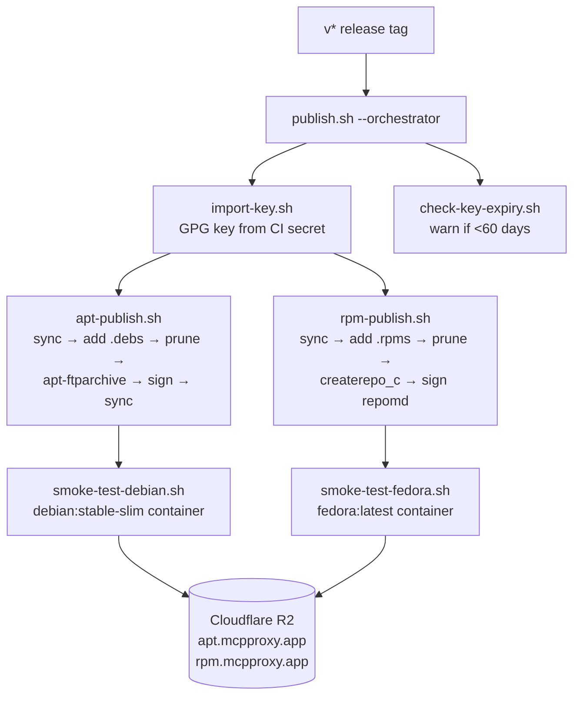

# Linux Package Repositories

*Signed apt and yum repositories for mcpproxy, published to Cloudflare R2 on every `v*` release tag — so `apt upgrade` and `dnf upgrade` just work.*

  

## Why this exists

- **Installs like a real package** — users add one repo line and get auto-updates through their native package manager, plus a hardened systemd unit that starts the service automatically.
- **Safe to iterate** — every script runs in `--dry-run` against tempdirs before it ever touches R2, so a bad publish can't poison the live repo.
- **Signed end to end** — apt `InRelease` and rpm `repomd.xml` are GPG-signed; the key expiry is watched with a 60-day warning window.



## Quick Start

```bash
# dry-run locally: generates metadata in a tempdir, skips the R2 sync-up
export APT_BUCKET=mcpproxy-apt-dev RPM_BUCKET=mcpproxy-rpm-dev
export APT_BASE_URL=https://apt.mcpproxy.app RPM_BASE_URL=https://rpm.mcpproxy.app
export GPG_KEY_ID=3B6FA1AD5D5359DA51F18DDCE1B59B9BA1CB8A3B RETAIN_N=10
./contrib/linux-repos/publish.sh --dry-run release-artifacts/
```

## Files

| File | Purpose |
|---|---|
| `publish.sh` | Top-level orchestrator — called from `.github/workflows/release.yml`. Sequences key import → expiry warning → apt publish → rpm publish. Supports `--dry-run` for local testing. |
| `apt-publish.sh` | Sync apt bucket down → add `.deb` files to `pool/` → prune to retain last 10 versions → regenerate `Packages`/`Release`/`InRelease` with `apt-ftparchive` → sign → sync back up. |
| `rpm-publish.sh` | Sync rpm bucket down → add `.rpm` files per arch → prune to retain last 10 versions → regenerate repomd with `createrepo_c` → sign `repomd.xml` → sync back up. |
| `import-key.sh` | Imports the GPG signing key from the `PACKAGES_GPG_PRIVATE_KEY` env var into a scratch `GNUPGHOME` and sets the preset passphrase. Idempotent. |
| `check-key-expiry.sh` | Emits a GitHub Actions `::warning::` annotation if the imported signing key expires within 60 days. Non-fatal. |
| `smoke-test-debian.sh` | Runs `apt install mcpproxy` in a `debian:stable-slim` container and asserts `mcpproxy --version` matches the release tag. |
| `smoke-test-fedora.sh` | Same, for `fedora:latest` with `dnf install`. |
| `apt-ftparchive.conf` | Static config for `apt-ftparchive release` (suite, components, architectures, description). |
| `mcpproxy.repo.template` | Pre-canned dnf source definition uploaded to `rpm.mcpproxy.app/mcpproxy.repo`. |

## Environment variables (expected from CI)

| Variable | Source | Purpose |
|---|---|---|
| `APT_BUCKET` | workflow env | R2 bucket name, default `mcpproxy-apt` |
| `RPM_BUCKET` | workflow env | R2 bucket name, default `mcpproxy-rpm` |
| `APT_BASE_URL` | workflow env | `https://apt.mcpproxy.app` |
| `RPM_BASE_URL` | workflow env | `https://rpm.mcpproxy.app` |
| `GPG_KEY_ID` | GH variable `PACKAGES_GPG_KEY_ID` | Full fingerprint of the signing key |
| `RETAIN_N` | workflow env | Retention count, default `10` |
| `AWS_ENDPOINT_URL` | built from `R2_ACCOUNT_ID` secret | R2 S3-compatible endpoint |
| `AWS_ACCESS_KEY_ID` | GH secret `R2_ACCESS_KEY_ID` | R2 API token access key |
| `AWS_SECRET_ACCESS_KEY` | GH secret `R2_SECRET_ACCESS_KEY` | R2 API token secret |
| `AWS_DEFAULT_REGION` | hard-coded `auto` | Required by aws CLI; R2 ignores it |
| `PACKAGES_GPG_PRIVATE_KEY` | GH secret | ASCII-armored private key (read by `import-key.sh`) |
| `PACKAGES_GPG_PASSPHRASE` | GH secret | Passphrase for the private key |

## Ops docs

- **User docs**: `docs/features/linux-package-repos.md` (upstream only — not in this vendored copy)
- **Ops runbook**: `docs/operations/linux-package-repos-infrastructure.md` (upstream only — not in this vendored copy)
- **Feature spec**: [`specs/043-linux-package-repos/`](../../specs/043-linux-package-repos/)

## License & Security

- Follows the upstream mcpproxy-go licensing (MIT).
- Security: the GPG private key lives only in the `PACKAGES_GPG_PRIVATE_KEY` GitHub secret and is imported into a scratch `GNUPGHOME` at publish time — it never lands in the repo, in logs, or in the R2 buckets; R2 credentials are scoped API tokens from CI secrets; releases are signature-verifiable by end users (`apt`/`dnf` verify `InRelease`/`repomd.xml` signatures against the published key fingerprint `3B6F A1AD 5D53 59DA 51F1  8DDC E1B5 9B9B A1CB 8A3B`).
